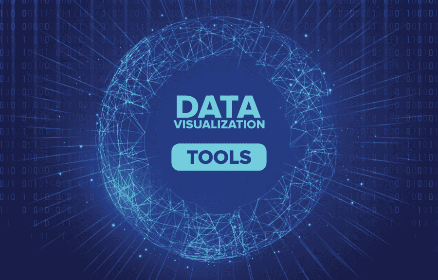

# 2020 年十大最佳数据可视化工具

> 原文:[https://www . geesforgeks . org/10-最佳数据-可视化-工具-in-2020/](https://www.geeksforgeeks.org/10-best-data-visualization-tools-in-2020/)

在这个数据时代，了解数据以获得一些可操作的见解非常重要。而**数据可视化**是了解数据中隐藏的模式和图层非常重要的一部分！你觉得什么更有趣？一张漂亮的描述性条形图还是一张枯燥的电子表格，告诉你同样的信息？

这是条形图，因为人类是视觉生物，数据可视化图表，如条形图、散点图、折线图、地理地图等。非常重要。他们只是通过查看信息来告诉你信息，而通常你必须阅读电子表格或文本报告来理解数据。数据可视化工具如此受欢迎，因为它们允许分析师和统计学家通过方便地在一个地方提供界面、数据库连接和[机器学习](https://www.geeksforgeeks.org/machine-learning/)工具，根据他们的规范轻松创建可视化数据模型！本文展示了目前常用的 **10 种最流行的数据可视化工具**。让我们来看看吧！

### 1.活人画

[Tableau](https://www.tableau.com/en-au) 是一款数据可视化工具，可以供数据分析师、科学家、统计师等使用。可视化数据，并根据数据分析得出明确的意见。Tableau 非常有名，因为它可以在很短的时间内获取数据并产生所需的数据可视化输出。它可以做到这一点，同时提供最高级别的安全性，并保证一旦出现安全问题或被用户发现，就立即处理这些问题。

Tableau 还允许其用户准备、清理和格式化他们的数据，然后创建数据可视化，以获得可操作的见解，并与其他用户共享。Tableau 适用于个人数据分析师，也适用于业务团队和组织。提供 **14 天免费试用**，随后是付费版。

### 2.检查员

[Looker](https://looker.com/#exit-popup) 是一个 Looker 数据可视化工具，可以深入数据并对其进行分析以获得有用的见解。它为更深入的分析提供了实时的数据仪表板，这样企业就可以根据获得的数据可视化做出即时决策。Looker 还提供了与红移、雪花、大查询以及 50 多种 SQL 支持的方言的连接，因此您可以毫无问题地连接到多个数据库。

Looker 数据可视化可以与任何使用特定工具的人共享。此外，您可以立即以任何格式导出这些文件。它还提供客户支持，您可以在其中提出任何问题并得到回答。可以通过提交表格获得报价。

### 3.Zoho 分析

[Zoho Analytics](https://www.zoho.com/analytics/) 是一款商业智能和数据分析软件，可以帮助您在几分钟内根据您的数据创建好看的数据可视化。您可以从多个来源获取数据，并将其连接在一起以创建多维数据可视化，从而允许您跨部门查看业务数据。如果你有任何问题，你可以使用 Zia，这是一个使用人工智能、机器学习和自然语言处理创建的智能助手。

Zoho Analytics 允许您与同事共享或发布您的报告，并根据需要添加评论或参与对话。您可以导出任何格式的 Zoho Analytics 文件，如电子表格、MS Word、Excel、PPT、PDF 等。该软件可用的定价选项包括一个基本计划**每月 34.1 澳元**按年计费。

### 4.Sisense

[Sisense](https://www.sisense.com/en-au/) 是一个基于商业智能的数据可视化系统，它提供了各种工具，允许数据分析师简化复杂的数据，并为他们的组织和外部人员获得见解。Sisense 认为，最终，每家公司都将是一家数据驱动型公司，每种产品都将以某种方式与数据相关。因此，它尽最大努力向业务团队和数据分析提供各种数据分析工具，以便他们能够帮助他们的公司成为未来的数据驱动型公司。

设置和学习 Sisense 非常容易。它可以在一分钟内轻松安装，数据分析师可以立即完成工作并获得结果。Sisense 还允许其用户以 PPT、Excel、MS Word、PDF 等多种格式导出自己的文件。每当用户遇到任何问题时，Sisense 还会提供全职客户支持服务。可以通过提交表格获得报价。

### 5.IBM Cognos 分析

[IBM Cognos Analytics](https://www.ibm.com/au-en/products/cognos-analytics) 是一个基于人工智能的商业智能平台，支持数据分析等。您可以可视化和分析您的数据，并与组织中的任何人分享可操作的见解。即使您对数据分析知之甚少或一无所知，您也可以轻松使用 IBM Cognos Analytics，因为它可以为您解释数据，并以通俗易懂的语言为您提供可操作的见解。

如果您愿意，您还可以在云上与多个用户共享您的数据，并通过电子邮件或 Slack 共享视觉效果。您还可以从各种来源导入数据，如电子表格、云、CSV 文件或内部数据库，并将相关数据源组合成一个数据模块。IBM Cognos Analytics 提供 30 天的免费试用，随后是从每月 20.87 澳元开始的计划。

### 6\. Qlik Sense

[Qlik Sense](https://www.qlik.com/us/products/qlik-sense) 是一个数据可视化平台，通过提供关联数据分析引擎、复杂的人工智能系统和可扩展的多云架构，帮助公司成为数据驱动型企业，该架构允许您部署 SaaS 云、内部云或私有云的任意组合。

您可以在 Qlik Sense 上轻松地组合、加载、可视化和探索您的数据，无论其大小如何。所有的数据图表、表格和其他可视化都是交互式的，并根据当前的数据上下文即时更新自身。Qlik Sense AI 甚至可以为您提供数据洞察，并帮助您只需拖放即可创建分析。您可以免费试用 Qlik Sense Business 30 天，然后继续使用付费版本。

### 7.Domo

[Domo](https://www.domo.com/platform/visualize) 是一个商业智能模型，包含多个数据可视化工具，这些工具提供了一个整合的平台，您可以在其中执行数据分析，然后创建交互式数据可视化，让其他人可以轻松理解您的数据结论。您可以在 Domo 仪表板中组合卡片、文本和图像，以便您可以在其他人讲述数据故事的同时引导他们浏览数据。

如果有任何疑问，您可以使用他们预先构建的仪表板从数据中快速获得见解。Domo 有一个免费的试用选项，所以你可以在完全投入之前使用它来了解这个平台。如果有任何客户服务咨询，Domo 在周一到周五的早上 7 点到下午 6 点一直都有空，你可以免费试用，然后是付费版。

### 8.微软电力商业智能

[Microsoft Power BI](https://powerbi.microsoft.com/en-us/) 是一个数据可视化平台，专注于在当今所有公司中创建数据驱动的商业智能文化。为了实现这一点，它提供了自助分析工具，可用于以有意义的方式分析、聚合和共享数据。

微软 Power BI 为其客户提供了数百种数据可视化，以及内置的人工智能功能和 Excel 集成工具。而这一切对于微软 Power BI Pro 来说都是非常口袋友好的，每个用户每月 9.99 美元。它还为您提供多种支持系统，如常见问题解答、论坛以及与员工的实时聊天支持。

### 9\. 克利普弗利奥

[Klipfolio](https://www.klipfolio.com/) 是一家加拿大商业智能公司，提供最好的数据可视化工具之一。您可以使用连接器从数百个不同的数据源访问数据，如电子表格、数据库、文件和 web 服务应用程序。Klipfolio 还允许您创建自定义的拖放数据可视化，您可以从不同的选项中进行选择，如图表、图形、散点图等。

Klipfolio 还有一些工具，可以用来执行复杂的公式，解决具有挑战性的数据问题。对于基本商业计划，您可以获得 14 天的免费试用，然后每月 49 美元。在客户咨询的情况下，您可以从社区论坛或知识论坛获得帮助。

### 10.思爱普分析云

[SAP 分析云](https://www.sapanalytics.cloud/)使用商业智能和数据分析功能来帮助您评估数据并创建可视化，以便预测业务成果。它还为您提供了最新的建模工具，通过提醒您数据中可能存在的错误以及对不同的数据度量和维度进行分类来帮助您。思爱普分析云还建议对数据进行智能转换，从而增强可视化效果。

如果您有任何疑问或与数据可视化相关的业务问题，SAP Analytics Cloud 通过使用对话式人工智能和自然语言技术处理您的查询，为您提供完全的客户满意度。您可以免费试用该平台 30 天，之后每月支付**$ 22**商业智能套餐。