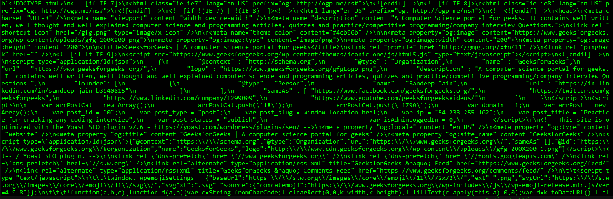

# Python 中 10 个有趣的模块一起玩

> 原文:[https://www . geesforgeks . org/10-有趣-python 中的模块-玩/](https://www.geeksforgeeks.org/10-interesting-modules-in-python-to-play-with/)

Python 是一种高级、解释和通用的动态编程语言，侧重于代码可读性。它在许多组织中使用，因为它支持多种编程范例。它还执行自动内存管理。它是世界上最流行的按需编程语言之一。这有很多原因:

*   很容易学。
*   超级百搭。
*   它有大量的模块和库。

事实上，它可以支持绝大多数第三方模块，它就像蛋糕上的樱桃。有一些相当有趣的模块被认为值得与他人分享。在本文中，讨论了一些模块，无论您是初学者还是专业人士，这些模块都会派上用场。由于大部分都是[第三方模块](https://stackoverflow.com/questions/33503510/what-are-third-party-modules)，没有内置 Python，需要安装。第三方模块的安装可以在[这里](https://docs.python.org/3/installing/index.html)看到。

**注意:**这些代码中的一些可能在 **Python 2** 中不起作用。因此，我强烈建议您在 **Python 3** 中尝试它们。

## Pyperclip

这个模块的创建是为了实现 Python 中的跨平台复制粘贴，这在早期是不存在的。`pyperclip`模块有`copy()`和`paste()`功能，可以向电脑的剪贴板发送文本和从剪贴板接收文本。将程序的输出发送到剪贴板将使它很容易粘贴到电子邮件、文字处理器或其他软件上。

Pyperclip 没有附带 Python。安装时，按照[安装第三方模块](https://docs.python.org/3/installing/index.html)的说明进行。安装模块后，在集成开发环境中输入以下内容:

```
# Python program to
# demonstrate pyperclip module

# This will import pyperclip
import pyperclip
pyperclip.copy("Hello world !")
pyperclip.paste()

pyperclip.copy("Isn't pyperclip interesting?")
pyperclip.paste()
```

当然，如果你的程序之外的东西改变了剪贴板的内容，`paste()`函数会返回。例如，如果将这句话复制到剪贴板，然后调用`paste()`，输出将如下所示:

> 例如，如果将此句子复制到剪贴板，然后调用 paste()，输出将如下所示:'

## 表情符号

表情符号已经成为表达和增强简单枯燥文本的一种方式。现在，同样的宝石也可以用在 Python 程序中。是的，真的！你现在有了在代码中使用表情符号的终极能力。为此，需要安装`emoji`模块。

在终点站。使用:

```
pip install emoji 

```

升级到最新的表情包。这是如何做到的:

```
pip install emoji --upgrade

```

```
from emoji import emojize
print(emojize(":thumbs_up:"))
```

使用[表情小抄](https://www.webfx.com/tools/emoji-cheat-sheet/)找到你最喜欢的表情。
或者，可以从表情模块使用 `encode()`功能将 Unicode 转换为表情:

```
import emojis
emojified = emojis.encode("There is a :snake: in my boot !")
print(emojified)
```

希望你试试！

## 怎么办

困在编码问题上？希望在不离开航站楼的情况下参观 StackOverflow？有了`howdoi`，你就能做到！

通过以下方式安装 howdoi 模块:

```
pip install howdoi

```

或者通过以下方式从 Python 安装:

```
python setup.py install

```

无论你有什么问题，它都会尽力回答。

```
howdoi make trees in Python
howdoi commit in git
```

从现在开始，你不需要打开这些浏览器进行快速搜索，就能获得大量的广告和干扰。你好！

```
howdoi use Howdoi in Python
```

## 维基百科(一个基于 wiki 技术的多语言的百科全书协作计划ˌ也是一部用不同语言写成的网络百科全书ˌ 其目标及宗旨是为全人类提供自由的百科全书)ˌ开放性的百科全书

好像 howdoi 还不够，我们现在可以导入整个维基百科了！是的，我们现在可以使用`Wikipedia` 模块导入 Python 中的维基百科。用 Python 源源不断的知识满足日常需求。
安装方式:

```
pip install wikipedia

```

并将其用作:

```
import wikipedia
result = wikipedia.page("GeeksforGeeks")
print(result.summary)
```

如果您希望从摘要中获得特定数量的句子，只需将其作为参数传递给`summary()`函数:

```
import wikipedia
print(wikipedia.summary("Debugging", sentences = 2))
```

## 运行时的新类型

这可以以完全动态的方式创建新类型。这和创建一个类是一样的，但是你可以向你的朋友展示一些新的东西。

```
# Python program to
# create new type object

# Creates a new type object
NewType = type("NewType", (object, ), {"attr": "hello newtype"})
New = NewType()

# Print the type of object
print(type(New))

# Print the attribute of object
print(New.attr)
```

**输出:**

```
<class '__main__.NewType'>
hello newtype

```

上述代码与以下代码相同:

```
# Creates a class
class NewType:
    attr = "hello newtype"

# Initialize an object
New = NewType()

# Print the type of object
print(type(New))

# Print the attribute of object
print(New.attr)
```

**输出:**

```
<class '__main__.NewType'>
hello newtype

```

可能不是最好的模块，但仍然值得一试！

## 拆解 Python

有没有想过蟒蛇在引擎盖下做什么？使用标准库模块 dis，您可以轻松地查看。

```
# This will import
# dis module
import dis

def test(number):
    return (str(number)+str(number))

def newFunc(string):
    print("Hello", string)

# This will display the
# disassembly of test():
dis.dis(test)

# This will display the
# disassembly of newFunc()
dis.dis(newFunc)
```

**输出:**

```
Result:
  8           0 LOAD_GLOBAL              0 (str)
              3 LOAD_FAST                0 (number)
              6 CALL_FUNCTION            1 (1 positional, 0 keyword pair)
              9 LOAD_GLOBAL              0 (str)
             12 LOAD_FAST                0 (number)
             15 CALL_FUNCTION            1 (1 positional, 0 keyword pair)
             18 BINARY_ADD
             19 RETURN_VALUE

  3           0 LOAD_GLOBAL              0 (print)
              3 LOAD_CONST               1 ('Hello')
              6 LOAD_FAST                0 (string)
              9 CALL_FUNCTION            2 (2 positional, 0 keyword pair)
             12 POP_TOP
             13 LOAD_CONST               0 (None)
             16 RETURN_VALUE

```

这是压倒性的，也是惊人的！

## 反重力

这个模块在这里的原因是因为这很有趣！它基本上是 Python 3 中的复活节彩蛋，用于谷歌应用引擎。它被添加到谷歌应用引擎中，只是为了娱乐用户。

安装时请使用:

```
pip install antigravity

```

然后在集成开发环境中键入这个，看看它的神奇之处:

```
import antigravity
```

这将在您的网络浏览器中打开一个页面，其中包含一个滑稽的 Python 摘要，专为您设计。恭喜你！你知道有能力飞行或目前有能力访问这个链接[https://xkcd.com/353/](https://xkcd.com/353/)。

## sys.exit()

您可能以前使用过 sys 模块，但是您知道您可以使用它提前退出程序吗？我们可以通过调用`sys.exit()`函数使程序终止。由于该功能在`sys`模块中，首先需要导入`sys` 模块。这不是第三方模块，内置 Python，所以不需要安装。

```
# This will import 
# sys module
import sys

while True:
    print("Type 'exit' to exit")
    response = input()
    if response == "exit":
        print("Exiting the program")
        sys.exit()
    print("You typed", response)
```

如果输入是:

```
"Geeky"
"GeeksforGeeks"
"exit"

```

输出将是:

```
Type 'exit' to exit
You typed Geeky

Type 'exit' to exit
You typed GeeksforGeeks

Type 'exit' to exit
Exiting the program

```

## [urllib](https://www.geeksforgeeks.org/python-urllib-module/)

Urllib 模块是 python 的 URL 处理模块。它用于获取网址(统一资源定位符)。它使用 urlopen 函数，能够使用各种不同的协议获取 URL。

Urllib 是一个包，它收集了几个用于处理 URL 的模块，例如:

*   请求打开和读取。
*   urllib.parse 用于解析 URL
*   引发的异常的 urllib.error
*   用于解析 robot.txt 文件的 urllib.robotparser

```
# This will import urlopen
# class from urllib module
from urllib.request import urlopen

page = urlopen("http://geeksforgeeks.org/")
print(page.headers)
```

输出将是:

```
Server: Apache
Strict-Transport-Security: max-age=3600; includeSubDomains
Access-Control-Allow-Credentials: true
X-Frame-Options: DENY
X-Content-Type-Options: nosniff
Content-Type: text/html; charset=UTF-8
X-Akamai-Transformed: 9 - 0 pmb=mRUM,3
Vary: Accept-Encoding
Cache-Control: must-revalidate, max-age=3, s-maxage=21600
Date: Fri, 04 Oct 2019 04:57:37 GMT
Transfer-Encoding: chunked
Connection: close
Connection: Transfer-Encoding
Server-Timing: cdn-cache; desc=HIT
Server-Timing: edge; dur=1

```

也可以使用`read()`功能查看网站的编码:

```
# This will import urlopen
# class from urllib module

from urllib.request import urlopen
page=urlopen("http://geeksforgeeks.org/")

# Fetches the code 
# of the web page
content = page.read()

print(content)
```

**输出:**


## 龟

是的，乌龟可以进口。别担心，它不慢。海龟是一个 Python 模块来绘制的。它的应用非常广泛，有很多方法可以在[这里](https://docs.python.org/2/library/turtle.html)了解。但是只需要一些基本的东西，就可以完成非常酷的事情。这个模块内置了 Python，所以不需要安装。

```
# This will import turtle module
import turtle

myTurtle = turtle.Turtle()
myWin = turtle.Screen()

# Turtle to draw a spiral
def drawSpiral(myTurtle, linelen):
    myTurtle.forward(linelen)
    myTurtle.right(90)
    drawSpiral(myTurtle, linelen-10)

drawSpiral(myTurtle, 80)
myWin.exitonclick()
```

**输出:**
