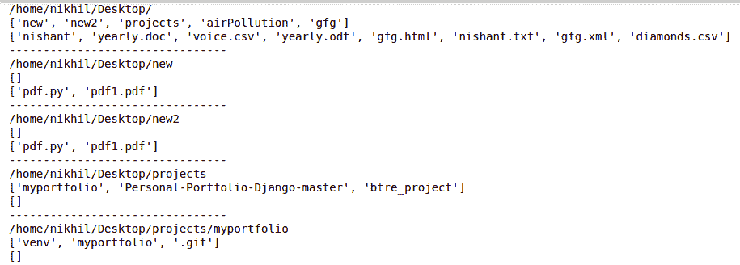
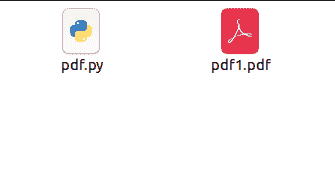
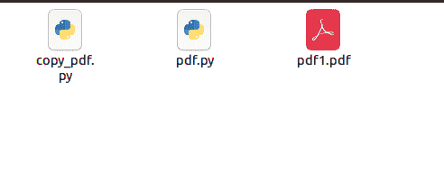
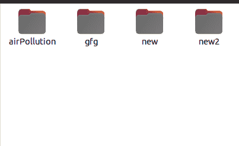
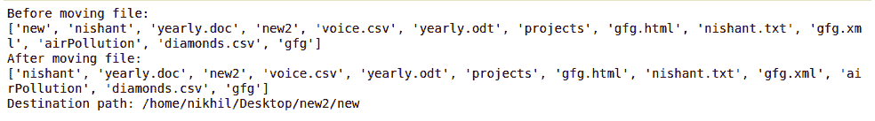

# 你应该知道的 10 种 Python 文件系统方法

> 原文:[https://www . geesforgeks . org/10-python-文件系统-方法-你应该知道/](https://www.geeksforgeeks.org/10-python-file-system-methods-you-should-know/)

当用任何语言编程时，程序和操作系统(Windows、Linux、macOS)之间的交互在任何开发人员的生命中的某个时刻都可能变得很重要。这种交互可以包括将文件从一个位置移动到另一个位置、创建新文件、删除文件等。

在本文中，我们将讨论 Python 中[操作系统](https://www.geeksforgeeks.org/os-module-python-examples/)和 [Shutil](https://www.geeksforgeeks.org/shutil-module-in-python/) 模块的 10 种基本文件系统方法，这些方法有助于与我们的操作系统交互并使用操作系统相关的功能。

## os . getcwd()

[os.getcwd()](https://www.geeksforgeeks.org/python-os-getcwd-method/) 方法告诉我们当前工作目录的位置(cwd)。

**示例:**

## 蟒蛇 3

```
# Python program to explain os.getcwd() method

# importing os module
import os

# Get the current working
# directory (CWD)
cwd = os.getcwd()

# Print the current working
# directory (CWD)
print("Current working directory:", cwd)
```

**输出:**

```
Current working directory: /home/nikhil/Desktop/gfg
```

## if.chdir（）

[Python 中的 os.chdir()](https://www.geeksforgeeks.org/python-os-chdir-method/) 方法，用于将当前工作目录更改为指定路径。它只接受一个参数作为新的目录路径。

## 蟒蛇 3

```
# Python3 program to change the
# directory of file using os.chdir() method

# import os library
import os

# change the current directory
# to specified directory
os.chdir(r"C:\Users\Gfg\Desktop\geeks")

print("Directory changed")
```

**输出:**

```
Directory changed
```

## os.listdir()

[使用 python 中的 os.listdir()](https://www.geeksforgeeks.org/python-os-listdir-method/) 方法获取指定目录下所有文件和目录的列表。如果我们没有指定任何目录，那么将返回当前工作目录中的文件和目录列表。

**示例:**

## 蟒蛇 3

```
# Python program to explain os.listdir() method

# importing os module
import os

# Get the path of current working directory
path = '/home'

# Get the list of all files and directories
# in current working directory
dir_list = os.listdir(path)

print("Files and directories in '", path, "' :")
print(dir_list)
```

**输出:**

```
Files and directories in ' /home ' :
['nikhil']
```

## os.walk()

[os.walk()](https://www.geeksforgeeks.org/os-walk-python/) 通过自上而下或自下而上遍历目录树来生成目录树中的文件名。对于树中以目录顶部(包括顶部本身)为根的每个目录，它产生一个三元组(目录路径、目录名、文件名)。

**示例:**

## 蟒蛇 3

```
# Driver function
import os

for (root,dirs,files) in os.walk('/home/nikhil/Desktop/', topdown=True):
    print (root)
    print (dirs)
    print (files)
    print ('--------------------------------')
```

**输出:**



## os.path.join()

[Python 中的 os.path.join()](https://www.geeksforgeeks.org/python-os-path-join-method/) 方法智能连接一个或多个路径组件。此方法将各种路径组件串联起来，除了最后一个路径组件之外，每个非空部分后面都有一个目录分隔符(“/”)。如果要连接的最后一个路径组件为空，则在末尾放置一个目录分隔符(“/”)。

## 蟒蛇 3

```
# Python program to explain os.path.join() method

# importing os module
import os

# Path
path = "/home"

# Join various path components
print(os.path.join(path, "User/Desktop", "file.txt"))

# Path
path = "User/Documents"

# Join various path components
print(os.path.join(path, "/home", "file.txt"))

# In above example '/home'
# represents an absolute path
# so all previous components i.e User / Documents
# are thrown away and joining continues
# from the absolute path component i.e / home.

# Path
path = "/home"

# Join various path components
print(os.path.join(path, "User/Public/", "Documents", ""))

# In above example the last
# path component is empty
# so a directory separator ('/')
# will be put at the end
# along with the concatenated value
```

**Output**

```
/home/User/Desktop/file.txt
/home/file.txt
/home/User/Public/Documents/
```

## os . makedirs()

[Python 中的 os.makedirs()](https://www.geeksforgeeks.org/python-os-makedirs-method/) 方法用于递归创建目录。这意味着在创建叶目录时，如果缺少任何中级目录，os.makedirs()方法将创建它们。例如，考虑以下路径:

```
/home/User/Documents/GeeksForGeeks/Authors/nikhil
```

假设我们想创建一个目录“nikhil ”,但是目录“GeeksForGeeks”和“Authors”在路径中不可用。然后 os.makedirs()方法将在指定路径中创建所有不可用/缺失的目录。首先创建“极客”和“作者”，然后创建“nikhil”目录。

**示例:**

## 蟒蛇 3

```
# Python program to explain os.makedirs() method

# importing os module
import os

# Leaf directory
directory = "nikhil"

# Parent Directories
parent_dir = "/home/User/Documents/GeeksForGeeks/Authors"

# Path
path = os.path.join(parent_dir, directory)

# Create the directory
# 'ihritik'
os.makedirs(path)
print("Directory '%s' created" %directory)
```

**输出:**

```
Directory 'nikhil' created
```

## shutil.copy2（）

[Python 中的 shutil.copy2()](https://www.geeksforgeeks.org/python-shutil-copy2-method/) 方法用于将源文件的内容复制到目标文件或目录中。此方法与 [shutil.copy()](https://www.geeksforgeeks.org/python-shutil-copy-method/) 方法相同，但它也尝试保留文件的元数据。

**示例:**

**使用的目录**



## 蟒蛇 3

```
# Python program to explain shutil.copy2() method

# importing os module
import os

# importing shutil module
import shutil

# path
path = '/home/nikhil/Desktop/new'

# List files and directories
# in '/home/User/Documents'
print("Before copying file:")
print(os.listdir(path))

# Source path
source = "/home/nikhil/Desktop/new/pdf.py"

# Print the metadeta
# of source file
metadata = os.stat(source)
print("Metadata:", metadata, "\n")

# Destination path
destination = "/home/nikhil/Desktop/new/copy_pdf.py"

# Copy the content of
# source to destination
dest = shutil.copy2(source, destination)

# List files and directories
# in "/home / User / Documents"
print("After copying file:")
print(os.listdir(path))

# Print the metadata
# of the destination file
matadata = os.stat(destination)
print("Metadata:", metadata)

# Print path of newly
# created file
print("Destination path:", dest)
```

**输出:**

> 复制文件前:
> 
> ['pdf.py '，' pdf1.pdf']
> 
> 元数据:os.stat_result(st_mode=33204，st_ino=58068385，st_dev=2050，st_nlink=1，st_uid=1000，st_gid=1000，st_size=887，st_atime=1619538642，st_mtime=1618307699，st_ctime=1618307700)
> 
> 复制文件后:
> 
> ['copy_pdf.py '，' pdf.py '，' pdf1.pdf']
> 
> 元数据:os.stat_result(st_mode=33204，st_ino=58068385，st_dev=2050，st_nlink=1，st_uid=1000，st_gid=1000，st_size=887，st_atime=1619538642，st_mtime=1618307699，st_ctime=1618307700)
> 
> 目标路径:/home/nikhil/Desktop/new/copy _ pdf . py

**目录**



## shutil.move（）

[shutil.move()](https://www.geeksforgeeks.org/python-shutil-move-method/) 方法递归地将文件或目录(源)移动到另一个位置(目标)并返回目标。如果目标目录已经存在，那么 src 将被移动到该目录中。如果目标已经存在，但不是目录，则根据 os.rename()语义，它可能会被覆盖。

**示例:**

**使用的目录**



## 蟒蛇 3

```
# Python program to explain shutil.move() method

# importing os module
import os

# importing shutil module
import shutil

# path
path = '/home/nikhil/Desktop/'

# List files and directories
# in 'C:/Users/Rajnish/Desktop/GeeksforGeeks'
print("Before moving file:")
print(os.listdir(path))

# Source path
source = '/home/nikhil/Desktop/new'

# Destination path
destination = '/home/nikhil/Desktop/new2'

# Move the content of
# source to destination
dest = shutil.move(source, destination)

# List files and directories
# in "C:/Users / Rajnish / Desktop / GeeksforGeeks"
print("After moving file:")
print(os.listdir(path))

# Print path of newly
# created file
print("Destination path:", dest)
```

**输出:**

 

## os.remove()

[Python 中的 os.remove()](https://www.geeksforgeeks.org/python-os-remove-method/) 方法用于移除或删除文件路径。此方法不能删除目录。

**示例:**

## 蟒蛇 3

```
# Python program to explain os.remove() method

# importing os module
import os

# File name
file = 'file.txt'

# File location
location = "/home/User/Documents"

# Path
path = os.path.join(location, file)

# Remove the file
# 'file.txt'
os.remove(path)
print("%s has been removed successfully" %file)
```

**输出:**

```
file.txt has been removed successfully
```

## shutil.rmtree（）

[shutil.rmtree()](https://www.geeksforgeeks.org/delete-an-entire-directory-tree-using-python-shutil-rmtree-method/) 用于删除一个完整的目录树，路径必须指向一个目录。

**示例:**假设目录和子目录如下。

**#父目录:**


**#父目录内的目录:**


**#子目录内文件:**


## 蟒蛇 3

```
# Python program to demonstrate
# shutil.rmtree()

import shutil
import os

# location
location = "D:/Pycharm projects/GeeksforGeeks/"

# directory
dir = "Authors"

# path
path = os.path.join(location, dir)

# removing directory
shutil.rmtree(path)
```

**输出:**


> **参考下面的文章，了解我们关于操作系统模块和 Shutil 模块的完整教程。**
> 
> *   [Python 中的操作系统模块，示例](https://www.geeksforgeeks.org/os-module-python-examples/)
> *   [Python 中的 Shutil 模块](https://www.geeksforgeeks.org/shutil-module-in-python/)