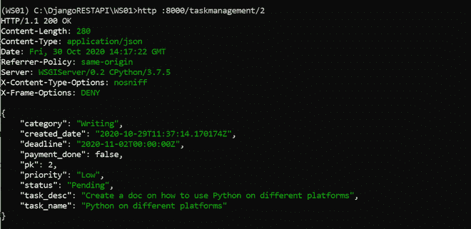
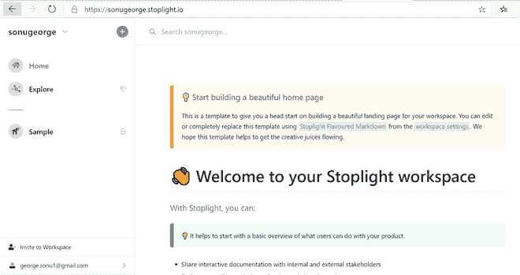
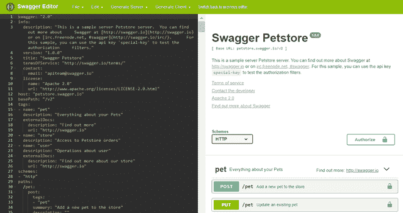
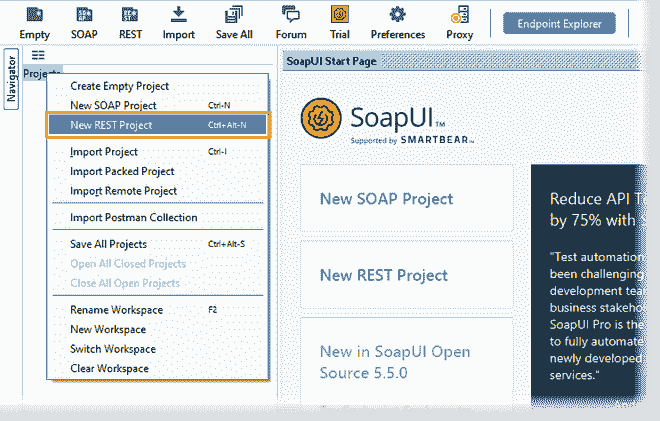
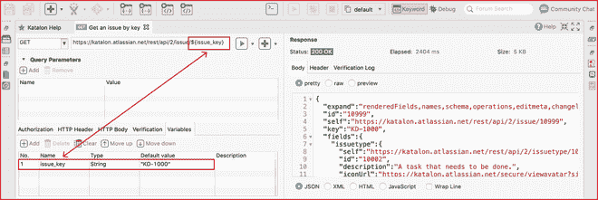
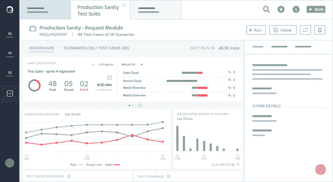
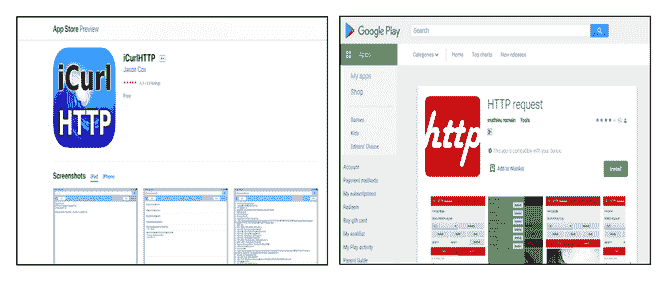

# 2021 年 12 款最佳 REST API 测试工具

> 原文:[https://www . geesforgeks . org/12-best-rest-API-testing-tools-in-2021/](https://www.geeksforgeeks.org/12-best-rest-api-testing-tools-in-2021/)

代表性状态转移(REST)已经成为创建 web 服务的事实标准。这突出了 RESTful web 服务在开发复杂的 web 和移动应用程序中的重要性。RESTful web 服务是基于 REST 架构的轻量级、可维护、可扩展的 web 服务。利用与 RESTful web 服务交互的高级工具非常重要，这样我们就可以检查 API 在不同条件下是否返回正确的输出。在这个功能中，我们将讨论与 RESTful 网络服务交互的不同工具。

*   卷曲
*   HTTPie
*   邮递员休息客户端
*   红色尾灯
*   时髦的
*   soapui
*   耐热试验
*   加泰隆尼亚人
*   accell
*   空手道 DSL
*   iCurlHTTP 应用程序
*   HTTP 请求应用程序

## 卷曲

卷曲

[Curl](https://curl.se/) 是一个开源的命令行工具，用于在服务器之间传输数据。使用 curl，您可以轻松地编写和发送 HTTP 请求，并分析它们的响应。使用 cURL 的优势之一是，您可以用批处理请求构建脚本并执行它们。您可以使用命令提示符下的 curl 或 [Cygwin 软件包安装](http://cygwin.com/install.html)。您也可以使用带有 curl 的 windows power shell，但是您必须删除 curl 别名。

要在命令提示符下使用 curl 命令，您必须下载最新的 [curl](https://curl.haxx.se/windows/) 并包含包含 curl.exe 文件的文件夹。

## HTTPie

HTTPie

[HTTPie](https://httpie.io/) 是一个用 Python 编写的命令行 HTTP 客户端。它使用比 cURL 更简单的语法，对输出进行着色，并使用多行来显示输出。缺点是加载时间比 cURL 长。它的一些主要特点是:

*   内置 JSON 支持
*   彩色和格式化的终端输出
*   合理的违约
*   持续会话
*   HTTPS、代理和身份验证支持

您可以使用以下命令安装 HTTPie

> pip3 安装–升级 httpie

## 邮递员休息客户端

邮递员网络版

Postman REST 客户端是一个图形用户界面(GUI)工具，有助于编写 HTTP 请求并将其发送到开发服务器。你可以使用网络版或者邮差应用。它的一些主要特点是:

*   创建和执行复杂的 REST 请求
*   可以直接导入集合，而不是手动创建调用
*   显示状态代码、响应类型和响应大小
*   易于检查响应体
*   强大而简单的可视化
*   向不同的环境变量发出请求
*   支持多种协议，管理 cookies 和管理证书

## 红色尾灯

红色尾灯

[红绿灯](https://stoplight.io/)是一个 GUI 工具，可以帮助你构建复杂的 API。它提供了一个 HTTP 请求生成器来编写和发送 HTTP 请求，并为不同的编程语言生成代码。它可以更快地设计、记录和构建高质量的 API。它的一些主要特点是:

*   它在 JSON 模式设计器的支持下提供了高质量的可视化 API 设计
*   确保样式指南的一致性和质量
*   自动模拟服务器
*   通过重用组件避免重复
*   Git 工作流协作

## 时髦的

来自斯瓦格的图像

[swaggle](https://swagger.io/)是为 API 设计、开发和测试、API 嘲讽和虚拟化以及 API 治理和监控而构建的开源工具。斯瓦格开放应用编程接口规范为开发和使用应用编程接口创建了一个 RESTful 接口。它有效地映射了与之相关的所有资源和操作。一些主要的 Swagger 工具包括:

*   Swagger Codegen:从 OpenAPI 规范定义中生成服务器存根和客户端 SDK
*   Swagger 编辑器:用 OpenAPI 规范设计 API 的 API 编辑器
*   霸气用户界面:在交互式用户界面中可视化 OpenAPI 规范定义

## **肥皂 UI**

来自 Soap 用户界面的图像

[Soap UI](https://www.soapui.org/) 是一个构建和测试 API 的开源工具，便于验证 REST 和基于 Soap 的 web 服务。Soap 用户界面的一些开源特性包括:

*   无脚本功能测试:它提供了拖放测试创建工具
*   安全测试:测试和扫描保护网络服务免受常见安全漏洞的影响
*   负载测试:它基于现有的功能性应用编程接口测试创建负载测试。
*   API 嘲讽:不需要构建昂贵的生产系统的全尺寸副本，就可以轻松模仿真实的文服务。
*   协议支持:为 SOAP/WSDL、REST 和 JMS 提供协议支持

## **金字塔试验**

[Pyresttest](https://pypi.org/project/pyresttest/) 是一个基于 Python 的工具，用于 REST 测试和 API 微基准测试工具。它的一些亮点是:

*   不需要编码——它的测试在基本的 YAML 或 JSON 配置文件中定义。
*   它支持生成、提取或验证机制来创建完整的测试场景
*   失败时返回退出代码，并提供可解析的日志
*   最小依赖性。

使用以下命令安装耐热测试。

> pip 安装 pyresttest

## 加泰隆尼亚人

来自 katalon.com 的图片

[Katalon](https://www.katalon.com/) 是一个用于编写 HTTP 请求并将其发送到开发服务器的自动化工具。它包括一个包中的所有框架、资产管理集成和插件。它的一些主要特点是:

*   用于应用编程接口自动化的生产性集成开发环境
*   支持所有类型的 REST 和 SOAP 请求
*   测试请求可以从斯瓦格、邮差和 WSDL 导入。
*   构建用于现代框架。
*   实时分析的本地和远程执行。
*   使用多个数据源(例如 XLS、CSV)使数据驱动的请求合成变得简单
*   可持续和可扩展的平台
*   最低限度的维护

## accell

来自 accelq 的图像

[ACCELQ](https://www.accelq.com/) 是基于 AI 的无代码 API 测试自动化和云上测试管理平台。它有助于自由开发测试请求，而不用担心语法。它的一些功能包括:

*   零代码应用编程接口测试自动化
*   应用编程接口测试用例管理，测试计划，执行
*   使用行为驱动的场景设计器进行测试设计
*   测试计划和管理
*   外部测试报告门户
*   云托管
*   备份和恢复

### iCurlHTTP 和 HTTP 请求应用程序

iCurlHTTP 和 HTTP 请求

iCurlHTTP 和 HTTP request app 是帮助您从移动设备编写 HTTP 请求并将其发送到开发服务器的应用程序。你可以在 IOS 设备上使用[icrlhttp](https://apps.apple.com/us/app/icurlhttp/id611943891)，在安卓设备上使用 [HTTP 请求应用](https://play.google.com/store/apps/details?id=air.http.request&hl=en)。