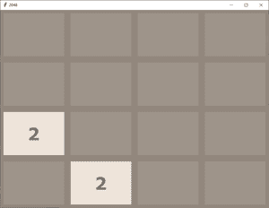
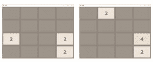
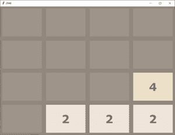
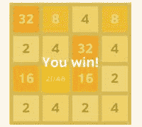
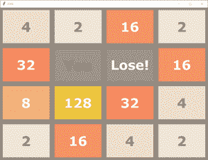

# 2048 Python 游戏

> 原文:[https://www.geeksforgeeks.org/2048-game-in-python/](https://www.geeksforgeeks.org/2048-game-in-python/)

在本文中，我们将通过 python 代码和逻辑来设计一款你在智能手机中经常玩的 2048 游戏。如果不熟悉游戏，强烈建议先玩游戏，这样可以了解它的基本功能。

**如何玩 2048 :**

**1。**有一个 4*4 的网格，可以填充任意数字。最初，两个随机单元格中填充了 2。休息区是空的。



**2。**我们必须按下四个键中的任何一个才能上下左右移动。当我们按下任何键时，单元格的元素会朝这个方向移动，这样，如果任何两个相同的数字包含在特定的行(在向左或向右移动的情况下)或列(在向上和向下移动的情况下)中，它们就会相加，并且那个方向的极端单元格会用这个数字填充自己，而其余的单元格会再次变空。



**3。**在这个网格压缩之后，任何随机的空单元格都会被 2 填充。



**4。**按照上述过程，我们必须通过相加使元素加倍，并在任何一个单元格中生成 2048。如果我们能做到这一点，我们就赢了。



**5。**但是如果在游戏过程中没有空的单元格可以填充新的 2，那么游戏结束。



在上述过程中，您可以从 2048 游戏的图形用户界面中看到快照。但是所有的逻辑都在主代码里。因此，为了单独理解其背后的逻辑，我们可以假设上面的网格是一个 4*4 矩阵(一个有四行四列的列表)。你可以在下面看到上面游戏不带 GUI 的输入输出方式。

**示例:**

```
Commands are as follows : 
'W' or 'w' : Move Up
'S' or 's' : Move Down
'A' or 'a' : Move Left
'D' or 'd' : Move Right
[0, 0, 0, 0]
[0, 0, 0, 0]
[0, 0, 0, 0]
[0, 0, 2, 0]
Press the command : a
GAME NOT OVER
[0, 0, 0, 2]
[0, 0, 0, 0]
[0, 0, 0, 0]
[2, 0, 0, 0]
Press the command : s
GAME NOT OVER
[0, 0, 0, 0]
[0, 0, 0, 0]
[0, 0, 2, 0]
[2, 0, 0, 2]
Press the command : d
GAME NOT OVER
[0, 0, 0, 0]
[0, 0, 0, 0]
[2, 0, 0, 2]
[0, 0, 0, 4]
Press the command : a
GAME NOT OVER
[0, 2, 0, 0]
[0, 0, 0, 0]
[4, 0, 0, 0]
[4, 0, 0, 0]
Press the command : s
GAME NOT OVER
[0, 0, 0, 0]
[0, 0, 0, 0]
[0, 0, 0, 0]
[8, 2, 0, 2]
.
.
.
And the series of input output will go on till we lose or win!
```

**编程方式:**

1.  我们将设计每个逻辑功能，比如我们正在执行左扫，然后我们将通过反转矩阵和执行左扫将其用于右扫。
2.  向上移动可以通过转置然后向左移动来完成。
3.  向下移动可以通过向右转置来完成。
4.  程序中的所有逻辑都在注释中详细解释。强烈建议浏览所有评论。

下面我们有两个 python 文件，一个是包含主驱动代码的 2048.py，另一个是包含所有用到的函数的 logic.py。logic.py 应该在 2048.py 中导入才能使用这些函数。只需将这两个文件放在同一个文件夹中，然后运行 2048.py 就会完美地工作。

**logic.py**

## 蟒蛇 3

```
# logic.py to be
# imported in the 2048.py file

# importing random package
# for methods to generate random
# numbers.
import random

# function to initialize game / grid
# at the start
def start_game():

    # declaring an empty list then
    # appending 4 list each with four
    # elements as 0.
    mat =[]
    for i in range(4):
        mat.append([0] * 4)

    # printing controls for user
    print("Commands are as follows : ")
    print("'W' or 'w' : Move Up")
    print("'S' or 's' : Move Down")
    print("'A' or 'a' : Move Left")
    print("'D' or 'd' : Move Right")

    # calling the function to add
    # a new 2 in grid after every step
    add_new_2(mat)
    return mat

# function to add a new 2 in
# grid at any random empty cell
def add_new_2(mat):

   # choosing a random index for
   # row and column.
    r = random.randint(0, 3)
    c = random.randint(0, 3)

    # while loop will break as the
    # random cell chosen will be empty
    # (or contains zero)
    while(mat[r] != 0):
        r = random.randint(0, 3)
        c = random.randint(0, 3)

    # we will place a 2 at that empty
    # random cell.
    mat[r] = 2

# function to get the current
# state of game
def get_current_state(mat):

    # if any cell contains
    # 2048 we have won
    for i in range(4):
        for j in range(4):
            if(mat[i][j]== 2048):
                return 'WON'

    # if we are still left with
    # atleast one empty cell
    # game is not yet over
    for i in range(4):
        for j in range(4):
            if(mat[i][j]== 0):
                return 'GAME NOT OVER'

    # or if no cell is empty now
    # but if after any move left, right,
    # up or down, if any two cells
    # gets merged and create an empty
    # cell then also game is not yet over
    for i in range(3):
        for j in range(3):
            if(mat[i][j]== mat[i + 1][j] or mat[i][j]== mat[i][j + 1]):
                return 'GAME NOT OVER'

    for j in range(3):
        if(mat[3][j]== mat[3][j + 1]):
            return 'GAME NOT OVER'

    for i in range(3):
        if(mat[i][3]== mat[i + 1][3]):
            return 'GAME NOT OVER'

    # else we have lost the game
    return 'LOST'

# all the functions defined below
# are for left swap initially.

# function to compress the grid
# after every step before and
# after merging cells.
def compress(mat):

    # bool variable to determine
    # any change happened or not
    changed = False

    # empty grid
    new_mat = []

    # with all cells empty
    for i in range(4):
        new_mat.append([0] * 4)

    # here we will shift entries
    # of each cell to it's extreme
    # left row by row
    # loop to traverse rows
    for i in range(4):
        pos = 0

        # loop to traverse each column
        # in respective row
        for j in range(4):
            if(mat[i][j] != 0):

                # if cell is non empty then
                # we will shift it's number to
                # previous empty cell in that row
                # denoted by pos variable
                new_mat[i][pos] = mat[i][j]

                if(j != pos):
                    changed = True
                pos += 1

    # returning new compressed matrix
    # and the flag variable.
    return new_mat, changed

# function to merge the cells
# in matrix after compressing
def merge(mat):

    changed = False

    for i in range(4):
        for j in range(3):

            # if current cell has same value as
            # next cell in the row and they
            # are non empty then
            if(mat[i][j] == mat[i][j + 1] and mat[i][j] != 0):

                # double current cell value and
                # empty the next cell
                mat[i][j] = mat[i][j] * 2
                mat[i][j + 1] = 0

                # make bool variable True indicating
                # the new grid after merging is
                # different.
                changed = True

    return mat, changed

# function to reverse the matrix
# means reversing the content of
# each row (reversing the sequence)
def reverse(mat):
    new_mat =[]
    for i in range(4):
        new_mat.append([])
        for j in range(4):
            new_mat[i].append(mat[i][3 - j])
    return new_mat

# function to get the transpose
# of matrix means interchanging
# rows and column
def transpose(mat):
    new_mat = []
    for i in range(4):
        new_mat.append([])
        for j in range(4):
            new_mat[i].append(mat[j][i])
    return new_mat

# function to update the matrix
# if we move / swipe left
def move_left(grid):

    # first compress the grid
    new_grid, changed1 = compress(grid)

    # then merge the cells.
    new_grid, changed2 = merge(new_grid)

    changed = changed1 or changed2

    # again compress after merging.
    new_grid, temp = compress(new_grid)

    # return new matrix and bool changed
    # telling whether the grid is same
    # or different
    return new_grid, changed

# function to update the matrix
# if we move / swipe right
def move_right(grid):

    # to move right we just reverse
    # the matrix
    new_grid = reverse(grid)

    # then move left
    new_grid, changed = move_left(new_grid)

    # then again reverse matrix will
    # give us desired result
    new_grid = reverse(new_grid)
    return new_grid, changed

# function to update the matrix
# if we move / swipe up
def move_up(grid):

    # to move up we just take
    # transpose of matrix
    new_grid = transpose(grid)

    # then move left (calling all
    # included functions) then
    new_grid, changed = move_left(new_grid)

    # again take transpose will give
    # desired results
    new_grid = transpose(new_grid)
    return new_grid, changed

# function to update the matrix
# if we move / swipe down
def move_down(grid):

    # to move down we take transpose
    new_grid = transpose(grid)

    # move right and then again
    new_grid, changed = move_right(new_grid)

    # take transpose will give desired
    # results.
    new_grid = transpose(new_grid)
    return new_grid, changed

# this file only contains all the logic
# functions to be called in main function
# present in the other file
```

## 蟒蛇 3

```
# logic.py to be
# imported in the 2048.py file

# importing random package
# for methods to generate random
# numbers.
import random

# function to initialize game / grid
# at the start
def start_game():

    # declaring an empty list then
    # appending 4 list each with four
    # elements as 0.
    mat =[]
    for i in range(4):
        mat.append([0] * 4)

    # printing controls for user
    print("Commands are as follows : ")
    print("'W' or 'w' : Move Up")
    print("'S' or 's' : Move Down")
    print("'A' or 'a' : Move Left")
    print("'D' or 'd' : Move Right")

    # calling the function to add
    # a new 2 in grid after every step
    add_new_2(mat)
    return mat

# function to add a new 2 in
# grid at any random empty cell
def add_new_2(mat):

   # choosing a random index for
   # row and column.
    r = random.randint(0, 3)
    c = random.randint(0, 3)

    # while loop will break as the
    # random cell chosen will be empty
    # (or contains zero)
    while(mat[r] != 0):
        r = random.randint(0, 3)
        c = random.randint(0, 3)

    # we will place a 2 at that empty
    # random cell.
    mat[r] = 2

# function to get the current
# state of game
def get_current_state(mat):

    # if any cell contains
    # 2048 we have won
    for i in range(4):
        for j in range(4):
            if(mat[i][j]== 2048):
                return 'WON'

    # if we are still left with
    # atleast one empty cell
    # game is not yet over
    for i in range(4):
        for j in range(4):
            if(mat[i][j]== 0):
                return 'GAME NOT OVER'

    # or if no cell is empty now
    # but if after any move left, right,
    # up or down, if any two cells
    # gets merged and create an empty
    # cell then also game is not yet over
    for i in range(3):
        for j in range(3):
            if(mat[i][j]== mat[i + 1][j] or mat[i][j]== mat[i][j + 1]):
                return 'GAME NOT OVER'

    for j in range(3):
        if(mat[3][j]== mat[3][j + 1]):
            return 'GAME NOT OVER'

    for i in range(3):
        if(mat[i][3]== mat[i + 1][3]):
            return 'GAME NOT OVER'

    # else we have lost the game
    return 'LOST'

# all the functions defined below
# are for left swap initially.

# function to compress the grid
# after every step before and
# after merging cells.
def compress(mat):

    # bool variable to determine
    # any change happened or not
    changed = False

    # empty grid
    new_mat = []

    # with all cells empty
    for i in range(4):
        new_mat.append([0] * 4)

    # here we will shift entries
    # of each cell to it's extreme
    # left row by row
    # loop to traverse rows
    for i in range(4):
        pos = 0

        # loop to traverse each column
        # in respective row
        for j in range(4):
            if(mat[i][j] != 0):

                # if cell is non empty then
                # we will shift it's number to
                # previous empty cell in that row
                # denoted by pos variable
                new_mat[i][pos] = mat[i][j]

                if(j != pos):
                    changed = True
                pos += 1

    # returning new compressed matrix
    # and the flag variable.
    return new_mat, changed

# function to merge the cells
# in matrix after compressing
def merge(mat):

    changed = False

    for i in range(4):
        for j in range(3):

            # if current cell has same value as
            # next cell in the row and they
            # are non empty then
            if(mat[i][j] == mat[i][j + 1] and mat[i][j] != 0):

                # double current cell value and
                # empty the next cell
                mat[i][j] = mat[i][j] * 2
                mat[i][j + 1] = 0

                # make bool variable True indicating
                # the new grid after merging is
                # different.
                changed = True

    return mat, changed

# function to reverse the matrix
# maens reversing the content of
# each row (reversing the sequence)
def reverse(mat):
    new_mat =[]
    for i in range(4):
        new_mat.append([])
        for j in range(4):
            new_mat[i].append(mat[i][3 - j])
    return new_mat

# function to get the transpose
# of matrix means interchanging
# rows and column
def transpose(mat):
    new_mat = []
    for i in range(4):
        new_mat.append([])
        for j in range(4):
            new_mat[i].append(mat[j][i])
    return new_mat

# function to update the matrix
# if we move / swipe left
def move_left(grid):

    # first compress the grid
    new_grid, changed1 = compress(grid)

    # then merge the cells.
    new_grid, changed2 = merge(new_grid)

    changed = changed1 or changed2

    # again compress after merging.
    new_grid, temp = compress(new_grid)

    # return new matrix and bool changed
    # telling whether the grid is same
    # or different
    return new_grid, changed

# function to update the matrix
# if we move / swipe right
def move_right(grid):

    # to move right we just reverse
    # the matrix
    new_grid = reverse(grid)

    # then move left
    new_grid, changed = move_left(new_grid)

    # then again reverse matrix will
    # give us desired result
    new_grid = reverse(new_grid)
    return new_grid, changed

# function to update the matrix
# if we move / swipe up
def move_up(grid):

    # to move up we just take
    # transpose of matrix
    new_grid = transpose(grid)

    # then move left (calling all
    # included functions) then
    new_grid, changed = move_left(new_grid)

    # again take transpose will give
    # desired results
    new_grid = transpose(new_grid)
    return new_grid, changed

# function to update the matrix
# if we move / swipe down
def move_down(grid):

    # to move down we take transpose
    new_grid = transpose(grid)

    # move right and then again
    new_grid, changed = move_right(new_grid)

    # take transpose will give desired
    # results.
    new_grid = transpose(new_grid)
    return new_grid, changed

# this file only contains all the logic
# functions to be called in main function
# present in the other file
```

**2048.py**

## 蟒蛇 3

```
# 2048.py

# importing the logic.py file
# where we have written all the
# logic functions used.
import logic

# Driver code
if __name__ == '__main__':

# calling start_game function
# to initialize the matrix
    mat = logic.start_game()

while(True):

    # taking the user input
    # for next step
    x = input("Press the command : ")

    # we have to move up
    if(x == 'W' or x == 'w'):

        # call the move_up function
        mat, flag = logic.move_up(mat)

        # get the current state and print it
        status = logic.get_current_state(mat)
        print(status)

        # if game not ove then continue
        # and add a new two
        if(status == 'GAME NOT OVER'):
            logic.add_new_2(mat)

        # else break the loop
        else:
            break

    # the above process will be followed
    # in case of each type of move
    # below

    # to move down
    elif(x == 'S' or x == 's'):
        mat, flag = logic.move_down(mat)
        status = logic.get_current_state(mat)
        print(status)
        if(status == 'GAME NOT OVER'):
            logic.add_new_2(mat)
        else:
            break

    # to move left
    elif(x == 'A' or x == 'a'):
        mat, flag = logic.move_left(mat)
        status = logic.get_current_state(mat)
        print(status)
        if(status == 'GAME NOT OVER'):
            logic.add_new_2(mat)
        else:
            break

    # to move right
    elif(x == 'D' or x == 'd'):
        mat, flag = logic.move_right(mat)
        status = logic.get_current_state(mat)
        print(status)
        if(status == 'GAME NOT OVER'):
            logic.add_new_2(mat)
        else:
            break
    else:
        print("Invalid Key Pressed")

    # print the matrix after each
    # move.
    print(mat)
```

**输出:**

<video class="wp-video-shortcode" id="video-455072-1" width="640" height="360" preload="metadata" controls=""><source type="video/mp4" src="https://media.geeksforgeeks.org/wp-content/uploads/20200718161629/output.1.mp4?_=1">[https://media.geeksforgeeks.org/wp-content/uploads/20200718161629/output.1.mp4](https://media.geeksforgeeks.org/wp-content/uploads/20200718161629/output.1.mp4)</video>