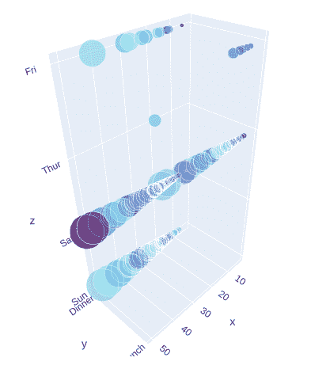

# Python 中使用 Plotly 的三维气泡图

> 原文:[https://www . geesforgeks . org/3d-bubble-chart-use-plotly-in-python/](https://www.geeksforgeeks.org/3d-bubble-chart-using-plotly-in-python/)

**Plotly** 是一个 Python 库，用来设计图形，尤其是交互图形。它可以绘制各种图形和图表，如直方图、条形图、箱线图、展开图等。它主要用于数据分析以及财务分析。plotly 是一个交互式可视化库。

## 绘图中的三维气泡图

可以使用 plotly.express 类的散点图 3d()方法创建**气泡图**。气泡图是一种数据可视化，有助于在三维图中显示多个圆(气泡)，与在三维散点图中相同。气泡图主要用于描述和显示数值变量之间的关系。

**示例 1:** 使用虹膜数据集

## 蟒蛇 3

```py
import plotly.express as px

df = px.data.iris()
fig = px.scatter_3d(df, x='sepal_width',
                    y='sepal_length', 
                    z='petal_width',
                    size='petal_length', 
                    color='species')

fig.show()
```

**输出:**


**示例 2:** 使用 tips 数据集

## 蟒蛇 3

```py
import plotly.express as px

df = px.data.tips()
fig = px.scatter_3d(df, x='total_bill',
                    y='day', z='time',
                    size='tip', color='sex')

fig.show()
```

**输出:**


## 自定义颜色栏

可以使用 graph_objects 类的散点 3D()方法的颜色选项进行编辑。让我们看下面的例子来更好地理解这个话题。

**示例:**

## 蟒蛇 3

```py
import plotly.express as px
import plotly.graph_objects as go

df = px.data.tips()

fig = go.Figure(go.Scatter3d(
    x = df['total_bill'],
    y = df['time'],
    z = df['day'],
    mode = 'markers',
    marker = dict(
        color = df['tip'],
        size = df['total_bill'],
        colorscale=[[0, 'rgb(15, 10, 172)'], 
                    [.3, 'rgb(150, 255, 255)'], 
                    [1, 'rgb(100, 10, 100)']]
        )
))

fig.show()
```

**输出:**

