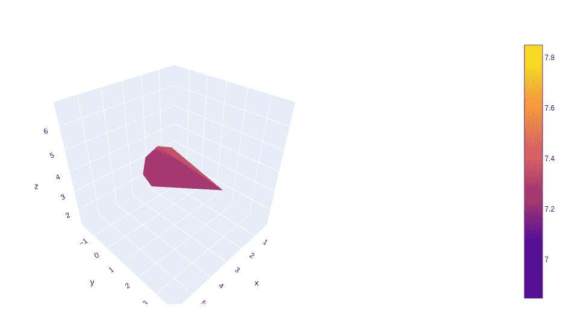
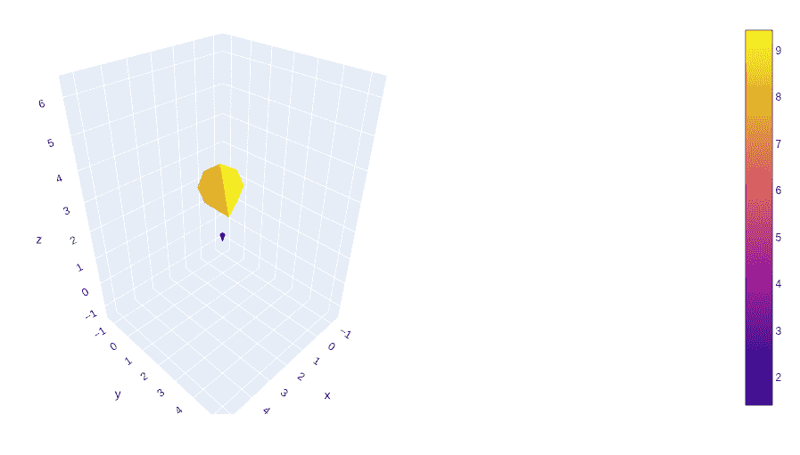
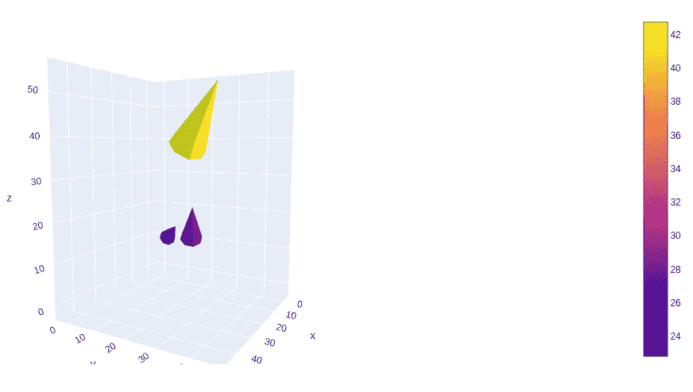

# 在 Python 中使用 Plotly 绘制三维圆锥图

> 原文:[https://www . geesforgeks . org/3d-cone-plots-use-plotly-in-python/](https://www.geeksforgeeks.org/3d-cone-plots-using-plotly-in-python/)

**Plotly** 是一个 Python 库，用来设计图形，尤其是交互图形。它可以绘制各种图形和图表，如直方图、条形图、箱线图、展开图等。它主要用于数据分析以及财务分析。plotly 是一个交互式可视化库。

## 绘图中的三维圆锥图

在剧情中，圆锥图是一个 3d 版的 2D 颤图。3d 向量代表向量的方向和范数。

*   三维坐标是定义矢量坐标的 X、Y 和 Z。
*   矢量场的三维坐标是 U、V 和 W，它们被定义为矢量场。

> **语法:** plotly.graph_objects。cone(arg =无，anchor =无，autocolorscale =无，cauto =无，cmax =无，cmid =无，cmin =无，coloraxis =无，colorbar =无，colorscale =无，customdata =无，customdatasrc =无，气垫 info =无，气垫 info src =无，气垫 name =无，气垫 template =无，气垫 text =无，气垫 textsrc =无，ids =无，idssrc =无，legendgroup =无，lighting =无，lightposition
> 
> **参数:**
> 
> **u**–设置矢量场的 x 分量。
> 
> **v**–设置矢量场的 y 分量。
> 
> **w**–设置矢量场的 z 分量。
> 
> **x**–设置矢量场和显示的圆锥体的 x 坐标。
> 
> **y**–设置矢量场和显示的圆锥体的 y 坐标。
> 
> **z**–设置矢量场和显示的圆锥体的 z 坐标。

**示例:**

## 蟒蛇 3

```py
import plotly.graph_objects as go

fig = go.Figure(data=go.Cone(x=[3],
                             y=[1],
                             z=[4],
                             u=[1],
                             v=[7],
                             w=[2]))

fig.show()
```

**输出:**



## 绘制多个三维圆锥体

在图中，多个 3d 圆锥体使用参数场景，在该图中，多个圆锥体显示在单个图形中，这有助于区分彼此。它可以通过在 x、y、z、u、v、w 参数中传递多个值来创建。

**例 1:**

## 蟒蛇 3

```py
import plotly.graph_objects as go

fig = go.Figure(data=go.Cone(x=[1,3], 
                             y=[1,3],
                             z=[1,4],
                             u=[1,6],
                             v=[1,7],
                             w=[0,2]))

fig.show()
```

**输出:**



**例 2:**

## 蟒蛇 3

```py
import plotly.graph_objects as go

fig = go.Figure(data=go.Cone(x=[11,31, 12], 
                             y=[12,32, 21],
                             z=[13,41, 15],
                             u=[14,16, 17],
                             v=[15,27, 10],
                             w=[10,29, 21]))

fig.show()
```

**输出:**

