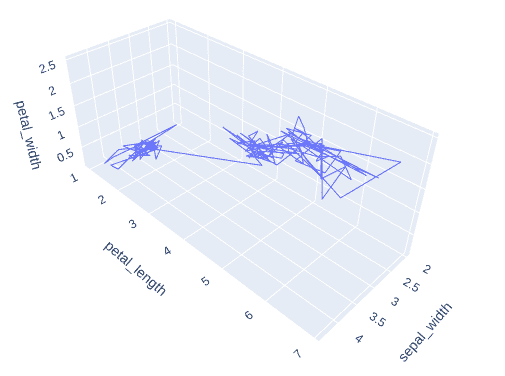
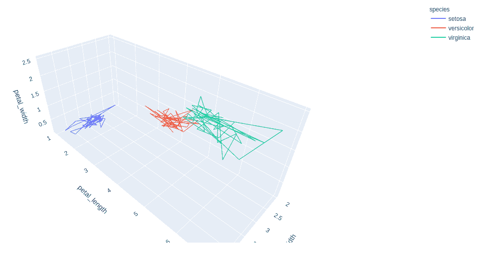
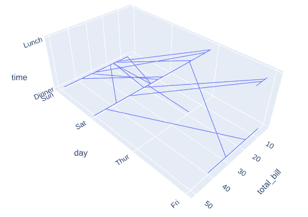
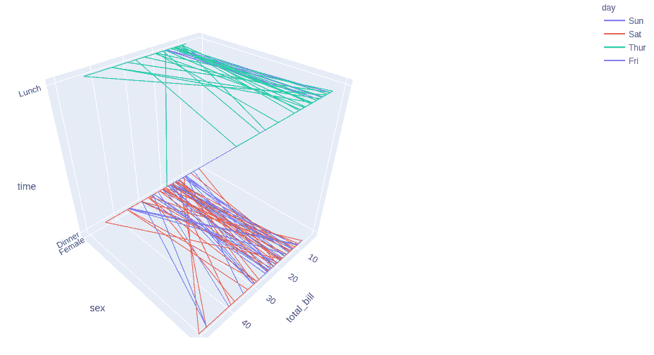

# 在 Python 中使用 Plotly 绘制三维线图

> 原文:[https://www . geesforgeks . org/3d-line-plots-use-plotly-in-python/](https://www.geeksforgeeks.org/3d-line-plots-using-plotly-in-python/)

**Plotly** 是一个 Python 库，用来设计图形，尤其是交互图形。它可以绘制各种图形和图表，如直方图、条形图、箱线图、展开图等。它主要用于数据分析以及财务分析。plotly 是一个交互式可视化库

## 情节中的线条图

**plotly 中的线图**是 plotly 非常容易访问和显著的补充，它管理各种类型的数据和汇编易于使用的统计数据。使用 px.line_3d，每个数据位置被表示为三维空间中折线标记的顶点(该位置由 x、y 和 z 列给出)。折线图将一系列数字数据显示为由线连接的点。它可视化地显示了两个数据趋势。主要的生产功能是它可以显示成千上万的数据点，而无需滚动。可以使用 plotly.express 类的 **line_3d()** 方法创建。

> **语法:**plot . express . line _ 3d(data _ frame =无，x =无，y =无，z =无，color =无，line _ dash =无，text =无，line _ group =无，hover _ name =无，hover _ data =无，custom _ data =无，error _ x =无，error _ x _ 减号=无，error _ y =无，error _ y _ 减号=无，error _ z =无，error _ z _ 减号=无，animation _ frame =无，animation _ group =无
> 
> **参数:**
> 
> **data_frame:** 需要传递此参数才能使用列名(而不是关键字名)。
> 
> **x，y，z:**data _ frame 中列的名称，或者 pandas Series 或 array_like 对象。此列或 array_like 中的值用于在笛卡尔坐标中分别沿 x、y 和 z 轴定位标记。
> 
> **颜色:**data _ frame 中列的名称，或者 pandas Series 或 array_like 对象。此列或 array_like 中的值用于为标记指定颜色。

**示例 1:** 使用虹膜数据集

## 蟒蛇 3

```
import plotly.express as px

df = px.data.iris()

fig = px.line_3d(df, x="sepal_width",
                 y="petal_length", 
                 z="petal_width")
fig.show()
```

**输出:**



**示例 2:** 带颜色参数的虹膜数据集

## 蟒蛇 3

```
import plotly.express as px

df = px.data.iris()

fig = px.line_3d(df, x="sepal_width",
                 y="petal_length", 
                 z="petal_width", 
                 color="species")
fig.show()
```

**输出:**



**示例 3:** 使用 tips 数据集

## 蟒蛇 3

```
import plotly.express as px

df = px.data.tips()

fig = px.line_3d(df, x="total_bill", 
                 y="day", z="time")
fig.show()
```

**输出:**



**示例 4:** 使用颜色参数提示数据集。

## 蟒蛇 3

```
import plotly.express as px

df = px.data.tips()

fig = px.line_3d(df, x="total_bill", y="day", z="time")
fig.show()
```

**输出:**

