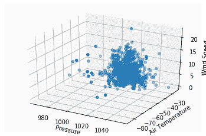

# 使用 Python 从 MongoDB 图谱中三维绘制样本数据

> 原文:[https://www . geesforgeks . org/3d-绘图-样本-数据-来自-MongoDB-atlas-使用-python/](https://www.geeksforgeeks.org/3d-plotting-sample-data-from-mongodb-atlas-using-python/)

**[MongoDB](https://www.geeksforgeeks.org/mongodb-and-python/)** ，最受欢迎的 NoSQL 数据库，是一个开源的面向文档的数据库。术语“NoSQL”的意思是“非关系的”。这意味着 MongoDB 不是基于类似表的关系数据库结构，而是提供了一种完全不同的数据存储和检索机制。这种存储格式称为 BSON(类似于 JSON 格式)。


## 绘制蒙古数据库地图集的样本数据

在开始绘制示例数据之前，请确保您已经在蒙古数据库云地图集上创建了一个帐户。如果您尚未创建，请遵循以下步骤。

*   从[这里](https://www.mongodb.com/cloud/atlas)打开 MongoDB 图谱云。
*   通过选择适合您的软件包来创建帐户(您也可以选择适合本文和学习目的的免费版本)。
*   单击位于左侧菜单栏的集群视图。
*   点击**椭圆按钮`(...)`** ，选择**加载样本数据集**。
*   添加样本数据集后，单击连接按钮。
    
*   然后将该 IP 地址列入白名单(选择您当前的 IP 地址或键入 0.0.0.0/0 IP 以允许它从任何地方访问。单击下图所示的按钮。
    
*   然后单击连接到应用程序按钮。
*   复制 cluster_uri 并将其粘贴到“课程 _cluster_uri”中。

**进场:**

*   导入 PyMongo 和 Axes3d 以及 Matplotlib。
*   登录进入 MongoDB 地图云。
*   按照上面的步骤粘贴“课程 _ 集群 _uri”。
*   使用“pymongo”获取客户端。MongoClient(课程 _url)”。
*   现在，通过移除明显是坏数据的异常值，将查询设置为过滤条件和标准。
*   将光标转换为列表。
*   现在将绘图设置为“分散/条形/历史”，并设置标题、X 轴标签、Y 轴标签和图例。
*   别忘了输入 plt.show()。

下面是实现。

```py
# Using PyMongo to create plots 
import pymongo
from mpl_toolkits.mplot3d import Axes3D
import matplotlib.pyplot as plt

course_cluster_uri = 'your_connection_string'
course_client = pymongo.MongoClient(course_cluster_uri)

# sample dataset
db = course_client['sample_weatherdata']

# sample collection
weather_data = db['data'] 

# remove outliers that are clearly bad data
query = { 
    'pressure.value': { '$lt': 9999 }, 
    'airTemperature.value': { '$lt': 9999 },
    'wind.speed.rate': { '$lt': 500 },
}

# convert our cursor into a list
l = list(weather_data.find(query).limit(1000))

# pull out the 3 variables we care
# about into their own respective lists
pressures = [x['pressure']['value'] for x in l]
air_temps = [x['airTemperature']['value'] for x in l]
wind_speeds = [x['wind']['speed']['rate'] for x in l]

# here you'll write the code to plot pressures,
# air_temps, and wind_speeds in a 3D plot
plt.clf()
fig = plt.figure()

ax = fig.add_subplot(111, projection = '3d')
ax.scatter(pressures, air_temps, wind_speeds)

ax.set_xlabel("Pressure")
ax.set_ylabel("Air Temperature")
ax.set_zlabel("Wind Speed")

plt.show()
```

