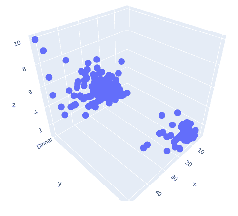
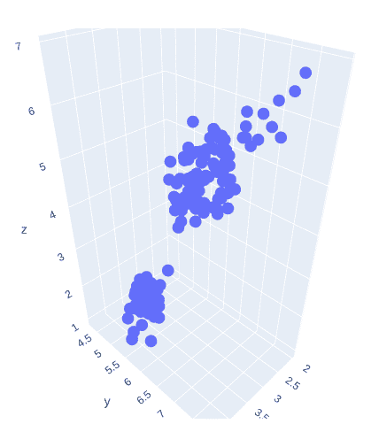
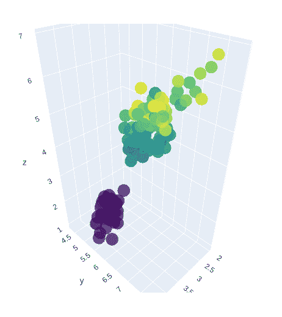
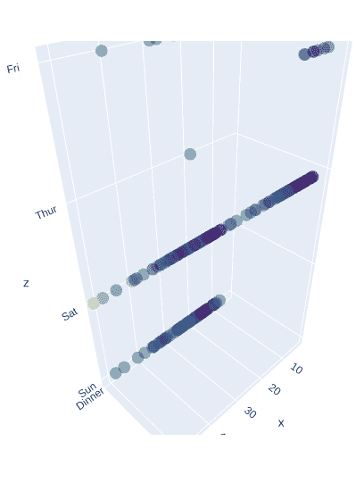

# 在 Plotly-Python 中使用 graph_objects 类的三维散点图

> 原文:[https://www . geeksforgeeks . org/3d-散点图-使用-graph _ objects-class-in-plotly-python/](https://www.geeksforgeeks.org/3d-scatter-plot-using-graph_objects-class-in-plotly-python/)

**Plotly** 是一个 Python 库，用来设计图形，尤其是交互图形。它可以绘制各种图形和图表，如直方图、条形图、箱线图、展开图等。它主要用于数据分析以及财务分析。plotly 是一个交互式可视化库。

## 使用图形对象类的散点图

如果一个情节性的表达不能提供一个很好的起点，那么可以使用 **go。plotly.graph_objects 中的散点 3D** 类。散点图是那些图表，其中数据点以水平和垂直轴表示，以显示一个变量如何影响另一个变量。属性的模式决定数据点的外观。

> **语法:** plotly.graph_objects。散点 3d(arg =无，connectgaps =无，customdata =无，customdatasrc =无，error _ x =无，error _ y =无，error _ z =无，气垫信息=无，气垫信息 src =无，气垫标签=无，气垫模板=无，气垫模板 src =无，气垫文本=无，气垫文本 src =无，id =无，idssrc =无，legendgroup =无，线条=无，标记=无，元=无，metasrc =无，模式=无，名称=无，不透明度=无
> 
> **参数:**
> 
> **x**–设置 x 坐标。
> 
> **y**–设置 y 坐标。
> 
> **z**–设置 z 坐标。
> 
> **模式**–确定该散射轨迹的绘制模式。

**例 1:**

## 蟒蛇 3

```py
import plotly.express as px
import plotly.graph_objects as go

df = px.data.tips()

fig = go.Figure(data =[go.Scatter3d(x = df['total_bill'],
                                   y = df['time'],
                                   z = df['tip'],
                                   mode ='markers')])
fig.show()
```

**输出:**



**例 2:**

## 蟒蛇 3

```py
import plotly.express as px
import plotly.graph_objects as go

df = px.data.iris()

fig = go.Figure(data =[go.Scatter3d(x = df['sepal_width'],
                                   y = df['sepal_length'],
                                   z = df['petal_length'],
                                   mode ='markers')])
fig.show()
```

**输出:**



## 使用颜色缩放和标记样式呈现三维散点图

通俗地说，颜色缩放和标记样式是更有效地表示数据的一种方式，它使数据更容易理解。

**例 1:**

## 蟒蛇 3

```py
import plotly.express as px
import plotly.graph_objects as go

df = px.data.iris()

fig = go.Figure(data =[go.Scatter3d(x = df['sepal_width'],
                                   y = df['sepal_length'],
                                   z = df['petal_length'],
                                   mode ='markers', 
                                   marker = dict(
                                     size = 12,
                                     color = df['petal_width'],
                                     colorscale ='Viridis',
                                     opacity = 0.8
                                   )
)])

fig.show()
```

**输出:**



**例 2:**

## 蟒蛇 3

```py
import plotly.express as px
import plotly.graph_objects as go

df = px.data.tips()

fig = go.Figure(data =[go.Scatter3d(x = df['total_bill'],
                                   y = df['time'],
                                   z = df['day'],
                                   mode ='markers',
                                   marker = dict(
                                     color = df['tip'],
                                     colorscale ='Viridis',
                                     opacity = 0.5
                                   )
)])
fig.show()
```

**输出:**

