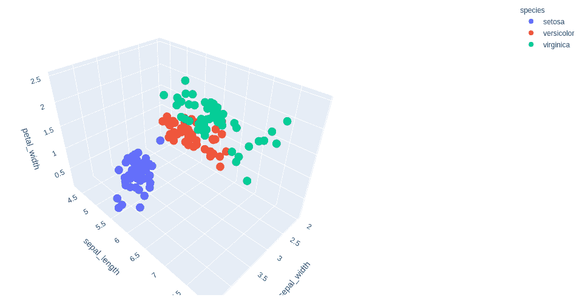
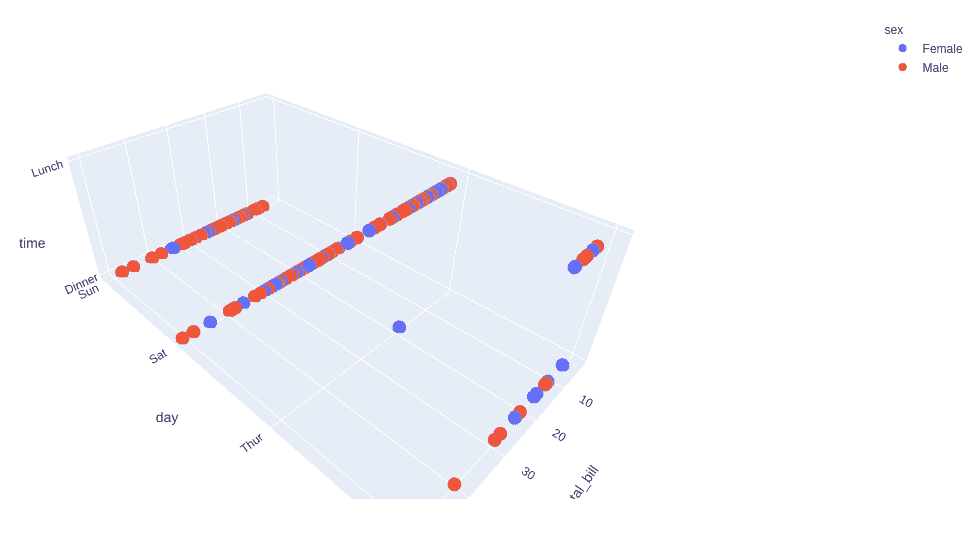

# 使用 Python 中的 Plotly 绘制三维散点图

> 原文:[https://www . geesforgeks . org/3d-散点图-使用 python 中的 plotly/](https://www.geeksforgeeks.org/3d-scatter-plot-using-plotly-in-python/)

**Plotly** 是一个 Python 库，用来设计图形，尤其是交互图形。它可以绘制各种图形和图表，如直方图、条形图、箱线图、展开图等。它主要用于数据分析以及财务分析。plotly 是一个交互式可视化库。

## 绘图中的三维散点图

一个**散点图**可以和几个语义分组一起使用，这有助于很好地理解图形。他们可以绘制二维图形，在使用色调、大小和样式参数的语义时，通过映射多达三个额外的变量可以增强二维图形。所有参数控制用于识别不同子集的视觉语义。使用冗余语义有助于使图形更易于访问。可以使用 plotly.express 类的散点 _3d 函数来创建。

> **语法:**plot . express . scatter _ 3d(data _ frame =None，x=None，y=None，z=None，color=None，symbol=None，size=None，text=None，hover_name=None，hover_data=None，custom_data=None，error_x=None，error _ x _ 减=None，error_y=None，error_y 减=None，error_z=None，error _ z _ 减= None，animation_frame=None，animation_group=None，category_orders
> 
> **参数:**
> 
> **data _ frame****(*****data frame 或类似数组或 dict*****)–**此参数需要传递给要使用的列名(而不是关键字名)。
> 
> **x** **(str** ***或 int 或 Series 或类似数组的*****)–**或者是 data_frame 中某列的名称，或者是 pandas Series 或类似数组的对象。
> 
> **y** **(str** ***或 int 或 Series 或类似数组的*****)–**或者是 data_frame 中某列的名称，或者是 pandas Series 或类似数组的对象。
> 
> **color**(**str***T5】或 int 或 Series 或 array-like***)–**或者是 data_frame 中的列名，或者是 pandas Series 或 array-like 对象。此列或 array_like 中的值用于为标记指定颜色。

**示例 1:** 使用虹膜数据集

## 蟒蛇 3

```
import plotly.express as px

df = px.data.iris()

fig = px.scatter_3d(df, x = 'sepal_width', 
                    y = 'sepal_length', 
                    z = 'petal_width',
                    color = 'species')

fig.show()
```

**输出:**



**示例 2:** 使用 tips 数据集

## 蟒蛇 3

```
import plotly.express as px

df = px.data.tips()

fig = px.scatter_3d(df, x = 'total_bill', 
                    y = 'day', z = 'time',
                    color = 'sex')

fig.show()
```

**输出:**



## 自定义三维散点图

在 Plotly 中，通过 px .散点 _3d 的参数，可以为某个选项自定义图形的样式。

**示例 1:** 使用虹膜数据集。

## 蟒蛇 3

```
import plotly.express as px

df = px.data.iris()

fig = px.scatter_3d(df, x = 'sepal_width', 
                    y = 'sepal_length', 
                    z = 'petal_width',
                    color = 'species', 
                    size='petal_length',
                    size_max = 20, 
                    opacity = 0.5)

fig.show()
```

**输出:**


**示例 2:** 使用 tips 数据集

## 蟒蛇 3

```
import plotly.express as px

df = px.data.tips()

fig = px.scatter_3d(df, x = 'total_bill', 
                    y = 'day', 
                    z = 'time',
                    color = 'sex', 
                    size='tip',
                    size_max = 20,
                    opacity = 0.7)

fig.show()
```

**输出:**

