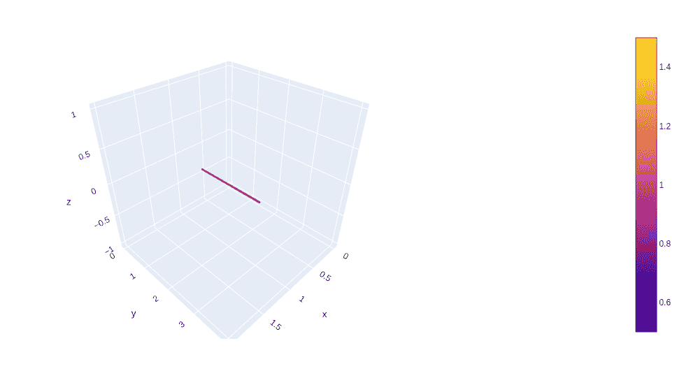
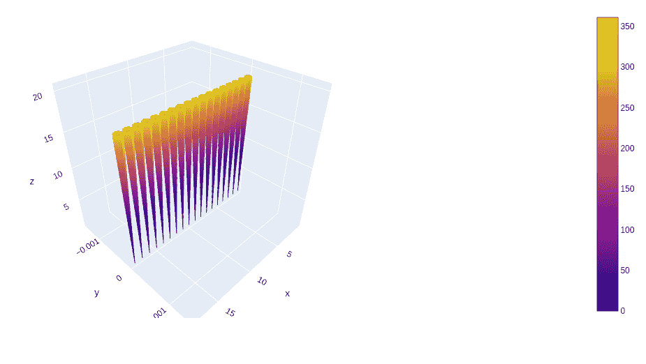

# 使用 Python 中的 Plotly 绘制三维流管图

> 原文:[https://www . geesforgeks . org/3d-stream tube-plots-use-plotly-in-python/](https://www.geeksforgeeks.org/3d-streamtube-plots-using-plotly-in-python/)

[**Plotly**](https://www.geeksforgeeks.org/getting-started-with-plotly-python/) 是一个 Python 库，用来设计图形，尤其是交互图形。它可以绘制各种图形和图表，如直方图、条形图、箱线图、展开图等。它主要用于数据分析以及财务分析。plotly 是一个交互式可视化库。

## 三维流管图

在管道绘图中，参数包括 X、Y 和 Z，它们用矢量场设置坐标。设置向量场的 X，Y 和 Z 分量的 u，V 和 W。流管是一个管状区域，被形成闭环的流线所包围。

> **语法:** plotly.graph_objects。stream tube(arg =无，气垫信息=无，显示比例=无，u =无，v =无，w =无，x =无，y =无，z =无，**kwargs)
> 
> **参数:**
> 
> **arg:** 与此构造函数或 plotly.graph_objects 实例兼容的属性集合。廉管道
> 
> **悬停信息:**确定悬停时出现哪些跟踪信息。如果设置了无或跳过，悬停时不会显示任何信息。但是，如果没有设置，点击和悬停事件仍然会触发。
> 
> **显示比例:**确定是否为此轨迹显示颜色条。
> 
> **u:** 设置矢量场的 x 分量。
> 
> **v:** 设置矢量场的 y 分量。
> 
> **w:** 设置矢量场的 z 分量。
> 
> **x:** 设置矢量场的 x 坐标。
> 
> **y:** 设置矢量场的 y 坐标。
> 
> **z:** 设置矢量场的 z 坐标。

**示例:**

## 蟒蛇 3

```py
import plotly.graph_objects as go

fig = go.Figure(data=go.Streamtube(x=[1, 1, 1], y=[1, 1, 2],
                                   z=[0, 0, 0], u=[0, 0, 0], 
                                   v=[1, 1, 1], w=[0, 0, 0]))
fig.show()
```

**输出:**



## 改变管径

管的直径可以通过矢量场的局部发散来确定。范数是成比例的，但是向量的方向是不同的，这导致了不同的散度场。

**示例:**

## 蟒蛇 3

```py
import plotly.graph_objects as go
import numpy as np

x, y, z = np.mgrid[0:20, 0:20, 0:20]
x = x.flatten()
y = y.flatten()
z = z.flatten()

u = np.zeros_like(x)
v = np.zeros_like(y)
w = z**2

fig = go.Figure(data=go.Streamtube(x=x, y=y, z=z, u=u, v=v, w=w))
fig.show()
```

**输出:**

