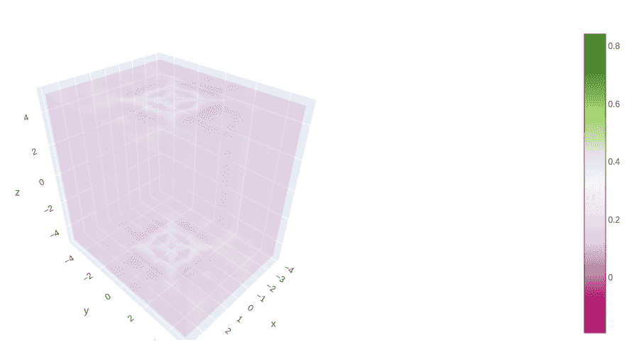
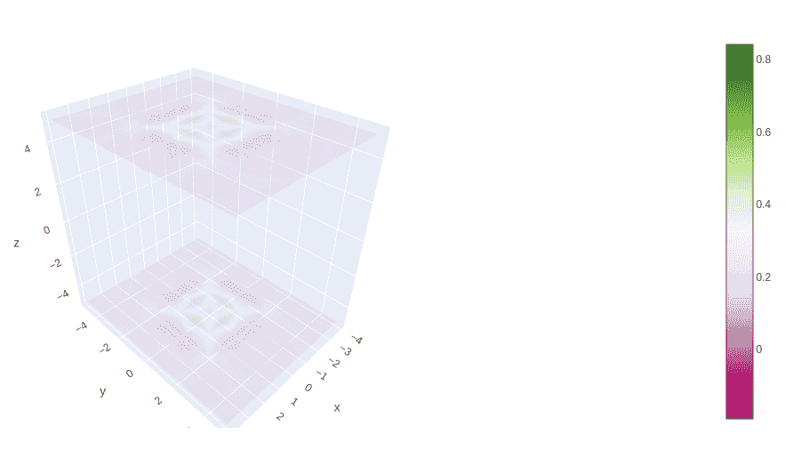
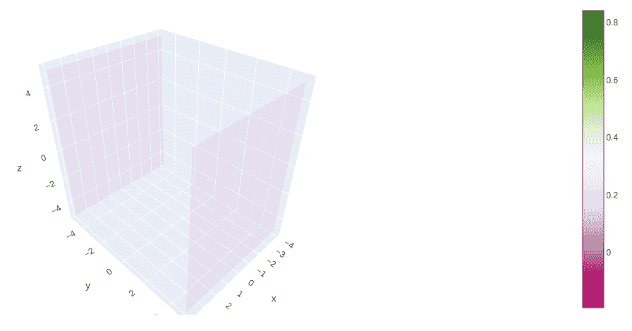
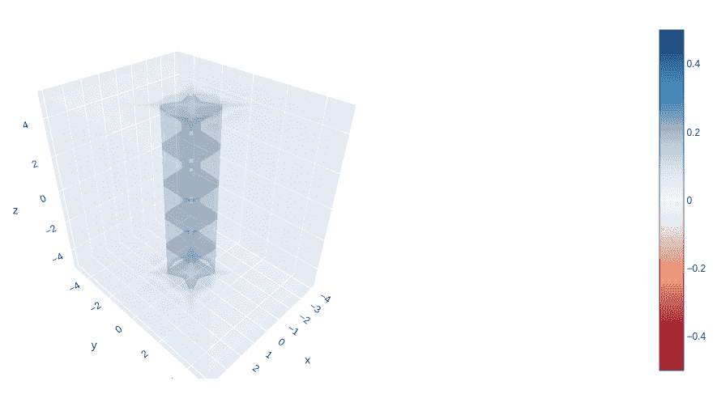

# 使用 Python 中的 Plotly 绘制三维体积图

> 原文:[https://www . geesforgeks . org/3d-volume-plots-use-plotly-in-python/](https://www.geeksforgeeks.org/3d-volume-plots-using-plotly-in-python/)

Plotly 是一个 Python 库，用于设计图形，尤其是交互式图形。它可以绘制各种图形和图表，如直方图、条形图、箱线图、展开图等。它主要用于数据分析以及财务分析。Plotly 是一个交互式可视化库。

## Plotly 中的体积图

体积图是带有 go.volume 的图，它显示了许多用于渲染体积的部分透明的等值面。go 的不透明度参数。体积产生深度效果并产生更好的体积渲染。三维体积可视化是一种允许观察和处理三维体积数据的方法。它用多边形和直线近似的曲面和边来表示三维对象。

> **语法:**plotly . graph _ objects . 3d _ Volume(arg =None，autocolorscale=None，caps=None，cauto=None，cmax=None，cmid=None，cmin=None，coloraxis=None，colorbar=None，colorscale=None，contour=None，customdata=None，customdatasrc =None，flatshading=None，气垫 info=None，气垫标签= None，气垫模板= None，气垫模板 src=None，气垫 text=None，气垫 textsrc
> 
> **参数:**
> 
> **X**–设置 X 轴上顶点的 X 坐标。
> 
> **Y**–设置 Y 轴上顶点的 Y 坐标。
> 
> **Z**–设置 Z 轴上顶点的 Z 坐标。
> 
> **值**–设置顶点的第四维(值)。

**示例:**

## 蟒蛇 3

```
import plotly.graph_objects as go
import numpy as np

x1 = np.linspace(-4, 4, 9) 
y1 = np.linspace(-5, 5, 11) 
z1 = np.linspace(-5, 5, 11) 

X, Y, Z = np.meshgrid(x1, y1, z1)

values = (np.sin(X**2 + Y**2))/(X**2 + Y**2)

fig = go.Figure(data=go.Volume(
    x=X.flatten(),
    y=Y.flatten(),
    z=Z.flatten(),
    value=values.flatten(),
    opacity=0.1,
    ))

fig.show()
```

**输出:**



## 在体积图中自定义大写

一般来说，为了更清晰地显示内表面，可以移除盖子。默认情况下，大写字母可见。

**例 1:**

## 蟒蛇 3

```
import plotly.graph_objects as go
import plotly.express as px
import numpy as np

df = px.data.tips()

x1 = np.linspace(-4, 4, 9) 
y1 = np.linspace(-5, 5, 11) 
z1 = np.linspace(-5, 5, 11) 

X, Y, Z = np.meshgrid(x1, y1, z1)

values = (np.sin(X**2 + Y**2))/(X**2 + Y**2)

fig = go.Figure(data=go.Volume(
    x=X.flatten(),
    y=Y.flatten(),
    z=Z.flatten(),
    value=values.flatten(),
    opacity=0.1, 
    caps= dict(x_show=False, y_show=False, z_show=True),
    ))
fig.show()
```

**输出:**



**例 2:**

## 蟒蛇 3

```
import plotly.graph_objects as go
import plotly.express as px
import numpy as np

df = px.data.tips()

x1 = np.linspace(-4, 4, 9) 
y1 = np.linspace(-5, 5, 11) 
z1 = np.linspace(-5, 5, 11) 

X, Y, Z = np.meshgrid(x1, y1, z1)

values = (np.sin(X**2 + Y**2))/(X**2 + Y**2)

fig = go.Figure(data=go.Volume(
    x=X.flatten(),
    y=Y.flatten(),
    z=Z.flatten(),
    value=values.flatten(),
    opacity=0.1,
    caps= dict(x_show=False, y_show=True, z_show=False),
    ))
fig.show()
```

**输出:**



## 自定义不透明度比例

在绘图中，可以定义自定义不透明度比例，将标量值与不透明度值成比例映射。该值从 0-1 给定，最大不透明度由不透明度关键字提供。

**示例:**

## 蟒蛇 3

```
import plotly.graph_objects as go
import plotly.express as px
import numpy as np

df = px.data.tips()

x1 = np.linspace(-4, 4, 9) 
y1 = np.linspace(-5, 5, 11) 
z1 = np.linspace(-5, 5, 11) 

X, Y, Z = np.meshgrid(x1, y1, z1)

values = (np.sin(X**2 + Y**2))/(X**2 + Y**2)

fig = go.Figure(data=go.Volume(
    x=X.flatten(),
    y=Y.flatten(),
    z=Z.flatten(), 
    isomin=-0.5,
    isomax=0.5,
    value=values.flatten(),
    opacity=0.1, 
    opacityscale=[[-0.5, 1], [-0.2, 0], [0.2, 0], [0.5, 1]],
    colorscale='RdBu'
    ))

fig.show()
```

**输出:**

