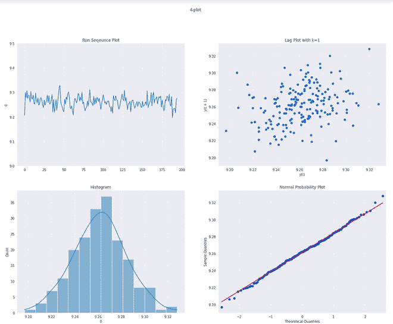

# 4-情节

> 原文:[https://www.geeksforgeeks.org/4-plot/](https://www.geeksforgeeks.org/4-plot/)

4 图是 4 种不同的图形探索性数据分析(EDA)工具的集合，其主要目的是测试大多数测量过程背后的假设。

4 图由以下内容组成:

*   **运行图:**运行序列图用于测试固定位置和变化。它有以下轴:
    *   **纵轴** : Y <sub>i</sub>
    *   **横轴** : i
*   **滞后图:**滞后图是一种散点图，其中一个变量滞后于另一个变量。这里，滞后指的是某段固定时间后变量的值。对数图可用于测试过程的随机性，并可给出关于过程分布的重要信息。
    *   **纵轴** : Y <sub>i</sub>
    *   **横轴** : Y <sub>i-k</sub>
*   **直方图:**直方图是数据值与它们在数据集中的频率的关系图。直方图用于了解过程的分布，即是否均匀、正常等。
    *   **纵轴**:计数/频率/概率。
    *   **横轴** : Y
*   **正态概率:**正态概率图用于了解过程分布与正态分布的接近程度。
    *   **纵轴**:订购 Y <sub>i</sub>
    *   **横轴**:正态分布*的理论值 **N(0，1)。***

4-plot 可以回答以下问题:

*   过程是可控的、稳定的和可预测的吗？
*   过程是否相对于位置漂移？
*   过程是否相对于变化而漂移？
*   数据是随机的吗？
*   观察是否与相邻的观察有关？
*   如果分布不是随机的，那么分布是什么？
*   样本均值是过程的一个好的估计量吗，如果不是，什么是好的估计量？

可以用 4 图验证的一些假设是:

*   随机生成。
*   固定分布。
*   该分布具有固定的位置
*   该分布随时间有固定的变化。

有一些潜在的假设遵循 4 图的必要性:

*   如果固定位置假设成立，那么运行序列图将是平坦且无漂移的。
*   如果固定变化假设成立，则运行序列图中的垂直分布在整个水平轴上大致相同。
*   如果随机性假设成立，那么滞后图将不会形成任何类型的结构。
*   如果正态分布假设成立，那么直方图将是钟形图。

如果以上假设都成立，那么过程就在控制之中。

### **实施:**

*   在这个实现中，我们还将使用*stat models*库以及一些常见的数据科学包(Numpy、Pandas 和 Seaborn)。所有这些库都预装在 Colab 中，可以通过 ***pip install*** 安装在本地环境中。
*   对于此代码，我们将使用热流计数据集。数据集可以从[这里](https://www.itl.nist.gov/div898/handbook/eda/section4/eda4281.htm)下载。

## 蟒蛇 3

```
# code
import pandas as pd
import matplotlib.pyplot as plt
import seaborn as sns
import statsmodels.api as sm
%matplotlib inline

heat_flow = pd.read_csv('heat_flow.txt', header = None)

heat_flow.head()
sns.set_style('darkgrid')

# plot different components of 4 plot
fig, ax  = plt.subplots(2,2)
sns.lineplot(x = pd.Series(heat_flow.index),y = heat_flow[0],ax = ax[0,0])

ax[0,0].set_title('Run Sequence Plot')
pd.plotting.lag_plot(heat_flow[0],ax = ax[0,1])

ax[0,1].set_title('Lag Plot with k=1')
sns.histplot(heat_flow[0],kde = True,ax = ax[1,0])

ax[1,0].set_title('Histogram')
sm.ProbPlot(heat_flow[0]).qqplot(line ='s', ax = ax[1,1],color = 'blue');

ax[1,1].set_title('Normal Probability Plot')
plt.show()
```

```
        0
0    9.206343
1    9.299992
2    9.277895
3    9.305795
4    9.275351
```



4 图

*   我们可以从上面的 4-图中推断出:
    *   在这里，运行序列图相当平坦，没有漂移。因此，固定位置假设成立。
    *   运行序列图也有非常相似的垂直分布。因此，固定变化假设成立。
    *   这里，滞后图不产生任何非随机模式。因此，我们可以假设分布是随机的。
    *   这里，直方图生成了非常对称的钟形曲线分布。因此，过程是正常分布的。
    *   事实上，上述观点可以用正态概率图来证实，该图产生的散布与正态分布非常相似。

### **参考文献:**

*   [**《NIST 手册》**](https://www.itl.nist.gov/div898/handbook/eda/section3/4plot.htm)