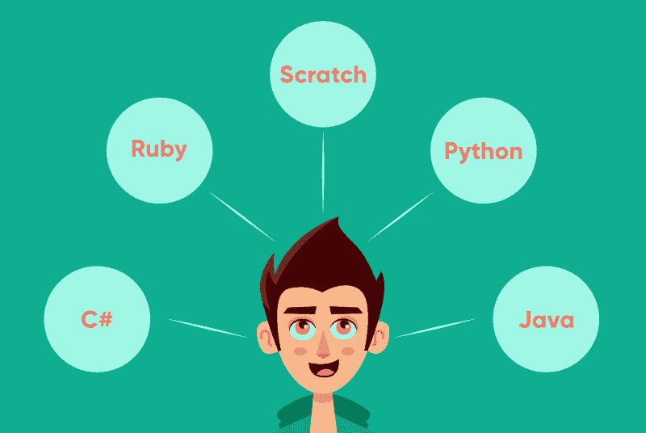

# 新手的 5 种最佳编程语言

> 原文:[https://www . geesforgeks . org/5-新手最佳编程语言/](https://www.geeksforgeeks.org/5-best-programming-languages-for-newbies/)

学习第一种编程语言对每个人来说总是特别的。我们依恋它，它永远伴随着我们。你可能有 10 岁、12 岁、15 岁或其他任何你的年龄，我们相信这对你来说肯定是特别的，将来也是如此。毕竟，你付出了这么多努力，在制作第一个程序或调试一个简单的语法错误时，你经历了很多痛苦，但是一旦你看到你的代码成功运行，并且在屏幕上获得了你想要的输出，你就会微笑，你会兴奋，你会忘记你所有的痛苦，你会意识到你可以成为一个好的程序员，并进入下一步。

在不同的时代学习编程，在不同的年龄是完全不同的。如今，编程变得相当容易学习。这么多容易挑选的语言都是为孩子准备的。他们的语法很容易学习，孩子们可以很容易地建立编码概念的基础，将他们的知识实际应用于创建一些令人惊叹的游戏或网站。教孩子们编程也有助于培养其他技能。他们在数学、阅读方面变得优秀，并发展了良好的问题解决和分析推理技能。
我们将讨论一些孩子可以学习并开始使用的编程语言，但请记住，对于不同的年龄组，学习其中一种语言应该是不同的。应该根据他们的年龄、兴趣，当然还有他们对概念的掌握能力。

### 1.擦

8 至 16 岁的孩子通常对故事、艺术、音乐、动画、游戏感兴趣，如果他们能自己创造这些令人惊叹的东西，对他们来说什么可能是最好的东西。Scratch 使它成为可能，它最适合更小的孩子，并在网上免费提供。如果你的孩子不是一个可靠的打字员，那么这种语言对他们来说是最好的开始。该平台提供了易于使用的块界面，这意味着孩子们可以简单地拖放代码块来制作角色动画、创建游戏和构建应用程序。
你还会发现一个支持 scratch 的大型在线社区，全球注册用户超过 1500 万。Scratch 平台及其社区还允许您将项目及其代码存储在 Scratch 服务器上。Scratch 服务器，让您的孩子学习高级用户如何创建复杂的游戏。你可以从[https://scratch.mit.edu](https://scratch.mit.edu)那里得到刮擦。

### 2.[蟒蛇](https://www.geeksforgeeks.org/python-programming-language/)

Python 是世界上最流行、最简单的编程语言之一，它不仅是年轻程序员的选择，也是有经验的程序员的最佳选择。Python 语法就像一种普通的英语语言，不需要在代码中添加注释。Python 代码足以向读者解释一切，因此孩子们在理解其语法时不会遇到任何困难。Python 在科学领域、[人工智能](https://www.geeksforgeeks.org/artificial-intelligence-an-introduction/)、网络安全等很多领域都很受欢迎和广泛应用，所以对这些领域感兴趣的孩子可以选择这门语言。
这种语言已经内置了许多通用功能。有人在构建任何应用程序时，只需在代码中使用 Python 核心库，就可以完成很多事情。这些都是 Python 最适合孩子学习的原因。如果你的孩子正在学习这种语言，那么他/她可以将想法转化为代码，并在很短的时间内运行它。这种语言可以帮助孩子很好地掌握如何像程序员一样思考。Python 还有一个致力于在计算机教育中使用它的庞大社区。

### 3.[红宝石](https://www.geeksforgeeks.org/ruby-programming-language/)

Ruby 也是最容易使用的语言之一，它的语法就像正常的英语语音一样。所以就像在 python 中一样，Ruby 的语法是不言自明的，所以向孩子解释代码花费的时间更少。它的可读性和清晰的语法使儿童更容易编码。Ruby 是一种自然、健壮、一致且易于记忆的语言，这些优秀的特性有助于孩子们学习概念，并用它来编写好的脚本。Ruby 还集成了面向对象的编程概念。
使用这种语言有一个限制。这种语言对于桌面应用程序很好，但是对于网络应用程序，必须有人学习 *Ruby on Rails* ，它引入了更复杂的概念，对于初学者来说并不好。

### 4. [Java](https://www.geeksforgeeks.org/java/)

Java 是最广泛使用的编程语言之一，但坦率地说，它不是孩子们最喜欢的编程语言，也不适合中级程序员。Java 比 Python 或 Ruby 难一点，但是对制作安卓应用程序或游戏引擎感兴趣并希望深入了解编码的孩子可以学习这种语言。
有一款在 java 上运行的热门游戏[《我的世界》](https://www.minecraft.net/en-us/what-is-minecraft/)吸引了孩子们学习这门语言。在玩这个游戏时，学生了解 java 原理，他们学习如何使用逻辑和解决问题。Java 有静态类型的语言，所以你需要用这种语言为所有东西编写代码，这需要孩子有很大的耐心，所以为你的孩子明智地选择这种语言。

### 5. [C#](https://www.geeksforgeeks.org/csharp-programming-language/)

如果您的孩子对制作 3D 游戏(如 Unity)或 windows 应用程序感兴趣，那么这种语言是最好的开始。C#是公司里工作需求最大的语言之一，它的语法类似于 Java，所以如果你使用过其中一种语言，学习它会变得更容易。C#拥有丰富的类库，强大的内存备份，自动垃圾回收，还支持从[开始。NET](https://www.geeksforgeeks.org/introduction-to-net-framework/) 。如果开发人员想要创建 windows 桌面应用程序，C#是最佳选择。