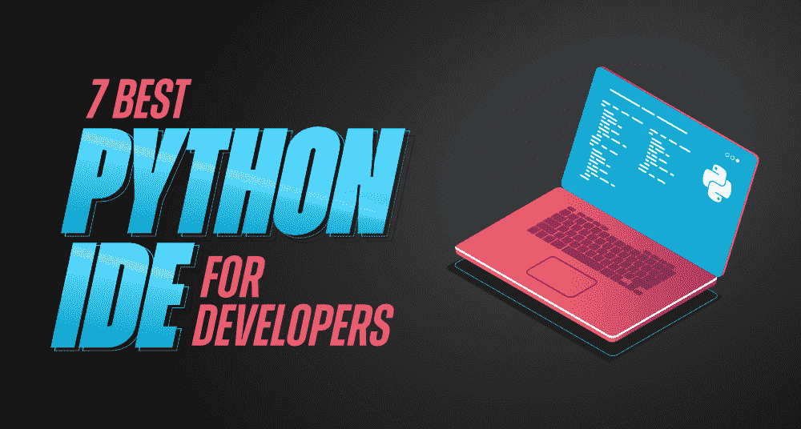

# 2021 年 7 款开发者最佳 Python IDE

> 原文:[https://www . geesforgeks . org/7-2021 年开发者最佳 python ide/](https://www.geeksforgeeks.org/7-best-python-ide-for-developers-in-2021/)

无论我们谈论数据科学还是网站开发或人工智能&机器学习或任何其他领域，所有这些领域都有一个共同点–[**【Python】**](https://www.geeksforgeeks.org/python-programming-language/)**！**在过去的几年中，这种语言的需求和受欢迎程度都有了显著的增长，目前在各种著名的顶级编程语言指数中，它都排在了 **#1 的位置**。如果你期待在 2021 年学习和使用 Python，那么对于你的职业生涯来说，这肯定是一个值得的选择。然而，为了高效和有效地使用 Python，您需要一个出色的 Python IDE！

***什么是 Python IDE…？？**T3】*

Python 集成开发环境(IDE)提供了使用 Python 进行软件开发所需的所有基本工具。它有助于自动化任务，并提高开发人员的生产力和效率。Python IDE 主要由代码编辑器、编译器、自动化工具、调试工具等组成，您可以在它的帮助下方便地编写、编译、执行和调试代码。更好的 Python IDE 的一些附加要求是——源代码备份、自动代码格式化、调试支持、语法高亮显示以及许多其他要求。

与此同时，您不需要担心为自己找到一个好的 Python IDE，因为为了让您的工作更轻松，在本文中，我们为开发人员整理了一份 2021 年最佳 Python IDE 的列表。那么，让我们开始吧:

### 1\. [皮卡姆](https://www.jetbrains.com/pycharm/)

它是开发人员使用最广泛的集成开发环境之一。由 JetBrains 开发的 PyCharm 是一个可定制的跨平台 IDE，它提供了许多突出的功能，例如用于智能代码完成和快速修复的智能代码编辑器、调试、测试和分析工具、VCS、部署和远程开发等。此外，PyCharm 还为各种知名的 web 开发框架提供了急需的支持，如 [Django](https://www.geeksforgeeks.org/django-tutorial/) 、Flask 等。伴随着对 JavaScript、CoffeeScript、TypeScript、 [HTML](https://www.geeksforgeeks.org/html-tutorials/) 和 [CSS](https://www.geeksforgeeks.org/css-tutorials/) 的大量支持。而且，它拿出了两个不同的版本:PyCharm 社区版和 PyCharm 专业版；后者是付费的，并为您提供了几个额外的功能，如 Python Profiler、科学工具、远程开发功能等。

*   *兼容:Windows、macOS、Linux*
*   *积极的社区支持*
*   *智能代码导航*
*   *快速安全的重构*
*   *标准数据库工具*

PyCharm 的主要缺点之一是加载时间慢。除此之外，Python 在各个方面都比较好，推荐给每个开发者，即从初级到高级。

### 2. [PyDev](https://www.pydev.org/)

接下来是另一个丰富而著名的 Python IDE——PyDev。PyDev 由 Aleks Totic 构建，实际上是一个用 JAVA 编写的第三方插件，它使 Eclipse 能够充当 Python 开发的集成开发环境(IDE)。由于其无与伦比的代码分析、自动导入的代码完成、调试器和重构功能，它在开发人员中非常受欢迎。此外，PyDev 还为 Python 开发提供了其他几个高级功能，如 PyLint 集成、Django 集成、类型提示、令牌浏览器、代码覆盖率、Unittest 集成等等。它确实是 Python 开发中健壮、高效和稳定的 IDE 之一。

*   *还支持 CPython、Jython 和 IronPython*
*   *自动导入代码完成*
*   *交互控制台*
*   *在调试器中查找引用者*
*   *兼容:Windows、macOS、Linux 等。*

PyDev 是独立于平台的&可以自由使用，特别是对于初学者来说，下载 Eclipse 并安装 PyDev 插件可能会相对困难一些，但是如果您以前使用过 Eclipse，那么您肯定可以尝试使用 PyDev 进行 Python 开发。

### 3. [Spyder](https://www.spyder-ide.org/)

Spyder 是开发人员最推荐的另一个 Python 集成开发环境(IDE)。这是一个免费的开源 Python 集成开发环境，为您提供了一些显著的功能，如高级分析和调试、概要分析功能、深度检查以及许多其他功能。它还提供了在图形用户界面模式下搜索和编辑变量的能力。Spyder 附带了 Anaconda 软件包管理器发行版，即使对于初学者来说也很容易安装。而且可以与 NumPy、SciPy、Matplotlib、SymPy 等众多科学 Python 库集成。这某种程度上意味着它主要是为数据科学家和工程师开发的，因为它为 Python 开发提供了一个强大的科学环境。

*   *开源跨平台 IDE*
*   *丰富的社区支持*
*   *兼容:Windows、macOS、Linux 等。*
*   ipython 控制台
*   *变量浏览器*

不过，Spyder 的目标用户主要是数据科学家和工程师——如果你是一名初级到中级 Python 开发人员，今年你可以选择探索和使用这个丰富的 Python IDE。

### 4.[千年一遇](https://thonny.org/)

Thonny 是一个轻量级的 Python IDE(集成开发环境)，它的设计方式使得 Python 开发人员，尤其是初学者，可以轻松很多。它提供了一个非常简单的用户界面，并且只包含基本和相关的功能，这使得它对初学者来说非常方便。它允许开发人员检查代码和 shell 命令如何影响 python 变量，并为调试提供一个简单的调试器。Thonny 的一些额外的重要特性是–没有断点的语句步进、调试期间的活动变量、用于执行函数调用的独立窗口、简单干净的 pip GUI 等等。

*   *易学*
*   *兼容:Windows、macOS、Linux。*
*   *支持 CPython 和 microython*
*   *通过表达式评估的步骤*
*   *参考文献解释模式*

如果您是一名经验丰富的 Python 开发人员，那么您可能会选择忽略这个特定的 Python IDE，但是在这种情况下，如果您是一名初学者或者希望很快开始使用 Python，那么强烈建议您查看 Thonny 以了解 Python 开发。

### 5.[怠速](https://docs.python.org/3/library/idle.html)

最佳 Python 集成开发环境列表中的另一个名字是 IDLE。集成开发和学习环境，IDLE 是一个 Python 集成开发环境，默认情况下附带 Python——因此不需要额外的设置或安装。它通常用于学习和实践目的，因为它易于使用的功能使初学者可以方便地学习 Python 开发。IDLE 主要提供了多窗口文本编辑器、Python shell 窗口、集成调试器以及许多其他突出的功能，例如语法高亮显示、自动代码完成、智能缩进和许多其他功能。此外，IDLE 支持浏览器、对话框和可编辑配置。

*   *无需额外设置或安装*
*   *支持语法高亮*
*   *具有步进和断点功能的调试器*
*   *调用堆栈清晰可见*
*   *兼容:Windows、macOS、Linux*

IDLE 主要推荐给初级 Python 开发人员，它对于构建简单的项目非常有用，如果您希望构建一些高级项目——您可以使用列表中提到的任何其他 Python IDE。

### 6.[翼](https://wingware.com/)

Wing 由 Wingware 开发，是一个专用于 Python 的集成开发环境(IDE)。它是一个轻量级的 Python IDE，提供了强大的调试器和智能编辑器，并支持多种测试驱动开发。此外，它是非常可定制的，并支持远程开发。机翼有三个版本——机翼专业版、机翼个人版和机翼 101 版。Wing Pro 是面向专业 Python 程序员的全功能付费版本，但是用户也可以获得该版本的试用版。Wing Personal 和 Wing 101 也是付费的，但也为学生和初学者提供了各自的免费版本，不包括一些高级功能。

*   *支持远程开发*
*   *集成单元测试*
*   *可定制和可扩展的集成开发环境*
*   *版本控制*
*   *兼容:Windows、macOS、Linux*

wing 非常适合所有 Python 开发人员，您可以根据自己的需求使用它，例如，如果您是新手，出于学习目的需要 Python IDE，您可以使用免费版本，或者如果您正在寻求一些高级功能，您可以选择 Wing Pro 或其他付费版本。

### 7\. [原子化蚀](https://ide.atom.io/)

最后但同样重要的是，Atom IDE 来了。你们中的许多人可能已经知道了由 GitHub 开发的 Atom 源代码编辑器。同时，虽然 Atom 只是一个文本编辑器，但 Atom IDE 是一个平台，它额外为您提供了基本集成开发环境的几乎所有功能。Atom IDE 由脸书开发，并得到开源社区的支持。它提供了各种重要的功能，如语法突出显示、自动完成、大纲视图、直接定义、文档格式等。此外，您可以通过安装 atom-ide-ui 包来方便地开始在 Atom 中使用类似 IDE 的功能。

*   *可定制界面*
*   *更好的文档*
*   *更简单的代码导航*
*   *诊断可用性(错误和警告)*
*   *兼容:Windows、macOS、Linux。*

尽管 Atom IDE 中有许多更新和改进，预计将在未来几年出现——您也可以考虑现在就探索它，用于 Python 开发。

因此，根据您的需求或项目需求，这些是您可以考虑的最推荐的 Python IDEs。例如——如果你是 Python 开发的初学者，可以考虑从 Thonny、IDLE 和 Wing 中选择；如果你是一个有经验的人，你可以选择 PyCharm 或 PyDev。同样，如果你需要一个构建基本项目的 Python IDE，你可以挑选 IDLE，或者如果你想要一些高级功能，你可以考虑从 Wing 和 PyCharm，或者如果你是一个数据科学爱好者，你肯定可以尝试一下 Spyder。