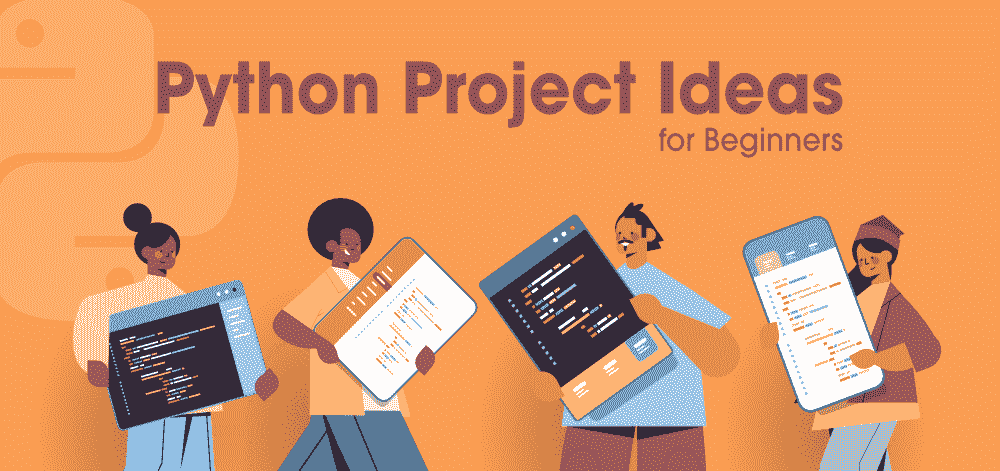

# 7 Python 初学者项目思路

> 原文:[https://www . geesforgeks . org/7-python-project-ideas-for-初学者/](https://www.geeksforgeeks.org/7-python-project-ideas-for-beginners/)

Python 是一种令人惊叹的编程语言，它可以应用于各个领域，包括数据科学、软件开发、机器学习、自动化、网页抓取、网站开发、系统管理等等。由于信息技术行业对 Python 开发人员的需求越来越大，学习 Python 的学生和专业人员的数量也在增加。人们也在转向 Python，因为众所周知，它对初学者非常友好，几天内就能轻松上手。根据 2020 年的 Python 调查，Python 是第二受欢迎的语言，在受欢迎程度指数上上升，超过了大多数其他编程语言。

虽然有太多的在线教程和博客来学习 Python，但大多数都只提供理论概念。要掌握一门语言，练习并获得良好的语言实践经验至关重要。因此，如果你刚开始使用 Python 或者对它有一个基本的了解，不用担心！我们列出了您可以着手构建的 7 大项目创意，将帮助您掌握其中的一些基本功能。这些项目没有那么难，但肯定会帮助你获得一些语言的信心。这些项目可以分为基于命令行的项目或基于图形用户界面的项目。我们不要一个接一个地看它们:

### 基于命令行界面的项目

这些类型的项目是可以使用控制台运行的项目，并且仅限于在其中运行。有各种命令行界面，您可以在其中运行您的代码，如 Anaconda 命令提示符、Windows 终端、VSCode 终端等。让我们看看您可以基于命令行界面构建的项目:

### 1.刽子手游戏

这是每个 Python 开发人员在学习 Python 时都会尝试的经典 Python 游戏。游戏包括一个名为*随机*的 Python 模块，它有助于随机化列表中的数字或选择。游戏的基本功能是，最初，Python 脚本包含一个随机单词列表。当运行时，它从列表中选择任何一个单词，但是这个单词不会显示给用户。用户将被给予几个回合，在每个回合中，用户必须输入一个字母。如果脚本选择的单词包含此字母，它会要求另一个字母。如果单词中没有字母，那么你的刽子手就更接近于被绞死。假设你有 10 次机会，如果你不能在 12 次机会中猜出这个词，你就输了，否则你就赢了，拯救刽子手。

**想了解更多，可以阅读:**[Python 中的刽子手](https://www.geeksforgeeks.org/python-program-for-word-guessing-game/)

### 2.猜数字游戏

这是可能所有 Python 学习者在学习 Python 的最初几天实现的第一个程序。游戏基本，需要两个 Python 库，分别是*随机*和*数学*。用户首先选择一个数字范围，作为程序的第一个输入。接下来，程序生成不向用户公开的随机数。用户现在必须在最小圈数的选定范围内猜测这个数字。

**想了解更多，可以阅读:**[Python 中的猜数字游戏](https://www.geeksforgeeks.org/number-guessing-game-in-python/)

### 3.Tic Tac Toe(微塔式机)

我们都和朋友一起玩过井字游戏，非常有趣，但是在 Python 中实现同样的游戏也会帮助你获得更好的问题技巧！这个游戏涉及两个玩家，他们交替地在 9X9 棋盘上放“X”或“O”。一旦一个玩家用三个相同的符号完成一行或一列或对角线，用户就赢了。如果没有玩家能够完成获胜条件，并且所有 9 个盒子都被填满，那就是平局。您可以为两个用户实现这一点，用户对计算机，或者自动对计算机。

**想了解更多，可以阅读:**[Python 井字游戏](https://www.geeksforgeeks.org/python-implementation-automatic-tic-tac-toe-game-using-random-number/)

### 基于图形用户界面的项目

基于图形用户界面或桌面图形用户界面的项目，这些项目不是在控制台窗口中与用户交互，而是使用图形和可视组件(如按钮、下拉菜单、箭头等)进行交互。这些可以使用各种各样的库来实现，比如 Tkinter 或 PyQT5。让我们来看看您在合并图形时可以创建的初级项目:

### 4.石头剪刀布

这个游戏很好地利用了您的 Python 基础和基本概念以及图形编程部分。在这个游戏中，两个玩家轮流选择石头、纸或剪刀。当两者有不同的形状时，总会有一个赢家，例如，剪刀赢了纸，纸赢了石头，石头赢了剪刀。在图形用户界面中制作时，您可以为所有三个符号创建按钮，并使用 if 条件来检查获胜。

**想了解更多，可以阅读:** [蟒蛇岩纸剪刀](https://www.geeksforgeeks.org/rock-paper-and-scissor-game-using-tkinter/)

### 5.倒计时定时器

创建倒计时计时器是另一个有趣的项目，您将需要一个名为 *time* 的 Python 库，它将帮助您在每个时间单位(比如秒或分钟)修改界面。这个项目可以通过分别为一小时、一分钟和一秒钟创建一个屏幕小部件和文本框来实现。它还应该包含一个开始按钮，当点击时，开始递减时间。屏幕小部件每秒更新一次时间，当时间到达零时停止。

**想了解更多，可以阅读:**[Python 中的倒计时](https://www.geeksforgeeks.org/create-countdown-timer-using-python-tkinter/)

### 6.计算器

我们都使用计算器，但是你想过实现它们吗？如果没有，这个初学者友好的 Python 项目将帮助您很好地实践图形用户界面 Python 库。您可以添加一个显示当前数字或结果的文本框。你还必须为数字和数学运算创建按钮，如加、减、乘、指数、除等。作为一项进步，您还可以添加浮点数的功能，并且必须检查操作数是否有效。

**想了解更多，可以阅读:**Python 中的[计算器](https://www.geeksforgeeks.org/python-simple-gui-calculator-using-tkinter/)

### 7.通用转换器

通用转换器可以方便地转换各种不同的货币、测量值甚至温度。您可以使用文本框来输入要转换的数字或值，以及预期结果的所需单位。一些例子可以是将摄氏转换为华氏，将英里转换为米或英寸，将印度卢比转换为美元(由于数值每天都在变化，您必须经常更新)，将码转换为公里，等等。

**想了解更多，可以阅读:**[Python 中的标准 GUI 转换器](https://www.geeksforgeeks.org/standard-gui-unit-converter-using-tkinter-in-python/)

我们已经看到了一些好的初学者友好的项目，您可以用 Python 实现这些项目来提高您的 Python 技能，并在此过程中提高您的问题解决技能。您也可以参考所附的链接，因为它们将帮助您开始项目！建立这些项目后，你可以继续进行一些中级项目，甚至将它们添加到你的简历中！