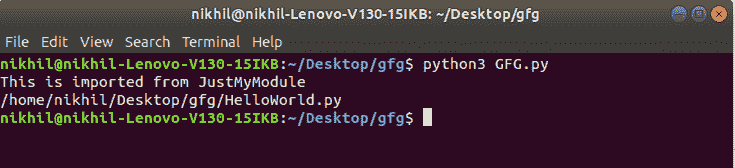

# __ Python 中的文件 _ _(特殊变量)

> 原文:[https://www . geesforgeks . org/_ _ file _ _ _-一个 python 中的特殊变量/](https://www.geeksforgeeks.org/__file__-a-special-variable-in-python/)

Python 中的双下划线变量通常被称为 [dunder](https://www.geeksforgeeks.org/dunder-magic-methods-python/) 。dunder 变量是 Python 定义的变量，这样它就可以以“特殊的方式”使用它。这种特殊方式取决于所使用的变量。

**注意:**更多信息请参考[邓德或 Python 中的魔法方法](https://www.geeksforgeeks.org/dunder-magic-methods-python/)T4】

### __file__ 变量:

**__file__** 是一个变量，包含当前正在导入的模块的路径。Python 在即将导入模块时会为自己创建一个 __file__ 变量。该变量的更新和维护由导入系统负责。当没有语义含义时，即从数据库导入模块/文件时，导入系统可以选择将变量留空。该属性是一个字符串。这可以用来知道您正在使用的模块的路径。要理解 __file__ 的用法，请考虑以下示例。

**示例:**让我们创建一个名为 HelloWorld 的模块，并将其存储为. py 文件。

## 大蟒

```py
# Creating a module named
# HelloWorld

def hello():
    print("This is imported from HelloWorld")

# This code is improved by gherson283
```

现在让我们创建另一个名为 GFG.py 的文件，它导入了上面创建的模块，以显示 __file__ 变量的使用。

## 大蟒

```py
# Importing the above
# created module
import HelloWorld

# Calling the method
# created inside the module
HelloWorld.hello()

# printing the __file__
# variable
print(HelloWorld.__file__)
```

**输出:**

