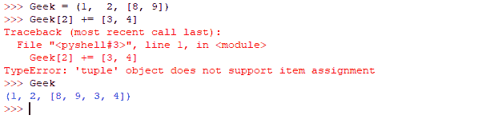
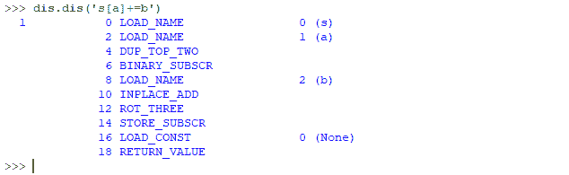

# Python 中的 A += B 赋值谜语

> 原文:[https://www . geesforgeks . org/a-B-赋值-python 中的谜语/](https://www.geeksforgeeks.org/a-b-assignment-riddle-in-python/)

在 Python 控制台上预测这两个表达式的输出

*   **On console**

    ```py
    Geek = (1, 2, [8, 9])
    Geek[2] += [3, 4]
    ```

    **输出:**
    
    **解释:**

    *   看看 Python 为表达式 s[a] += b 生成的字节码。很明显这是如何发生的。
        
    *   **循序渐进**
        *   将 s[a]的值放在堆栈顶部(TOS)。
        *   执行 TOS += b .如果 TOS 引用了一个可变对象，这将成功。这就是为什么将项目附加到列表是成功的。
        *   指定 s[a] = TOS。这将失败，如果 s 是不可变的。类型错误，因为在上面例子中元组是不可变的。

    **要学的东西**

    *   将可变项放在元组中不是一个好主意。
    *   扩充赋值不是原子操作——我们只是看到它在完成部分工作后抛出了一个异常。
    *   检查 Python 字节码并不太困难，通常有助于了解幕后发生了什么。