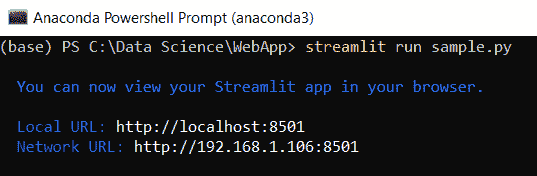
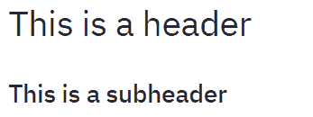
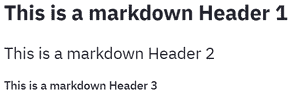

# 简化初学者指南

> 原文:[https://www . geeksforgeeks . org/a-初学者指南-简化/](https://www.geeksforgeeks.org/a-beginners-guide-to-streamlit/)

数据科学和分析的趋势日益增强。从数据科学管道来看，最重要的步骤之一是模型部署。我们在 python 中有很多选项来部署我们的模型。一些流行的框架是 Flask 和 Django。但是使用这些框架的问题是，我们应该对 HTML、CSS 和 JavaScript 有所了解。牢记这些先决条件，阿德里安·特雷伊尔、蒂亚戈·特谢拉和阿曼达·凯利创造了“细流”。现在使用 streamlit，您可以轻松部署任何机器学习模型和任何 python 项目，而无需担心前端。Streamlit 非常方便用户使用。

在本文中，我们将学习 streamlit 的一些重要功能，创建一个 python 项目，并在本地 web 服务器上部署该项目。

让我们安装 streamlit。在命令提示符下键入以下命令。

```py
pip install streamlit
```

一旦成功安装了 streamlit，运行给定的 python 代码，如果没有出现错误，那么 streamlit 就成功安装了，现在可以使用 Streamlit 了。

## 如何运行细流文件？

打开命令提示符或 Anaconda shell 并键入

```py
streamlit run filename.py
```



运行小数据流文件

这里我的文件名是“sample.py”。在网络浏览器中打开本地网址。


### 理解小数据流的基本功能

**1. 标题：**

## 蟒蛇 3

```py
# import module
import streamlit as st

# Title
st.title("Hello GeeksForGeeks !!!")
```

**输出:**


标题

**2。标题和副标题:**

## 计算机编程语言

```py
# Header
st.header("This is a header")

# Subheader
st.subheader("This is a subheader")
```

**输出:**



标题/副标题

**3。正文:**

## 蟒蛇 3

```py
# Text
st.text("Hello GeeksForGeeks!!!")
```

**输出:**


文本

**4。降价:**

## 蟒蛇 3

```py
# Markdown
st.markdown("### This is a markdown")
```

**输出:**



减价

**5。成功、信息、警告、错误、异常:**

## 蟒蛇 3

```py
# success
st.success("Success")

# success
st.info("Information")

# success
st.warning("Warning")

# success
st.error("Error")
```