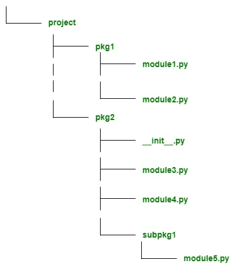

# Python 中的绝对和相对导入

> 原文:[https://www . geeksforgeeks . org/python 中绝对和相对导入/](https://www.geeksforgeeks.org/absolute-and-relative-imports-in-python/)

**python 中`import` 的工作:**

Python 中的导入类似于 C/C++中的`#include header_file`。Python 模块可以通过使用 import 导入文件/函数来访问另一个模块的代码。`import` 语句是调用导入机制最常见的方式，但不是唯一的方式。导入语句由`import` 关键字和模块名称组成。

import 语句涉及两个操作，它搜索一个模块，并将搜索结果绑定到本地范围内的名称。导入模块时，Python 会运行模块文件中的所有代码，并使导入程序文件可用。

当一个模块被导入时，解释器首先在`sys.modules`中搜索它，T0 是所有先前已经导入的模块的缓存。如果没有找到，那么它会搜索所有具有该名称的内置模块，如果找到了，那么解释器会运行所有代码并提供给文件。如果找不到该模块，它将在变量`sys.path`给出的目录列表中搜索同名文件。
`sys.path`是一个包含路径列表的变量，路径列表包含 python 库、包和包含输入脚本的目录。例如，一个名为 `math`的模块被导入，然后解释器在一个内置模块中搜索它，如果没有找到它，那么它在`sys.path`给出的目录列表中搜索名为`math.py`的文件。

```
# Python program importing
# math module

import math
print(math.pi)
```

**输出:**

```
3.141592653589793

```

**导入语句语法:**
用户可以同时导入包和模块。(注意，导入包本质上是将包的`__init__.py`文件作为模块导入。)用户还可以从包或模块中导入特定对象。
导入语法一般有两种。当您使用第一个时，您直接导入资源。

```
import gfg

```

`gfg`可以是一个包，也可以是一个模块。

当用户使用第二种语法时，用户从另一个包或模块导入资源。

```
from gfg import geek

```

*geek* 可以是模块、子包或对象，如类或函数。

**导入语句的样式:**
[【PEP 8】](https://www.python.org/dev/peps/pep-0008/#imports)，python 的官方样式指南，有一套如何制定 python 代码以最大化其可读性的规则。对于编写导入语句，需要遵循以下几点:

1.  导入应该总是写在文件的顶部，就在任何模块注释和文档字符串之后。
2.  导入通常应该用空格隔开。
3.  导入应按以下顺序分组。
    *   标准库导入(Python 的内置模块)
    *   相关第三方进口。
    *   本地应用程序/库特定导入

在每个导入组中按字母顺序排列导入语句也很好。

```
# Python program showing
# how to style import statements

import math
import os

# Third party imports
from flask import Flask
from flask_restful import Api
from flask_sqlalchemy import SQLAlchemy

# Local application imports
from local_module import local_class
from local_package import local_function
```

### 绝对进口量:

绝对导入涉及完整路径，即从项目的根文件夹到所需模块的路径。绝对导入状态，表示要使用项目根文件夹中的完整路径导入资源。

**语法及实例:**
我们来看看我们有以下目录结构:

这里有一个名为 project 的目录，下面有两个子目录即 `pkg1`、`pkg2`。`pkg1`有两个模块，模块 1 和模块 2。
pkg2 包含三个模块，模块 3、模块 4、`__init__.py`和一个包含模块 5.py 的子包名 subpack 1。

*   `pkg1 / module1.py`包含一个函数 fun1
*   `pkg2 / module3.py`包含一个函数 fun2
*   `pkg2 / subpkg1 / module5.py` 包含函数 fun3

```
# Python program showing
# practical example of
# absolute imports

# importing a fun1 from pkg1/module1
from pkg1.import module1 import fun1

from pkg1 import module2

# importing a fun2 from pkg2/module3
from pkg2 import module3 import fun2

# importing a fun3 from pkg2/subpkg1/module5
from pkg2.subpkg1.module5 import fun3
```

在本例中，我们通过从模块的根文件夹写入完整路径来导入模块。

**绝对进口的利弊:**
T5】利弊:

*   绝对进口是非常有用的，因为它们是明确和直截了当的。
*   只需查看语句，就可以很容易地从导入的资源所在的位置准确地判断出绝对导入。
*   即使导入语句的当前位置发生变化，绝对导入仍然有效。

**缺点:**
如果目录结构很大那么使用绝对导入就没有意义了。在这种情况下，使用相对导入效果很好。

```
from pkg1.subpkg2.subpkg3.subpkg4.module5 import fun6

```

### 相对进口:

相对导入指定从其当前位置导入的对象或模块，即导入语句所在的位置。相对进口有两种类型:

*   Implicit relative imports :

    Python(3.x)中不支持隐式相对导入。

*   Explicit relative imports :

    Python(3.x)中已批准显式相对导入。

**语法和实例:**
相对导入的语法取决于当前位置以及要导入的模块或对象的位置。相对导入使用点(。)符号来指定位置。单点表示模块在当前目录中，两点表示模块在当前位置的父目录中，三点表示模块在祖父母目录中，以此类推。
我们来看看我们有以下目录结构:

我们来假设如下:

*   `pkg1 / module1.py`包含一个函数 fun1
*   `pkg2 / module3.py`包含一个函数 fun2
*   `pkg2 / subpkg1 / module5.py` 包含函数 fun3

```
# Python program showing
# practical example of
# relative imports

# importing fun1 into pkg1/module1.py
from .module1 import fun1

# importing fun2 and fun3 into pkg2/module3.py 
from .module3 import fun2
from .subpackage1.module5 import fun3
```

**相对进口的利弊:**
**利弊:**

*   使用相对导入简洁明了。
*   基于当前位置，它降低了导入语句的复杂性。
    **Cons:**

    *   相对导入不如绝对导入可读性强。
    *   使用相对导入并不容易，因为很难知道模块的位置。