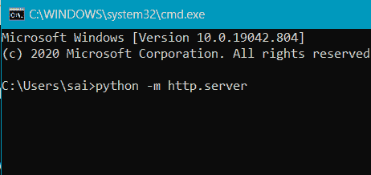
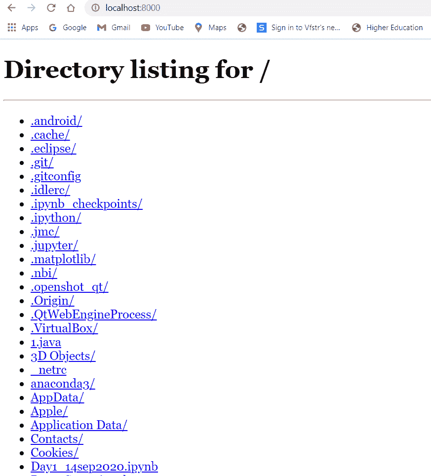
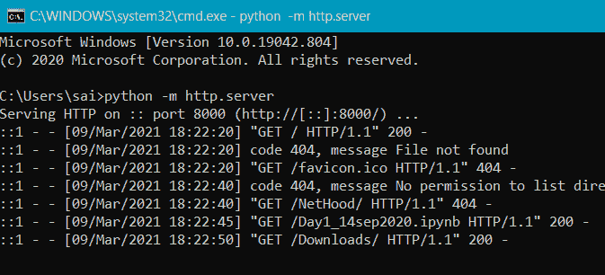

# 使用 Python 访问同一网络中设备的文件

> 原文:[https://www . geeksforgeeks . org/access-同网设备文件-使用 python/](https://www.geeksforgeeks.org/access-files-of-a-devices-in-the-same-network-using-python/)

在 Linux 和 Ubuntu 中，我们有很多方法可以将文件从一台计算机传输到另一台计算机，但是在那里我们必须更改 Apache 文件夹的权限，然后共享文件。但是在窗口中，我们不能使用 Apache 共享文件，所以这里我们讨论了 Python 方法在连接在同一网络上的系统和手机之间共享文件。

Python 是一种解释器，用户友好且简单的语言。Python 中有大量的模块。在这里，我们使用了 **http.server** 模块在连接在同一网络上的系统之间共享文件。此模块用于定义 HTTP 服务器(网络服务器)。服务器是处理请求并将数据传递给客户端的软件或硬件。

### 逐步方法:

*   为了实现这一点，您只需要在命令提示符(cmd)中运行一个小命令。

> python -m http.server

*   通过运行上述命令，可能会弹出窗口安全警报。你可以根据自己的需要选择。

*   要在本地访问服务器，我们需要访问 [http://localhost:8000/](http://localhost:8000/) 或 [http://127.0.0.1:8000/](http://127.0.0.1:8000/) 在这里我们可以看到您本地存储的所有目录以及所有数据。您还可以访问一个网页，当您访问它时，它将由您的网络浏览器呈现。

*   另一方面，您可以在命令提示符下看到活动日志。

*   只需执行上述过程，您就可以访问同一网络上的其他系统。要关闭，服务器只需在命令提示符下按 Ctrl+c 即可。

通过这种方式，用户可以轻松访问同一网络中设备中的文件。