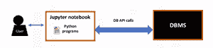
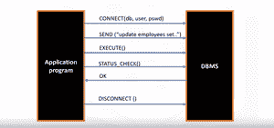

# 用 Python 访问关系数据库

> 原文:[https://www . geesforgeks . org/access-relation-databases-with-python/](https://www.geeksforgeeks.org/access-relation-databases-with-python/)

数据库是数据科学家的强大工具。 **DB-API** 是 Python 用来访问数据库的标准 API。它允许您编写一个单独的程序来处理多种关系数据库，而不是为每种数据库编写单独的程序。这是一个典型的用户如何使用写在基于网络的编辑器 Jupyter 笔记本上的 Python 代码访问数据库。



Python 程序与数据库管理系统之间有一种通信机制:

*   应用程序以一个或多个将程序连接到数据库管理系统的应用编程接口调用开始其数据库访问。
*   然后，为了将 SQL 语句发送到数据库管理系统，程序将该语句构建为文本字符串，然后调用一个应用编程接口将内容传递给数据库管理系统。
*   应用程序调用应用编程接口来检查其数据库管理系统请求的状态并处理错误。
*   应用程序用一个将它与数据库断开的应用编程接口调用结束它的数据库访问。



Python 数据库应用编程接口中的两个主要概念是:

**1)用于**的连接对象

*   连接到数据库
*   管理您的交易。

**以下是几种连接方式:**

*   **cursor()** :这个方法使用连接返回一个新的 cursor 对象。
*   **commit()** :此方法用于向数据库提交任何挂起的事务。
*   **rollback()** :此方法会导致数据库回滚到任何挂起事务的开始。
*   **close()** :此方法用于关闭数据库连接。

**2)查询对象用于运行查询。**

这是一个使用数据库应用编程接口查询数据库的 python 应用程序。

## 蟒蛇 3

```
from dbmodule import connect

# Create connection object
connection = connect('databasename', 'username', 'pswd')

# Create a cursor object
cursor = connection.cursor()

# Run queries
cursor.execute('select * from mytable')
results = cursor.fetchall()

# Free resources
cursor.close()
connection.close()
```

1.  首先，我们使用数据库模块中的连接应用编程接口导入该模块。要打开到数据库的连接，您可以使用**连接功能**并传入数据库名称、用户名和密码等参数。**连接功能**返回连接对象。
2.  之后，我们在连接对象上创建一个**光标对象**。游标用于运行查询和获取结果。
3.  在使用光标运行查询之后，我们还使用光标**获取查询的结果**。
4.  最后，当系统运行完查询后，它通过关闭连接来释放所有资源。请记住，关闭连接总是很重要的，以避免未使用的连接占用资源。