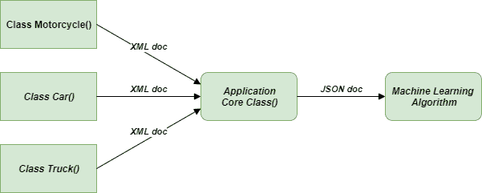
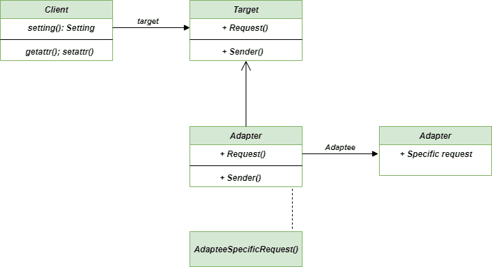

# 适配器方法–Python 设计模式

> 原文:[https://www . geesforgeks . org/adapter-method-python-design-patterns/](https://www.geeksforgeeks.org/adapter-method-python-design-patterns/)

适配器方法是一种[结构设计模式](https://www.geeksforgeeks.org/design-patterns-set-1-introduction/)，帮助我们使不兼容的对象相互适应。Adapter 方法是最容易理解的方法之一，因为我们有很多现实生活中的例子可以与之类比。这个方法的主要目的是在两个不兼容的接口之间建立一个桥梁。此方法为类提供了不同的接口。通过思考有线适配器，我们可以更容易地理解这个概念，有线适配器允许我们在有不同形状插座的地方给手机充电。
利用这个思想，我们可以集成由于接口不兼容而无法集成的类。

### 不使用适配器方法时出现问题

假设您正在创建一个显示所有不同类型车辆数据的应用程序。它以 XML 格式从不同车辆组织的 API 中获取数据，然后显示信息。
但是假设在某个时候，你想用一种机器学习算法升级你的应用程序，这种算法可以很好地处理数据，并且只提取重要的数据。但是有一个问题，它只接受 JSON 格式的数据。
对机器学习算法进行修改，使其采用 XML 格式的数据，这将是一种非常糟糕的方法。



问题-适配器-方法

### 使用适配器方法的解决方案

为了解决我们上面定义的问题，我们可以使用**适配器方法**，这有助于创建适配器对象。
要在我们的代码中使用适配器:

1.  客户端应该通过使用目标接口调用适配器上的方法向适配器发出请求。
2.  使用适配器接口，适配器应该在适配器上翻译该请求。
3.  客户端收到呼叫结果，并且他/她不知道适配器的存在。

```py
# Dog - Cycle
# human - Truck
# car - Car

class MotorCycle:

    """Class for MotorCycle"""

    def __init__(self):
        self.name = "MotorCycle"

    def TwoWheeler(self):
        return "TwoWheeler"

class Truck:

    """Class for Truck"""

    def __init__(self):
        self.name = "Truck"

    def EightWheeler(self):
        return "EightWheeler"

class Car:

    """Class for Car"""

    def __init__(self):
        self.name = "Car"

    def FourWheeler(self):
        return "FourWheeler"

class Adapter:
    """
    Adapts an object by replacing methods.
    Usage:
    motorCycle = MotorCycle()
    motorCycle = Adapter(motorCycle, wheels = motorCycle.TwoWheeler)
    """

    def __init__(self, obj, **adapted_methods):
        """We set the adapted methods in the object's dict"""
        self.obj = obj
        self.__dict__.update(adapted_methods)

    def __getattr__(self, attr):
        """All non-adapted calls are passed to the object"""
        return getattr(self.obj, attr)

    def original_dict(self):
        """Print original object dict"""
        return self.obj.__dict__

""" main method """
if __name__ == "__main__":

    """list to store objects"""
    objects = []

    motorCycle = MotorCycle()
    objects.append(Adapter(motorCycle, wheels = motorCycle.TwoWheeler))

    truck = Truck()
    objects.append(Adapter(truck, wheels = truck.EightWheeler))

    car = Car()
    objects.append(Adapter(car, wheels = car.FourWheeler))

    for obj in objects:
       print("A {0} is a {1} vehicle".format(obj.name, obj.wheels()))
```

### 类图

作为**结构设计模式**类型的适配器方法类图:



适配器类图

### 优势

*   **单一责任原则:**我们可以用 Adapter 方法实现单一责任原则，因为在这里我们可以将具体的代码与客户端的主要逻辑分开。
*   **灵活性:**适配器方法有助于实现代码的灵活性和可重用性。
*   **不太复杂的类:**我们的客户端类并不因为必须使用不同的接口而变得复杂，并且可以使用多态性在适配器的不同实现之间进行交换。
*   **开/闭原则:**我们可以在不违反开/闭原则的情况下，在代码中引入 ne wadapter 类。

### 不足之处

*   **代码的复杂性:**随着我们引入了一组新的类、对象和接口，or 代码的复杂性肯定会上升。
*   **适应性:**很多时候，我们需要和 adaptee 链进行多次的适配，才能达到我们想要的兼容性。

### 适应性

*   **让类和接口兼容:**当我们需要让某些类兼容进行通信时，总是会用到 Adapter 方法。
*   **与继承相关:**当我们想要重用一些代码，即缺少某些功能的类和接口时，可以使用**适配器方法**来完成。

**进一步阅读:Java 中的** [适配器模式](https://www.geeksforgeeks.org/adapter-pattern/)