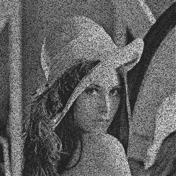

# 用 Python 给图像添加“椒盐”噪点

> 原文:[https://www . geeksforgeeks . org/add-a-a-椒盐噪声到图像的 python/](https://www.geeksforgeeks.org/add-a-salt-and-pepper-noise-to-an-image-with-python/)

在本文中，我们将看到如何使用 Python 向图像添加“椒盐”噪声。

**噪声:**噪声是指计算机版本中信号的随机扰动。在我们的例子中，信号是图像。图像亮度和颜色的随机干扰称为图像噪声。

**椒盐色:**仅在灰度图像(黑白图像)中发现。顾名思义，胡椒(黑色)中的盐(白色)——深色区域中的白色斑点或胡椒(黑色)中的盐(白色)——白色区域中的黑色斑点。换句话说，具有椒盐噪声的图像在亮区有一些暗像素，在暗区有一些亮像素。椒盐噪声也叫脉冲噪声。它可能由几个原因引起，如死像素、模数转换错误、位传输错误等。

**我们来看看如何在图像中添加椒盐噪声–**

*   椒盐噪声只能在灰度图像中添加。因此，读取图像后将其转换为灰度
*   随机选择添加了噪声的像素数(像素数)
*   在图像中随机挑选一些会添加噪声的像素。这可以通过随机选择 x 和 y 坐标来完成
*   请注意，生成的随机值必须在图像尺寸范围内。x 和 y 坐标必须在图像大小的范围内
*   随机数可以使用随机数生成器函数生成，如代码中使用的 [random.randint](https://www.geeksforgeeks.org/random-sampling-in-numpy-randint-function/)
*   将一些随机选取的像素着色为黑色，并将它们的值设置为 0
*   将一些随机选取的像素着色为白色，并将它们的值设置为 255
*   保存图像的价值

**下面是实现:**

## 计算机编程语言

```
import random
import cv2

def add_noise(img):

    # Getting the dimensions of the image
    row , col = img.shape

    # Randomly pick some pixels in the
    # image for coloring them white
    # Pick a random number between 300 and 10000
    number_of_pixels = random.randint(300, 10000)
    for i in range(number_of_pixels):

        # Pick a random y coordinate
        y_coord=random.randint(0, row - 1)

        # Pick a random x coordinate
        x_coord=random.randint(0, col - 1)

        # Color that pixel to white
        img[y_coord][x_coord] = 255

    # Randomly pick some pixels in
    # the image for coloring them black
    # Pick a random number between 300 and 10000
    number_of_pixels = random.randint(300 , 10000)
    for i in range(number_of_pixels):

        # Pick a random y coordinate
        y_coord=random.randint(0, row - 1)

        # Pick a random x coordinate
        x_coord=random.randint(0, col - 1)

        # Color that pixel to black
        img[y_coord][x_coord] = 0

    return img

# salt-and-pepper noise can
# be applied only to grayscale images
# Reading the color image in grayscale image
img = cv2.imread('lena.jpg',
                 cv2.IMREAD_GRAYSCALE)

#Storing the image
cv2.imwrite('salt-and-pepper-lena.jpg',
            add_noise(img))
```

**输出:**


输入图像:“lena.jpg”



输出图像:“盐和胡椒-lena.jpg”