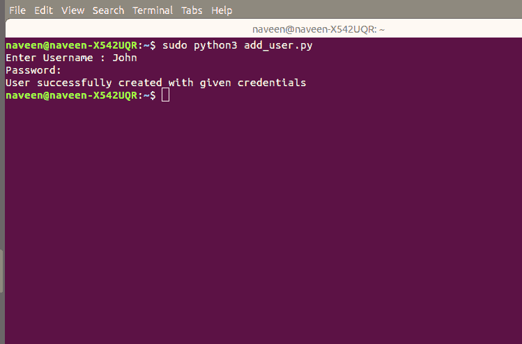

# 使用 Python 脚本在 Linux 中添加用户

> 原文:[https://www . geesforgeks . org/add-a-user-in-Linux-using-python-script/](https://www.geeksforgeeks.org/add-a-user-in-linux-using-python-script/)

在 Linux 中通过命令行创建用户是一项繁琐的任务。每当有人加入您的组织，而您需要键入一个长的 Linux 命令而不是这样做时，您可以创建一个 python 脚本，该脚本可以要求您输入用户名和密码，并为您创建该用户。

**示例:**

```
Input : 
Enter Username : John
Password: ****

Output :
User successfully created with given credentials

```

下面是 Python 代码–

```
# importing linrary
import os
import subprocess
import sys
import getpass

# add user function
def add_user():

     # Ask for the input
     username = input("Enter Username ")   

     # Asking for users password
     password = getpass.getpass()   4

     try:
         # executing useradd command using subprocess module
         subprocess.run(['useradd', '-p', password, username ])      
     except:
         print(f"Failed to add user.")                     
         sys.exit(1)

add_user()
```

**输出:**


成功创建用户类型后，使用此命令获取新用户的详细信息–

```
cat /etc/passwd
```

