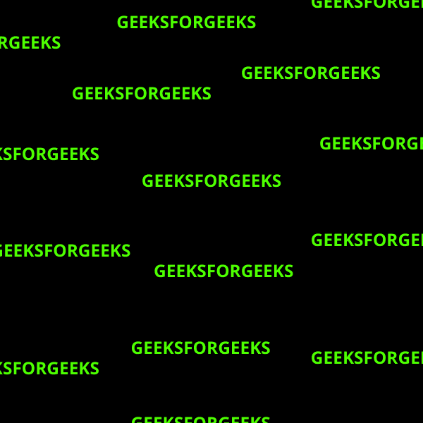
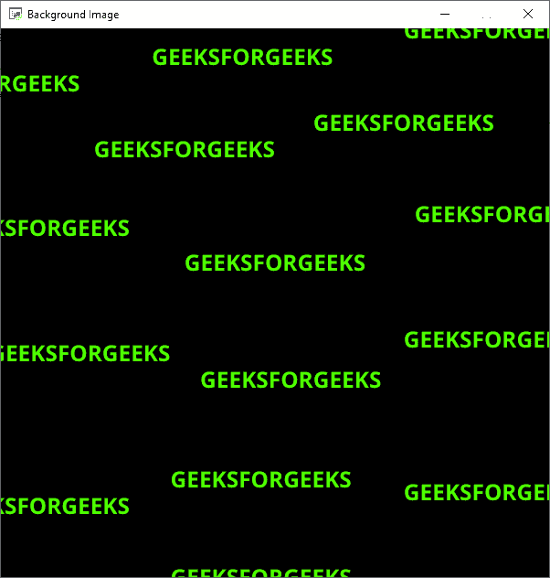

# 在 Python 街机中添加背景图像

> 原文:[https://www . geesforgeks . org/add-back gound-image-in-python-arcade/](https://www.geeksforgeeks.org/add-backgound-image-in-python-arcade/)

在本文中，我们将学习如何在 Python 中为街机游戏添加背景图像。

## 添加背景图像

我们将使用下面的图像作为我们的背景图像。



所以为了添加这个图像作为我们的背景图像，我们将使用 load_texture()和 draw_texture_rectangle()函数。

### load_texture():

load_texture 函数用于从 arcade 中的文件导入纹理。

> **语法:** arcade.load_texture(名称，x，y，宽度，高度)
> 
> **参数:**
> 
> *   名称:保存纹理的文件的名称。
> *   X:纹理裁剪区域的 X 位置
> *   Y:纹理裁剪区域的 Y 位置
> *   宽度:纹理的宽度
> *   高度:纹理的高度

### draw _ texture _ 矩形( ):

draw_texture_rectangle 函数用于导入具有特定坐标的纹理。

> **语法:**arcade . draw _ texture _ rectangle(x，y，宽度，高度，纹理，角度，alpha)
> 
> #### 参数:
> 
> *   x。
> *   y:矩形中心的 y 坐标。
> *   宽度:纹理的宽度
> *   高度:纹理的高度
> *   纹理:从 load_texture()调用返回的纹理的标识符
> *   角度:矩形的旋转
> *   阿尔法:图像的透明度

**下面是实现:**

## 蟒蛇 3

```py
# Importing arcade module
import arcade

# Creating MainGame class
class MainGame(arcade.Window):
    def __init__(self):
        super().__init__(600, 600, title = "Background Image")

        # Loading the background image
        self.background = arcade.load_texture("BACKGROUND.png")

    # Creating on_draw() function to draw on the screen
    def on_draw(self):
        arcade.start_render()

        # Drawing the background image
        arcade.draw_texture_rectangle(300, 300, 600,
                                      600, self.background)

# Calling MainGame class
MainGame()
arcade.run()
```

**输出:**

