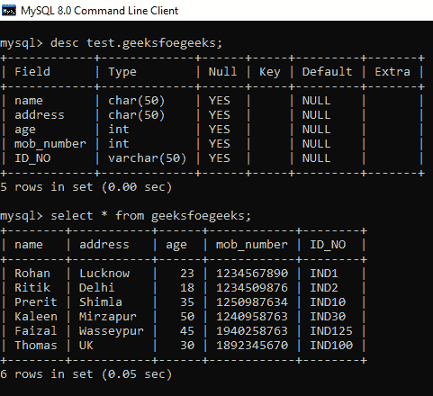
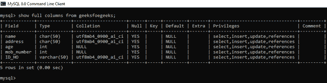

# 使用 Python 给 MySQL 中的列添加注释

> 原文:[https://www . geesforgeks . org/add-comment-to-column-in-MySQL-using-python/](https://www.geeksforgeeks.org/add-comment-to-column-in-mysql-using-python/)

MySQL 服务器是一个开源的关系数据库管理系统，是对基于 web 的应用程序的主要支持。数据库和相关表格是许多网站和应用程序的主要组成部分，因为数据是通过网络存储和交换的。为了从网络服务器访问 MySQL 数据库，我们使用 Python 中的各种模块，如 PyMySQL、mysql.connector 等。

注释是放在 SQL 查询中的可读解释或语句。它用于使 SQL 语句更易于人类理解的目的。在解析 SQL 代码的过程中，MySQL 通常会忽略它们。注释可以用单行或多行书写。

在本文中，我们使用一个名为 *test* 的数据库，其中有一个名为*极客*的表。请看下图。



数据库=测试和表格=极客极客

要检查任何列是否有任何注释，请参见下面的语句。

```
SHOW FULL COLUMNS FROM table_name;
```

下图显示没有任何列与任何类型的注释相关联。



任何列都没有注释

向列添加任何注释的语句如下所示:

> ALTER TABLE _ TABLE _ name MODIFY _ column _ name _ type _ of _ that _ column COMMENT '在此输入注释'；

**以下是一些示例，描述了如何使用 Python 向 MySQL 表中的列添加注释:**

**例 1**

添加单行注释。

## 蟒蛇 3

```
# import required module 
import pymysql

# make connection
conn = pymysql.connect(host="localhost", user="root",
                       password="1234",db="test")

# create cursor object
mycursor = conn.cursor()

# execute query
mycursor.execute("ALTER TABLE geeksforgeeks MODIFY name \
                 CHAR(50) COMMENT 'ENTER NAMES HERE'")

# display comments of all columns
mycursor.execute("SHOW FULL COLUMNS FROM GEEKSFOEGEEKS")
result = mycursor.fetchall()
for i in result:
    print(i)
mycursor.execute("COMMIT")

#terminate connection
conn.close()
```