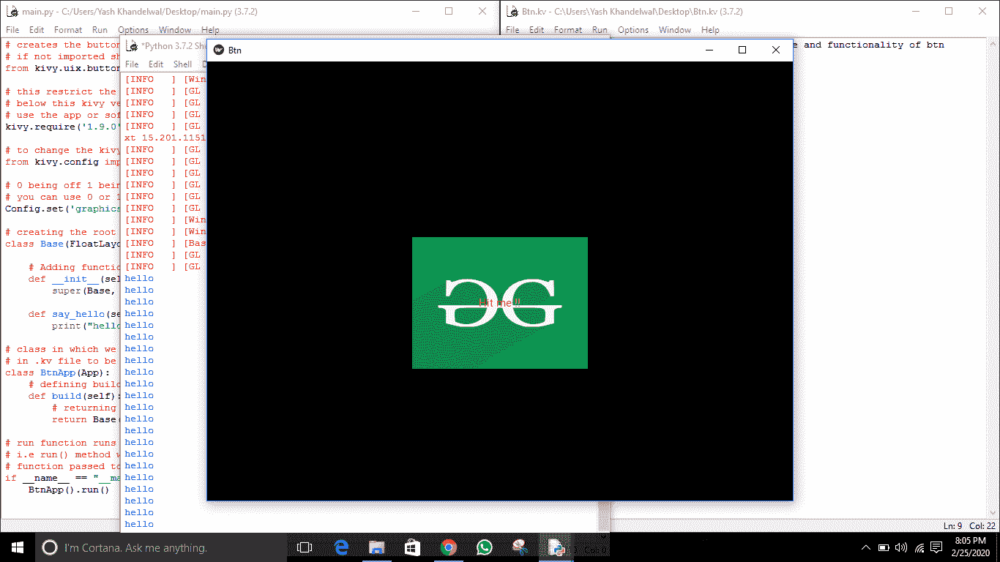
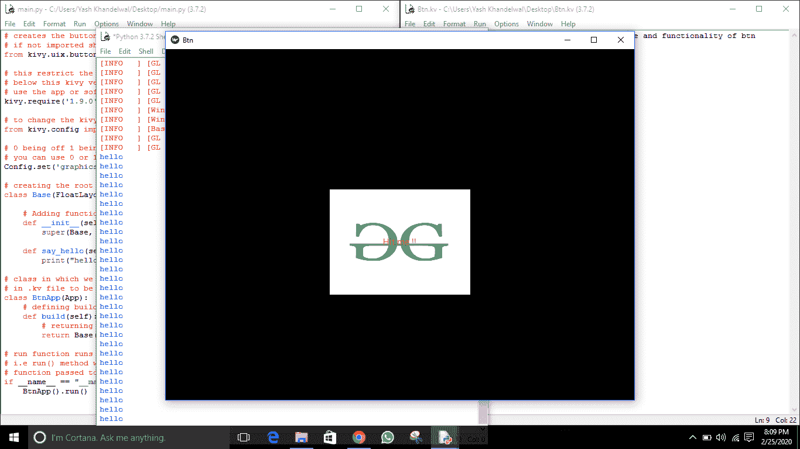

# 使用添加图像按钮。kivy 中的 kv 文件

> 原文:[https://www . geesforgeks . org/add-image-button-using-kv-file-in-kivy/](https://www.geeksforgeeks.org/add-image-button-using-kv-file-in-kivy/)

Kivy 是 Python 中独立于平台的 GUI 工具。因为它可以在安卓、IOS、linux 和 Windows 等平台上运行。它基本上是用来开发安卓应用程序的，但并不意味着它不能在桌面应用程序上使用。
我们之前讨论过如何处理图像，现在我们将学习如何使用图像并使用它们创建按钮。因此在本文中，我们将学习如何使用 [**将图像用作按钮。kv 文件**](https://www.geeksforgeeks.org/python-kivy-kv-file/) 的功能性也给了按钮一些造型。但是在开始之前，让我们学习一下 button 的一些属性–

> **background_down :** 按钮按下时用于默认图形表示的按钮背景图像。
> **background_normal :** 按钮的背景图像，用于按钮未按下时的默认图形表示。
> **Background _ disabled _ normal:**按钮禁用且未按下时用于默认图形表示的按钮背景图像。
> 这三个属性都是 StringProperty，这意味着它们只接受字符串作为值。

**要使用按钮，您必须导入:**

```py
import kivy.uix.button as Button
```

```py
Basic Approach:

1) import kivy
2) import kivyApp
3) import button
4) import FloatLayout
5) set minimum version(optional)
6) Create the Layout class
7) Create App class
8) Create .kv file:
          1) Add Base class
          2) Add Button properties
          3) Add Image as button
          4) Resizing, Positioning, functionality etc of Imagebutton 
9) return instance of the layout class
10) Run an instance of the class
```

> [Kivy 教程——用例子学习 Kivy。](https://www.geeksforgeeks.org/kivy-tutorial/)

**本文所用图像–**
**normal . png:**


**向下. png:**T2]


**主文件**

## 蟒蛇 3

```py
## Sample Python application demonstrating that  
## how to create button using image in kivy using .kv file

##################################################     
# import kivy module
import kivy

# this restrict the kivy version i.e
# below this kivy version you cannot
# use the app or software
kivy.require("1.9.1")

# base Class of your App inherits from the App class.
# app:always refers to the instance of your application
from kivy.app import App

# module consist the floatlayout
# to work with FloatLayout first
# you have to import it
from kivy.uix.floatlayout import FloatLayout

# creates the button in kivy
# if not imported shows the error
from kivy.uix.button import Button

# this restrict the kivy version i.e  
# below this kivy version you cannot  
# use the app or software  
kivy.require('1.9.0') 

# to change the kivy default settings we use this module config
from kivy.config import Config

# 0 being off 1 being on as in true / false
# you can use 0 or 1 && True or False
Config.set('graphics', 'resizable', True)

# creating the root widget used in .kv file
class Base(FloatLayout):

    # Adding functionality and arranging a callback to a button
    def __init__(self, **kwargs):
        super(Base, self).__init__(**kwargs)

    def say_hello(self):
        print("hello")

# class in which we are creating the imagebutton
# in .kv file to be named Btn.kv
class BtnApp(App):
    # defining build()
    def build(self):
        # returning the instance of root class
        return Base()

# run function runs the whole program
# i.e run() method which calls the target
# function passed to the constructor.
if __name__ == "__main__":
    BtnApp().run()

```

**。千伏档:**

## 蟒蛇 3

```py
#.kv file implementation of setting position, size and functionality of btn  

# create a fully styled functional button
# Adding images normal.png and down.png
<Base>:
    Button:
        text: 'Hit me !!'
        background_normal: 'normal.png'
        background_down: 'down.png'
        size_hint: .3, .3
        pos_hint: {"x":0.35, "y":0.3}
        on_press: root.say_hello()
```

**输出:**
**按钮未按下时**



**按下按钮时**

