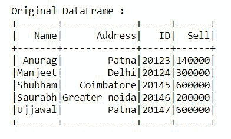
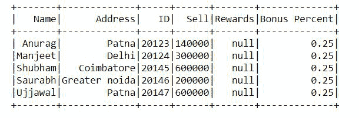

# 在 PySpark 数据框

中添加带默认值的新列

> 原文:[https://www . geesforgeks . org/add-new-column-with-default-value-in-py spark-data frame/](https://www.geeksforgeeks.org/add-new-column-with-default-value-in-pyspark-dataframe/)

在本文中，我们将看到如何在 PySpark Dataframe 中添加一个带有默认值的新列。

向 PandPySpark 添加列作为数据框的三种方法，默认值。

*   使用 pyspark . SQL . data frame . with column(colName，col)
*   使用 py spark . SQL . DataFrame . select(* cols)
*   使用 py spark . SqL . sparkSession . SqL(SqL query)

### 方法 1:使用 pyspark . SQL . data frame . with column(colName，col)

它向数据框添加一列或替换同名的现有列，并将包含所有现有列的新数据框返回到新数据框。列表达式必须是此数据框上的表达式，从其他数据框添加列会引发错误。

> **语法:**pyspark . SQL . data frame . with column(colName，col)
> 
> **参数:**该方法接受如下参数，如上所述，如下所述。
> 
> *   **colName:** 是字符串，包含新列的名称。
> *   **col:** 是新列的列表达式。
> 
> **返回:**数据帧

**首先，创建一个简单的数据帧。**

## 蟒蛇 3

```
import findspark
findspark.init()

# Importing the modules
from datetime import datetime, date
import pandas as pd
from pyspark.sql import SparkSession

# creating the session
spark = SparkSession.builder.getOrCreate()

# creating the dataframe
pandas_df = pd.DataFrame({
    'Name': ['Anurag', 'Manjeet', 'Shubham',
             'Saurabh', 'Ujjawal'],
    'Address': ['Patna', 'Delhi', 'Coimbatore',
                'Greater noida', 'Patna'],
    'ID': [20123, 20124, 20145, 20146, 20147],
    'Sell': [140000, 300000, 600000, 200000, 600000]
})
df = spark.createDataFrame(pandas_df)
print("Original DataFrame :")
df.show()
```

**输出:**



**添加新列，默认值:**

## 蟒蛇 3

```
# Add new column with NUll
from pyspark.sql.functions import lit
df = df.withColumn("Rewards", lit(None))
df.show()

# Add new constanst column
df = df.withColumn("Bonus Percent", lit(0.25))
df.show()
```

**输出:**



### **方法二:使用 pyspark . SQL . data frame . select(* cols)**

我们可以使用 pyspark.sql.DataFrame.select()在 DataFrame 中创建新列，并将其设置为默认值。它投射一组表达式并返回一个新的数据帧。

> **语法:**py spark . SQL . data frame . select(* cols)
> 
> **参数:**该方法接受如下参数，如上所述，如下所述。
> 
> *   **列:**包含列名(字符串)或表达式(列)
> 
> **返回:**数据帧

**首先，创建一个简单的数据帧。**

## 蟒蛇 3

```
import findspark
findspark.init()

# Importing the modules
from datetime import datetime, date
import pandas as pd
from pyspark.sql import SparkSession

# creating the session
spark = SparkSession.builder.getOrCreate()

# creating the dataframe
pandas_df = pd.DataFrame({
    'Name': ['Anurag', 'Manjeet', 'Shubham',
             'Saurabh', 'Ujjawal'],
    'Address': ['Patna', 'Delhi', 'Coimbatore',
                'Greater noida', 'Patna'],
    'ID': [20123, 20124, 20145, 20146, 20147],
    'Sell': [140000, 300000, 600000, 200000, 600000]
})
df = spark.createDataFrame(pandas_df)
print("Original DataFrame :")
df.show()
```

**输出:**


**添加新列，默认值:**

## 蟒蛇 3

```
# Add new column with NUll
from pyspark.sql.functions import lit
df = df.select('*', lit(None).alias("Rewards"))

# Add new constanst column
df = df.select('*', lit(0.25).alias("Bonus Percent"))
df.show()
```

**输出:**


### 方法 3:使用 py spark . SqL . sparksession . SqL(SqL query)

我们可以使用 pyspark.sql.SparkSession.sql()在 DataFrame 中创建新列，并将其设置为默认值。它返回一个代表给定查询结果的数据帧。

> **语法:**py spark . SQL . sparksession . SQL(SqL query)
> 
> **参数:**该方法接受如下参数，如上所述，如下所述。
> 
> *   **sqlQuery:** 它是一个字符串，包含 sql 可执行查询。
> 
> **返回:**数据帧

**首先，创建一个简单的数据帧:**

## 蟒蛇 3

```
import findspark
findspark.init()

# Importing the modules
from datetime import datetime, date
import pandas as pd
from pyspark.sql import SparkSession

# creating the session
spark = SparkSession.builder.getOrCreate()

# creating the dataframe
pandas_df = pd.DataFrame({
    'Name': ['Anurag', 'Manjeet', 'Shubham',
             'Saurabh', 'Ujjawal'],
    'Address': ['Patna', 'Delhi', 'Coimbatore',
                'Greater noida', 'Patna'],
    'ID': [20123, 20124, 20145, 20146, 20147],
    'Sell': [140000, 300000, 600000, 200000, 600000]
})
df = spark.createDataFrame(pandas_df)
print("Original DataFrame :")
df.show()
```

**输出:**


**添加新列，默认值:**

## 蟒蛇 3

```
# Add columns to DataFrame using SQL
df.createOrReplaceTempView("GFG_Table")

# Add new column with NUll
df=spark.sql("select *, null as Rewards from GFG_Table")

# Add new constanst column
df.createOrReplaceTempView("GFG_Table")
df=spark.sql("select *, '0.25' as Bonus_Percent from GFG_Table")
df.show()
```

**输出:**

