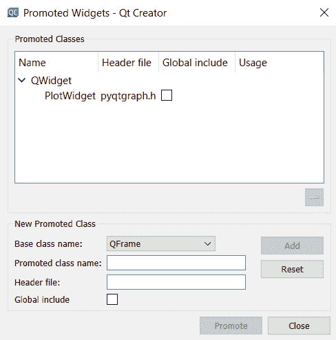
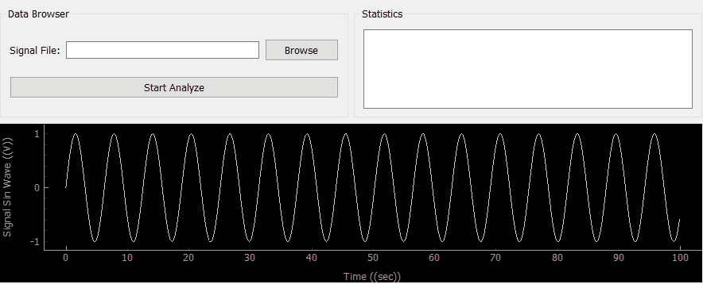

# 在 Python 中添加 QT GUI 绘制图形

> 原文:[https://www . geeksforgeeks . org/add-Qt-GUI-to-python-for-plot-graphics/](https://www.geeksforgeeks.org/add-qt-gui-to-python-for-plotting-graphics/)

Qt 框架(带有 QT Creator IDE)可以用来为 Python GUI 应用程序创建一个花哨的界面。使用 pyqtgraph 库可以在图形用户界面上绘制图形。

**安装 pyqtgraph–**
根据您的需要，安装 pyqtgraph 有多种方式。

如果您使用的是 Anaconda，您可以通过以下方式安装:

```py
conda install -c anaconda pyqtgraph

```

或者用画中画命令:

```py
pip install pyqtgraph

```

**使用 QT Creator 创建绘图小部件–**

添加按钮、文本区域和其他内容，就像 QT Creator 通常做的那样。要创建绘图区域，您需要遵循以下步骤:

1.  将小部件添加到用户界面，并给它一个合适的名称，如“widgetSignal”
2.  将小部件升级到 pyqtgraph



**将用户界面加载到 Python–**

1.  在您的 python 代码中，调用您用 QT Creator 创建的用户界面。
2.  创建一个用于绘图的正弦波
3.  在用户界面上绘制图形

```py
from PyQt5 import QtWidgets, uic
import sys
import numpy as np

class MainWindow(QtWidgets.QMainWindow):

    def __init__(self, *args, **kwargs):
        super(MainWindow, self).__init__(*args, **kwargs)
         # Load the UI Page
        self. ui = uic.loadUi('mainwindow.ui', self)
        # Create a sin wave
        x_time = np.arange(0, 100, 0.1);
        y_amplitude = np.sin(x_time)

        pltSignal = self.widgetSignal
        pltSignal.clear()
        pltSignal.setLabel('left', 'Signal Sin Wave', units ='(V)')
        pltSignal.setLabel('bottom', 'Time', units ='(sec)')
        pltSignal.plot(x_time, y_amplitude, clear = True)

        self.ui.show()

def main():
    app = QtWidgets.QApplication(sys.argv)
    window = MainWindow()
    sys.exit(app.exec_())

if __name__ == '__main__':
    main()     
```

**输出:**
