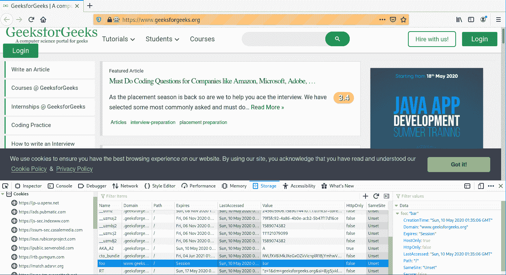

# add_cookie 驱动方法–硒蟒

> 原文:[https://www . geesforgeks . org/add _ cookie-driver-method-selenium-python/](https://www.geeksforgeeks.org/add_cookie-driver-method-selenium-python/)

Selenium 的 Python 模块是为使用 Python 执行自动化测试而构建的。硒 Python 绑定提供了一个简单的应用编程接口，可以使用硒网络驱动程序编写功能/验收测试。要使用硒 Python 打开网页，请使用 get 方法-硒 Python 签出–[导航链接。仅仅能够去一些地方并没有多大用处。我们真正想做的是与页面交互，或者更具体地说，与页面中的 HTML 元素交互。使用硒元素有多种策略，结账–](https://www.geeksforgeeks.org/navigating-links-using-get-method-selenium-python/)[定位策略](https://www.geeksforgeeks.org/locator-strategies-selenium-python/)。Selenium WebDriver 提供了各种有用的方法来控制会话，或者换句话说，浏览器。例如，添加 cookie、按后退按钮、在选项卡间导航等。

本文围绕《硒》中的`add_cookie`驱动方法展开。`add_cookie`方法用于将 cookie 添加到您当前的会话中。这个 cookie 可以被网站本身使用，也可以被你使用。

**语法–**

```
add_cookie(cookie_dict)
```

**示例–**
现在可以使用 add_cookie 方法作为驱动程序方法，如下所示–

```
driver.add_cookie({‘name’ : ‘foo’, ‘value’ : ‘bar’})

```

## 如何在 Selenium Python 中使用 add_cookie 驱动方法？

演示一下，硒 Python 中网络驱动的`add_cookie`方法。让我们访问 https://www.geeksforgeeks.org/，对驱动程序对象进行操作。

**程序–**

```
# import webdriver
from selenium import webdriver

# create webdriver object
driver = webdriver.Firefox()

# get geeksforgeeks.org
driver.get("https://www.geeksforgeeks.org/")

# add_cookie method driver
driver.add_cookie({"name" : "foo", "value" : "bar"})
```

**输出–**
添加名称为 foo 且数值为 bar 的 Cookie，如下所示验证–
