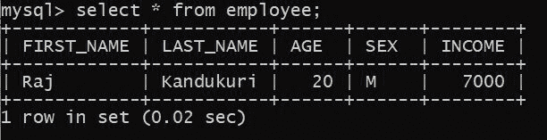
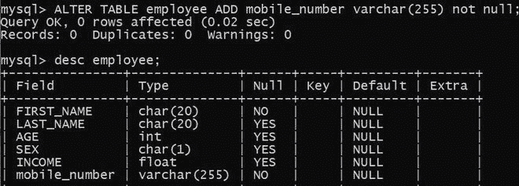
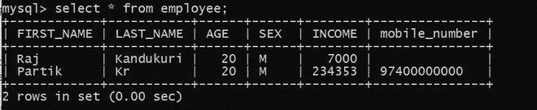
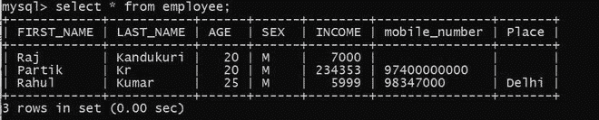

# 使用 Python 在 MySQL 中添加新的 NOT NULL 列

> 原文:[https://www . geesforgeks . org/add-a-new-not-null-column-in-MySQL-using-python/](https://www.geeksforgeeks.org/adding-a-new-not-null-column-in-mysql-using-python/)

**先决条件:** [Python: MySQL 创建表](https://www.geeksforgeeks.org/python-mysql-create-table/)

在本文中，我们将看到如何使用 Python 在 MySQL 中添加一个新的 NOT NULL 列。Python 允许广泛的数据库服务器与应用程序的集成。从 Python 访问数据库需要数据库接口。 [MySQL 连接器](https://www.geeksforgeeks.org/mysql-connector-python-module-in-python/) Python 模块是 Python 中的一个 API，用于与 MySQL 数据库进行通信。

**正在使用的数据库表:**



我们要用**极客**(数据库名)数据库和表格描述工资。

**进场:**

*   导入模块。
*   向数据库发出连接请求。
*   为数据库游标创建一个对象。
*   执行以下 MySQL 查询:

```py
ALTER TABLE table_name ADD colunm_name datatype NOT NULL;
insert into table_name value('Value');
```

*   并打印结果。

**在开始之前，让我们在 SQL 中做同样的事情:**

**第一步:**在表中增加一个非空列。

```py
ALTER TABLE employee ADD mobile_number varchar(255) not null;
```



**步骤 2:** 当您创建非空列时，您不能在该列中插入空值。查看错误。


**第 3 步:**将非空值添加到列中。


**并检查表格是否包含您的更新数据:**



**下面是 python 中的实现:**

## 蟒蛇 3

```py
# Establish connection to MySQL database
import mysql.connector

db = mysql.connector.connect(
  host="localhost",
  user="root",
  password="root123",
  database = "geeks"
  )

# getting the cursor by cursor() method
mycursor = db.cursor()

query = "ALTER TABLE employee ADD Place varchar(255) not null;"
query_1 = "insert into employee value('Rahul', 'Kumar', 25, 'M', '5999','98347000', 'Delhi');"

mycursor.execute(query)
mycursor.execute(query_1)

mycursor.execute("select * from employee;") 
myresult = mycursor.fetchall() 
for row in myresult: 
    print(row)
db.commit() 

# close the Connection
db.close()
```

**输出:**


**让我们检查一下表格中是否包含您的更新数据:**

