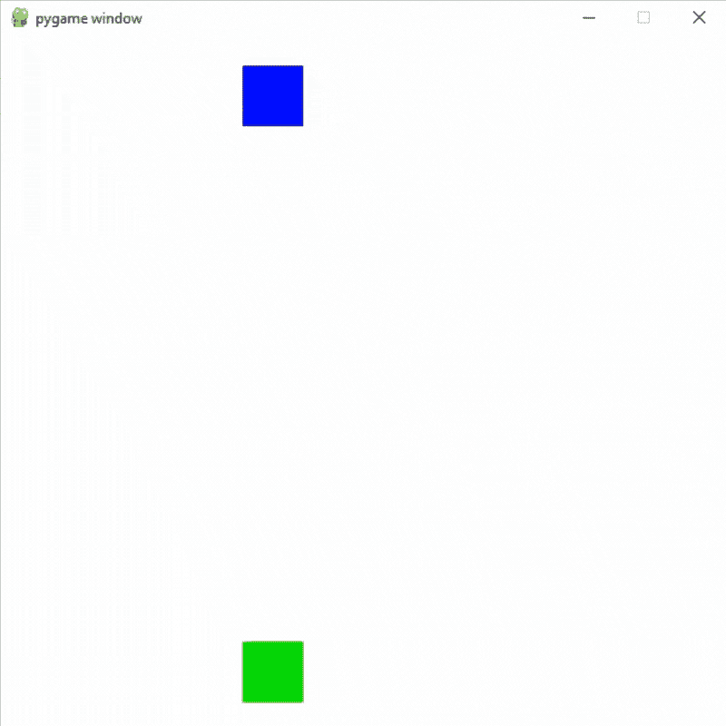
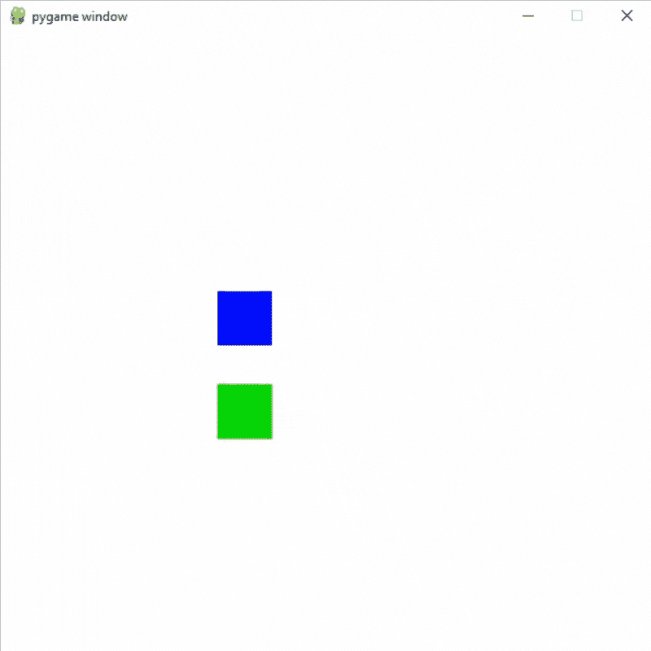

# 使用 pygame 添加碰撞。Pygame 中的矩形碰撞矩形

> 原文:[https://www . geeksforgeeks . org/add-conflicts-using-pygame-rect-conflict-in-pygame/](https://www.geeksforgeeks.org/adding-collisions-using-pygame-rect-colliderect-in-pygame/)

**先决条件:** [在 Pygame](https://www.geeksforgeeks.org/python-drawing-different-shapes-on-pygame-window/)[中绘制形状 pygame](https://www.geeksforgeeks.org/introduction-to-pygame/) 简介

在本文中，我们将使用 pygame。rect . conflict rect 用于使用 Python 中的 Pygame 在形状中添加碰撞。

我们可以使用碰撞矩形( )在 Pygame 形状中轻松添加碰撞。为此，我们将绘制两个矩形，然后我们将检查矩形是否碰撞。

> **语法：**pygame。Rect.colliderect（rectum1， recct2）
> 
> **参数:**将取两个矩形作为其参数。
> 
> **返回:**如果任一矩形的任何部分重叠，则返回真。

### 示例 1:以某种方式在形状中添加碰撞的简单示例

## 蟒蛇 3

```py
# Importing the pygame module
import pygame
from pygame.locals import *

# Initiate pygame and give permission
# to use pygame's functionality
pygame.init()

# Create a display surface object
# of specific dimension
window = pygame.display.set_mode((600, 600))

# Creating a new clock object to
# track the amount of time
clock = pygame.time.Clock()

# Creating a new rect for first object
player_rect = Rect(200, 500, 50, 50)

# Creating a new rect for second object
player_rect2 = Rect(200, 0, 50, 50)

# Creating variable for gravity
gravity = 4

# Creating a boolean variable that
# we will use to run the while loop
run = True

# Creating an infinite loop
# to run our game
while run:

    # Setting the framerate to 60fps
    clock.tick(60)

    # Adding gravity in player_rect2
    player_rect2.bottom += gravity

    # Checking if player is colliding
    # with platform or not using the
    # colliderect() method.
    # It will return a boolean value
    collide = pygame.Rect.colliderect(player_rect, p
                                      layer_rect2)

    # If the objects are colliding
    # then changing the y coordinate
    if collide:
        player_rect2.bottom = player_rect.top

    # Drawing player rect
    pygame.draw.rect(window, (0,   255,   0),
                     player_rect)
    # Drawing player rect2
    pygame.draw.rect(window, (0,   0,   255),
                     player_rect2)

    # Updating the display surface
    pygame.display.update()

    # Filling the window with white color
    window.fill((255, 255, 255))
```

**输出:**



### 示例 2:在两侧添加碰撞

## 蟒蛇 3

```py
# Importing the pygame module
import pygame
from pygame.locals import *

# Initiate pygame and give permission
# to use pygame's functionality
pygame.init()

# Create a display surface object
# of specific dimension
window = pygame.display.set_mode((600, 600))

# Creating a new clock object to
# track the amount of time
clock = pygame.time.Clock()

# Creating a new rect for first object
player_rect = Rect(200, 500, 50, 50)

# Creating a new rect for second object
player_rect2 = Rect(200, 0, 50, 50)

# Creating a boolean variable that
# we will use to run the while loop
run = True

# Speed for the objects
speed_a = 8
speed_b = -7

# Creating an infinite loop
# to run our game
while run:

    # Setting the framerate to 60fps
    clock.tick(60)

    # Adding speed in player rects
    player_rect.bottom += speed_a
    player_rect2.top += speed_b

    # Checking if player is colliding
    # with platform or not using the
    # colliderect() method.
    # It will return a boolean value
    collide = pygame.Rect.colliderect(player_rect,
                                      player_rect2)

    # If the objects are colliding
    # then changing the speed direction
    if collide:
        speed_a *= -1
        speed_b *= -1

    # Changing the direction if the objects
    # goes outside the window
    if player_rect.top<0 or player_rect.bottom > 600:
        speed_a *= -1
    if player_rect2.bottom > 600 or player_rect2.top<0:
        speed_b *= -1

    # Drawing player rect
    pygame.draw.rect(window, (0,   255,   0),
                     player_rect)
    # Drawing player rect2
    pygame.draw.rect(window, (0,   0,   255),
                     player_rect2)

    # Updating the display surface
    pygame.display.update()

    # Filling the window with white color
    window.fill((255, 255, 255))
```

**输出:**

