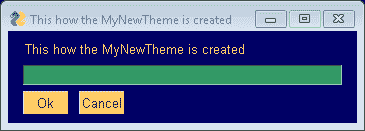

# 在 PySimpleGUI 中添加自定义颜色主题

> 原文:[https://www . geesforgeks . org/add-customized-color-theme-in-pysimplegui/](https://www.geeksforgeeks.org/adding-customized-color-theme-in-pysimplegui/)

PySimpleGUI 允许用户为其主题列表选择主题。此外，它允许用户根据自己的选择指定和自定义主题。用户只需知道颜色深浅，即颜色的十六进制代码。因此，他/她可以通过新的颜色定制主题。

**示例:**

```py
import PySimpleGUI as sg

# Add your new theme colors and settings
sg.LOOK_AND_FEEL_TABLE['MyCreatedTheme'] = {'BACKGROUND': '# 000066',
                                        'TEXT': '# FFCC66',
                                        'INPUT': '# 339966',
                                        'TEXT_INPUT': '# 000000',
                                        'SCROLL': '# 99CC99',
                                        'BUTTON': ('# 003333', '# FFCC66'),
                                        'PROGRESS': ('# D1826B', '# CC8019'),
                                        'BORDER': 1, 'SLIDER_DEPTH': 0, 
'PROGRESS_DEPTH': 0, }

# Switch to use your newly created theme
sg.theme('MyCreatedTheme')

# Call a popup to show what the theme looks like
sg.popup_get_text('This how the MyNewTheme is created')      
```

**输出:**
