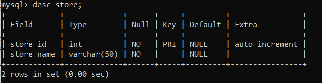
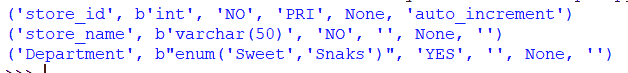
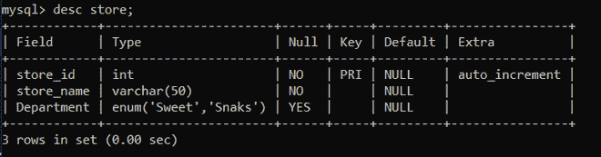

# 使用 Python 向现有的 MySQL 表添加新的枚举列

> 原文:[https://www . geesforgeks . org/add-new-enum-column-to-existing-MySQL-table-using-python/](https://www.geeksforgeeks.org/adding-new-enum-column-to-an-existing-mysql-table-using-python/)

**先决条件:** [Python: MySQL 创建表](https://www.geeksforgeeks.org/python-mysql-create-table/)

在本文中，我们将看到如何使用 Python 向现有的 MySQL 表中添加一个新的枚举列。Python 允许广泛的数据库服务器与应用程序的集成。从 Python 访问数据库需要数据库接口。 [**MySQL 连接器**](https://www.geeksforgeeks.org/mysql-connector-python-module-in-python/) -Python 模块是 Python 中的一个 API，用于与 MySQL 数据库进行通信。

**正在使用的数据库表:**



我们要用**极客**(数据库名)数据库和表格描述工资。

**进场:**

*   导入模块。
*   向数据库发出连接请求。
*   为数据库游标创建一个对象。
*   执行以下 MySQL 查询:

```
ALTER TABLE table_name ADD colunm_name  ENUM('field1','field2',...)
```

*   并打印结果。

**下面是用 python 实现:**

## 蟒蛇 3

```
# Establish connection to MySQL database
import mysql.connector

db = mysql.connector.connect(
  host = "localhost",
  user = "root",
  password = "rot23",
  database = "geeks"
  )

# getting the cursor by cursor() method
mycursor = db.cursor()

query = "ALTER TABLE store ADD Department  ENUM('Sweet','Snaks');"

mycursor.execute(query)

mycursor.execute(" desc store;") 
myresult = mycursor.fetchall() 
for row in myresult: 
    print(row)

db.commit() 

# close the Connection
db.close()
```

**输出:**



**我们来看看 SQL shell:**

