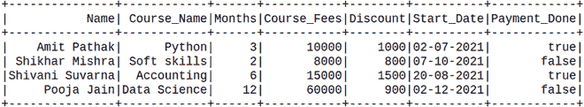
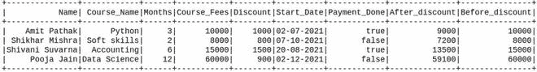
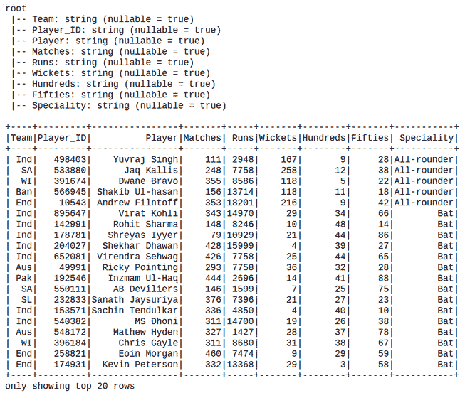
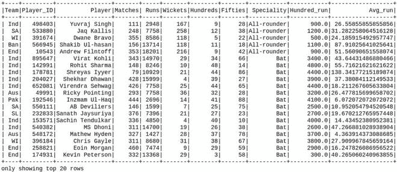

# 使用 withColumn

向现有 PySpark 数据框添加两列

> 原文:[https://www . geesforgeks . org/add-two-column-to-existing-py spark-data frame-using-with column/](https://www.geeksforgeeks.org/adding-two-columns-to-existing-pyspark-dataframe-using-withcolumn/)

在本文中，我们将看到如何使用 WithColumns 向现有的 Pyspark 数据框架添加两列。

WithColumns 用于更改值、转换现有列的数据类型、创建新列等等。

> **语法:** df.withColumn(colName，col)
> 
> **通过添加一列或替换同名的现有列，返回:**一个新的:类:` DataFrame '。

**示例 1:** 创建数据框，然后添加两列。

在这里，我们将从给定数据集的列表中创建一个数据帧。

## 蟒蛇 3

```
# Create a spark session
from pyspark.sql import SparkSession
spark = SparkSession.builder.appName('SparkExamples').getOrCreate()

# Create a spark dataframe
columns = ["Name", "Course_Name",
           "Months",
           "Course_Fees", "Discount",
           "Start_Date", "Payment_Done"]
data = [
    ("Amit Pathak", "Python", 3, 10000, 1000,
     "02-07-2021", True),
    ("Shikhar Mishra", "Soft skills", 2,
     8000, 800, "07-10-2021", False),
    ("Shivani Suvarna", "Accounting", 6,
     15000, 1500, "20-08-2021", True),
    ("Pooja Jain", "Data Science", 12,
     60000, 900, "02-12-2021", False),
]

df = spark.createDataFrame(data).toDF(*columns)

# View the dataframe
df.show()
```

**输出:**



**现在添加列:**

这里，我们基于现有的列创建两列。

## 蟒蛇 3

```
new_df = df.withColumn('After_discount',
                       df.Course_Fees - df.Discount).withColumn('Before_discount',
                                                                df.Course_Fees)
new_df.show()
```

**输出:**



**示例 2:** 从 csv 创建数据框，然后添加列。

这里我们将使用 [cricket_data_set_odi.csv 文件](https://media.geeksforgeeks.org/wp-content/cdn-uploads/20210628161151/Cricket_data_set_odi.csv)作为数据集，并从该文件创建 dataframe。

**创建用于演示的数据框:**

## 蟒蛇 3

```
# import pandas to read json file
import pandas as pd

# importing module
import pyspark

# importing sparksession from pyspark.sql
# module
from pyspark.sql import SparkSession

# creating sparksession and giving an app name
spark = SparkSession.builder.appName('sparkdf').getOrCreate()

# create Dataframe
df = spark.read.option("header",True).csv("Cricket_data_set_odi.csv")

# Display Schema
df.printSchema()

# Show Dataframe
df.show()
```

**输出:**



**然后，在现有数据框中添加列:**

## 蟒蛇 3

```
new_df = df.withColumn(
    'Hundred_run', df.Hundreds*100).withColumn(
    'Avg_run', df.Runs / df.Matches)

new_df.show()
```

**输出:**

