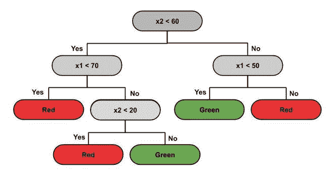
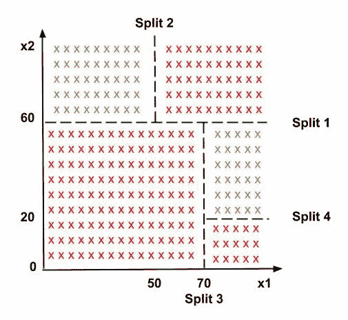
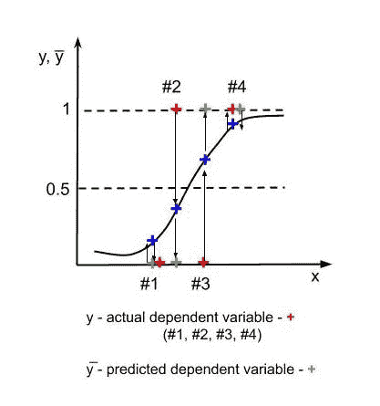
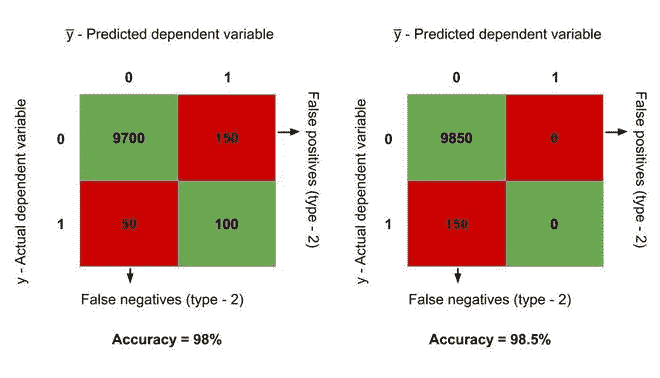
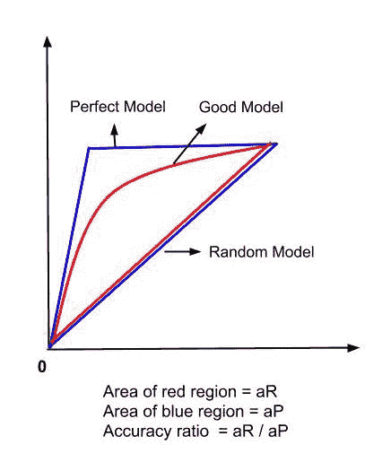

# 不同分类模式的优缺点

> 原文:[https://www . geesforgeks . org/不同分类模型的优缺点/](https://www.geeksforgeeks.org/advantages-and-disadvantages-of-different-classification-models/)

**分类**是典型的[监督](https://www.geeksforgeeks.org/ml-types-learning-supervised-learning/)学习任务。我们在那些我们必须预测一个分类类型的情况下使用它，即一个特定的例子是否属于一个类别(不像回归，它用于预测连续值)。例如，情感分析，将一封电子邮件归类为垃圾邮件与否，预测一个人是否购买了一辆 SUV 或没有提供包含工资的培训集，以及购买一辆 SUV。

**分类模型类型:**

*   **逻辑回归**是线性分类模型(因此，预测边界是线性的)，用于对二元因变量进行建模。它用于预测事件发生的概率(p)。如果 p > = 0.5，则输出为 1 否则为 0。sigmoid 函数将概率值映射到离散类(0 和 1)。例如，假设我们的逻辑回归模型是在包含一个人的工资和他是否买了一辆越野车的数据集上训练的。现在，根据这个人的工资，我们的模型预测这个人是否会买一辆 SUV。逻辑回归的假设很少——预测因子之间没有很高的相关性，结果的 sigmoid 和预测因子变量之间有线性关系。
*   **K-最近邻**是一个非线性分类器(因此，预测边界是非线性的)，它通过识别 K 个最近邻的类别来预测新的测试数据点属于哪个类别。我们基于欧氏距离选择这 k 个最近邻。在这 k 个邻居中，计算每个类别中的数据点的数量，并将新的数据点分配给邻居最多的类别。
*   **支持向量机(SVM)** 被用作基于所使用的核的线性或非线性分类器。如果我们使用线性核，那么分类器和预测边界是线性的。在这里，要分开两个类，我们需要画一条线。这条线有一个**最大余量**。这条线与两组等距。我们在两边再画两条线，这些线被称为支持向量。与其他机器学习模型从正确和不正确的数据中学习不同，支持向量机从支持向量中学习。例如，假设我们有两个班级——苹果和橘子。在这种情况下，SVM 学习了苹果中最右边的例子(一个像橘子的苹果)和橘子中最左边的例子(一个像苹果的橘子)；也就是说，他们看极端的情况。因此，他们大多数时候表现得更好。
*   **核 SVM** 在数据不可线性分离时特别有用。因此，我们采用非线性可分数据集，将其映射到更高维度，获得线性可分数据集，调用 SVM 分类器，为数据构建决策边界，然后将其投影回原始维度。这种映射在计算上非常昂贵，因此我们使用**核技巧**，它给出了类似的结果。可用的核有–高斯径向基函数核、Sigmoid 核、多项式核(核的默认值是“径向基函数”)。这也被称为非线性 SVM。
*   **朴素贝叶斯分类器**基于 [**贝叶斯定理工作。**](https://en.wikipedia.org/wiki/Bayes%27_theorem) 所做的基本假设是所有的特征都是相互独立的**，并对结果做出同等的贡献；所有的都同等重要。但是这些假设在现实生活中并不总是有效的(朴素贝叶斯的缺点)。这是一个概率分类器模型，其核心是贝叶斯定理。**
*   ****决策树分类**是最强大的分类器。决策树是类似于树结构的流程图，其中每个内部节点表示对属性(条件)的测试，每个分支表示测试的结果(真或假)，每个叶节点(终端节点)保存一个类标签。基于此树，进行拆分以区分给定原始数据集中的类。分类器基于决策树预测新数据点属于哪个类别。预测边界是水平线和垂直线。下面是数据分布及其对应的决策树。**

**

决策图表** 

**

使用决策树分割数据集** 

*   ****随机森林分类**是集成学习的一个例子，将多个机器学习算法放在一起，创建一个更大、性能更好的 ML 算法。我们从训练集中随机挑选‘k’个数据点，建立与这些 k 个点相关的决策树。然后，我们选择我们想要建立和重复的树的数量。对于一个新的数据点，我们采用每个“n”决策树的预测，并将其分配到多数票类别。**

<figure class="table">

| **分类模型** | **优势** | **缺点** |
| 逻辑回归 | 概率方法，给出了关于特征统计意义的信息。 | 逻辑回归的假设。 |
| k–最近的邻居 | 简单易懂，快速高效。 | 需要手动选择邻居的数量‘k’。 |
| 支持向量机(SVM) | 表现出色，不受异常值的影响，对过度拟合不敏感。 | 不适用于非线性问题，不是大量特征的最佳选择。 |
| 内核 SVM

 | 非线性问题的高性能，不受异常值的影响，对过度拟合不敏感。 | 不是大量功能的最佳选择，比较复杂。 |
| 朴素贝叶斯 | 高效，不受异常值的影响，处理非线性问题，概率方法。 | 基于特征具有相同统计相关性的假设。 |
| 决策树分类 | 可解释性，不需要特征缩放，适用于线性/非线性问题。 | 在非常小的数据集上效果不佳，容易出现过拟合。 |
| 随机森林分类 | 强大而准确，在许多问题上表现良好，包括非线性问题。 | 没有可解释性，容易出现过拟合，需要手动选择树的数量。 |

</figure>

****如何为给定的问题选择合适的分类模型？****

**分类模型的准确性是根据假阳性和假阴性的数量来衡量的。**

 **

假阳性和假阴性** 

**在上图中，对于 1，4–y =y̅(实际值=预测值)。3 处的错误是**假阳性**或类型 1 错误(我们预测了阳性结果，但它是假的——我们预测了没有发生的效果)。第 2 点的错误是**假阴性**或 2 型错误(我们预测的结果是假的，这在现实中会发生——这就像预测癌症患者没有癌症一样，这对患者的健康非常危险。我们使用**混淆矩阵**来表示假阳性、假阴性和正确预测结果的数量。**

 **

从混淆矩阵计算准确度** 

**假设最初，模型正确地预测 9700 个观察为真，100 个观察为假，150 个是类型 1 错误(假阳性)，其余 50 个是类型 2 错误(假阴性)。因此，准确率= (9800/10000)*100 = 98%。**

**现在，让我们停止模型进行预测，并说我们的预测 y̅总是= 0。在这种情况下，假阳性的数量减少到 0，并增加到正确预测的真实观测值，而先前正确预测的假观测值减少到 0。这增加了假阴性。因此，现在我们有–9850 个观测值被正确预测为真，150 个观测值为假阴性。因此，准确率= (9850/10000)*100 = 98.5%，比之前的型号还要高！但实际上，我们的模型根本没有经过训练。它总是预测 0。这就是所谓的**精度悖论**。**

**

准确性悖论** 

**因此，我们需要比准确率更准确的方法来分析我们的模型。为此，我们使用 CAP 曲线。使用 [CAP 曲线](https://en.wikipedia.org/wiki/Cumulative_accuracy_profile)分析计算模型的**精度比**。精度比是模型 CAP 和随机 CAP (aR)之间的封闭面积与完美 CAP 和随机 CAP (aP)之间的封闭面积之比。精度比越接近 1，模型越好。一个好的模型的 CAP 曲线介于完美 CAP 和随机 CAP 之间。**

 **

CAP 曲线分析** 

**通过考虑因变量和自变量(线性或非线性)之间的关系类型，为问题选择特定分类模型的利弊，以及模型通过上述方法的准确性，我们选择最适合待解决问题的分类问题。**