# 仿射空间

> 原文:[https://www.geeksforgeeks.org/affine-space/](https://www.geeksforgeeks.org/affine-space/)

### **仿射空间**

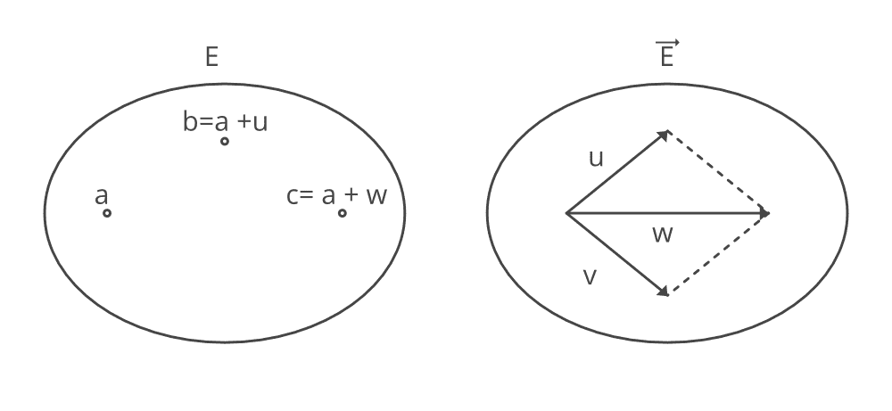

仿射空间

仿射空间是具有向量空间的集合 E，是集合 E 上加性空间的传递和自由作用，空间 A 的元素称为点。与仿射空间相关联的向量空间称为自由向量，并且动作+: E * \vec{E} \rightarrow E 满足以下条件:

1.  右标识:a + 0 = a 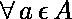
2.  关联性: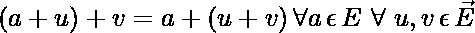
3.  对于任意两点 a，b \εE，存在唯一的 u，使得:

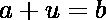

其中 u \uε\u vec { E }和可以表示为 *ab* 或\u vec { ab }或有时表示为 b-a。因此，我们可以写出上面的等式

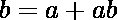

### 示例:

。考虑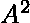的子集 L，它由满足以下等式的所有点(x，y)组成:

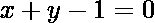

l 是通过点(1，0)和(0，1)的斜率为-1 的直线。通过定义 L 上的 R 的动作+: L * R \rightarrow L，使得 L 上的每个点(x，1-x)和任何 u \εR，线 L 可以是仿射空间

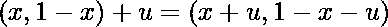

现在，对于 L 上的任意两点 a =(a_1，1- a_1)和 b = (b_1，1-b_1)，唯一向量 u \εR 使得 b = a+u 是 u = b _ 1–a _ 1。注意向量空间 **R** 同构于方程 *x + y = 0* 通过原点的直线。

### 查斯的身份

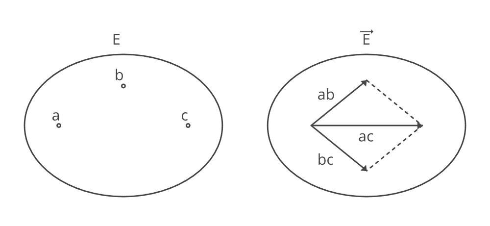

给定任意三个点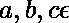，由于 c = a + ac，b = a + ab，c = b + bc，我们得到

通过应用上述属性 2 和 3，

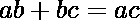

上述方程被称为 chasles 恒等式。因为

a = a + aa

通过使用属性 1，我们得到

a = a+ 0

因此，通过使用属性 3，我们得到:

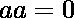

在 Chasles Identity 中用 a 代替 c，我们得到:

ba =-ab

现在，对于 4 个点 a，b，c，d \ε，裂缝的恒等式可以表示为:

ad+bc = ad+ dc = ac

## 仿射组合/重心

类似于线性代数中的线性组合，仿射几何中的相应概念是仿射组合的概念，也称为重心

将 2 维空间视为仿射空间，原点 O= (0，0)和基向量(1，0)和(0，1)。给定任意两点 a =(a1，a2)和 b =(b1，b2)，可以有一个自然的组合，使得\λa+\μb 或:

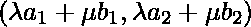

当 a = (-1，-1)和 b = (2，2)时，a+b 可以这样给出:c = (1，1)。

现在，考虑相对于原点 c = (1，1)的新坐标系。现在，a 的坐标= (-2，-2)，b 的坐标是(1，1)，d 的点= (-1，-1)。但是，点 d 与第一个坐标系的原点 O = (0，0)相同。

因此，a + b 对应于两个不同的点，这取决于使用哪个坐标系进行计算。这意味着我们需要仿射计算所需的额外条件。结果是标量加起来是 1。这有助于我们定义重心

对于 E 中的任意点族(a _ I)_ { I \εI }，对于任意标量族，使得和任意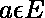点

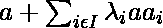被称为分配了权重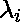的点 a_i 的*重心*，由以下等式表示:

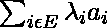。

重心由符号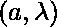方便地表示，而是点，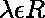被称为标量。

### 仿射子空间

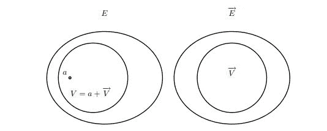

v 是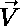方向上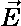的仿射子空间

给定仿射空间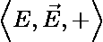，E 的子集 V 是的仿射子空间，如果对于 V 中的每一族加权点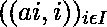，使得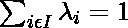，重心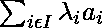属于 V。

### 参考文献:

*   [**仿射空间 upen**](https://www.cis.upenn.edu/~cis610/geombchap2.pdf)