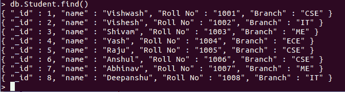
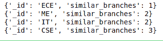

# 使用 Python 在 MongoDB 中聚合

> 原文:[https://www . geeksforgeeks . org/aggregation-in-MongoDB-using-python/](https://www.geeksforgeeks.org/aggregation-in-mongodb-using-python/)

**MongoDB** 是免费、开源、跨平台、面向文档的数据库管理系统(dbms)。这是一个 NoSQL 类型的数据库。它将数据以 **BSON** 格式存储在硬盘上。BSON 是 MongoDB 中表示简单数据结构、关联数组和各种数据类型的二进制形式。NoSQL 是最近使用的数据库，它提供了存储和检索数据的机制。mongodb architechture 不是像在关系数据库中那样使用表和行，而是由集合和文档组成。

## **MongoDB 中的聚合**

聚合操作将来自多个文档(对于 MongoDB 是行)的值组合在一起，对分组的数据执行各种操作，并在聚合后为每个分组的数据返回一个结果。

**语法:**

```
db.collection_name.aggregate(aggregate operations)

```

**以下所有示例中使用的示例数据库:**



**例 1:**

## 蟒蛇 3

```
from pymongo import MongoClient

my_client = MongoClient('localhost', 27017)
db = my_client["GFG"]
coll = db["Student"]

# Aggregation
cursor = coll.aggregate([{"$group":
       {"_id":"$Branch",
       "similar_branches":{"$sum":1}
       }
       }])

for document in cursor:
       print(document)
```

**输出:**



在这里，我们使用 **"$group"** 命令进行分组，然后通过 **"_id ":"分支"**我们根据分支对 id 进行分组。**“相似 _ 分支”**是用于相似分支总数的关键词，我们可以在这里使用任意关键词。**“$ sum:1”**作为每个分支机构总数的计数器。总和增加 1。

**例 2:** 我们还可以使用聚合查询来统计数据库中的文档数量。

## 蟒蛇 3

```
from pymongo import MongoClient

my_client = MongoClient('localhost', 27017)
db = my_client["GFG"]
coll = db["Student"]

# Aggregation
cursor = coll.aggregate([{"$group":
       {"_id":"$None",
       "total collections":{"$sum": 1}
       }
       }])

for document in cursor:
       print(document)
```

**输出:**

```
{'_id': None, 'total collections': 8}
```