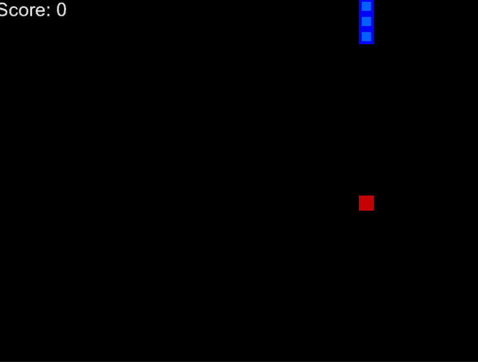
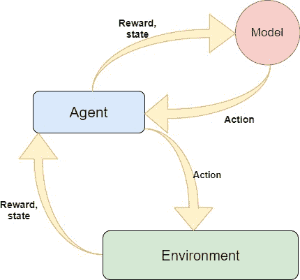
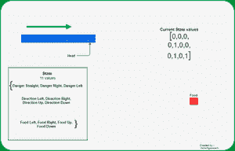
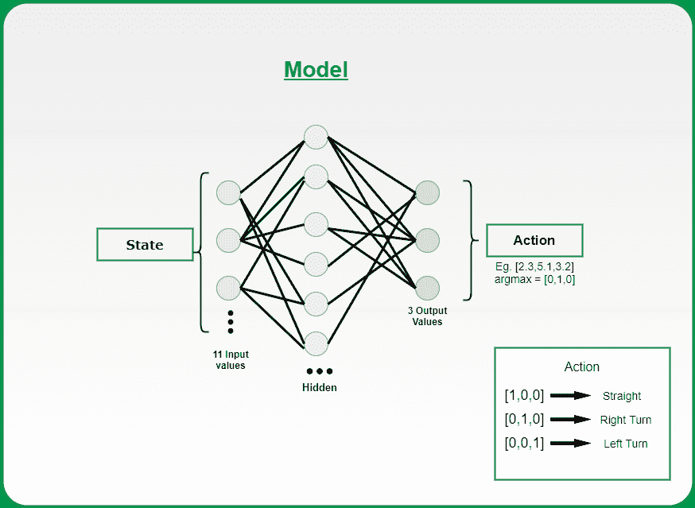
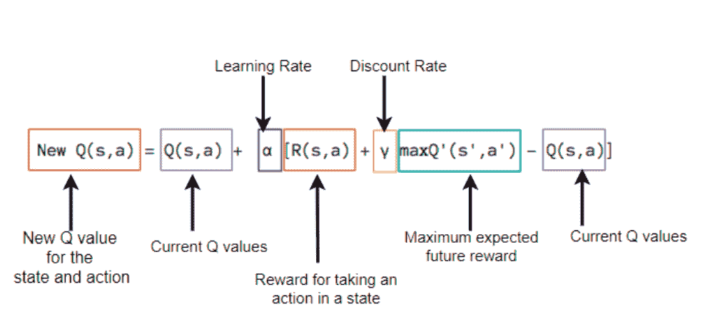
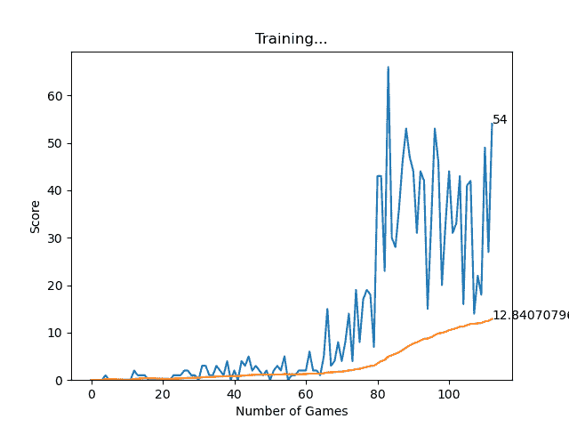
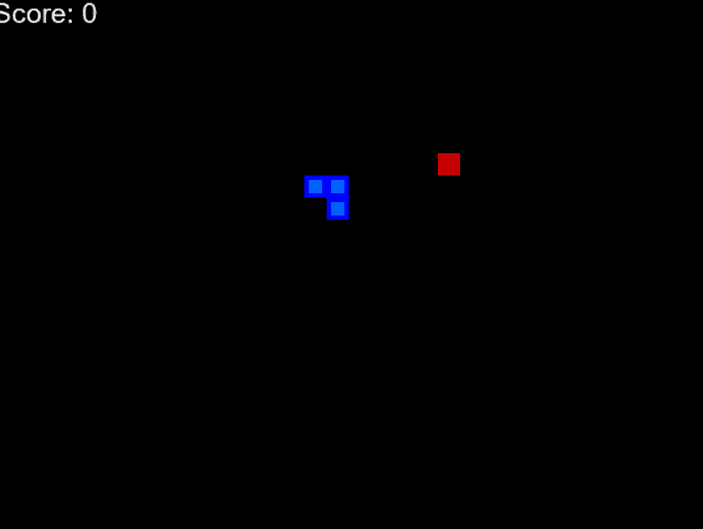

# 使用深度 Q 学习的 AI 驱动蛇游戏

> 原文:[https://www . geesforgeks . org/ai-driven-snake-game-use-deep-q-learning/](https://www.geeksforgeeks.org/ai-driven-snake-game-using-deep-q-learning/)

**简介:**本项目基于强化学习，训练蛇吃环境中存在的食物。

下面给出了一个示例 gif，您可以从中了解我们将要构建的内容。



**AI 驱动的蛇**

**本项目前提条件为:**

*   强化学习
*   深度学习(密集神经网络)
*   皮尤游戏

要了解我们如何使用 pygame 手动构建这个蛇 2D 动画模拟，请遵循以下链接:[https://www . geeksforgeeks . org/snake-game-in-python-use-pygame-module/](https://www.geeksforgeeks.org/snake-game-in-python-using-pygame-module/)

在构建了基本的蛇游戏之后，现在我们将重点关注如何将强化学习应用于它。

**我们必须在这个项目中创建三个模块:**

1.  **环境**(我们刚刚搭建的游戏)
2.  **模型**(移动预测的强化模型)
3.  **代理**(环境和模型之间的中介)



模块链接

### 算法:

我们把蛇和食物随意放在木板上。

*   使用 11 个值计算蛇的状态。如果条件为真，则将该值设置为零，否则设置一。



如何定义 11 种状态

基于当前的头部位置，代理将如上所述计算 11 个状态值。

*   获得这些状态后，代理会将此传递给模型，并执行下一步操作。
*   执行下一个状态后计算奖励。奖励定义如下:
    *   ***吃菜:+10***
    *   ***游戏结束:-10***
    *   ***否则:0***
*   更新 Q 值(将在后面讨论)并训练模型。
*   在分析了算法之后，现在我们必须建立编码该算法的思路。

### **车型:**



神经网络模型

该模型是使用 Pytorch 设计的，但您也可以根据自己的舒适度使用 TensorFlow。

我们使用的是密集神经网络，其中一个**输入层的大小为 11** ，一个**密集层的大小为 256 个神经元**和**输出为 3 个神经元。**你可以调整这些超参数来得到最好的结果。

### **模型是如何工作的？**

*   游戏开始，Q 值随机初始化。
*   系统获取当前状态。
*   基于 s，它随机地或基于它的神经网络执行一个动作。在训练的第一阶段，系统经常选择随机的动作来最大化探索。后来，这个系统越来越依赖它的神经网络。
*   当人工智能选择并执行动作时，环境会给予奖励。然后，代理到达新状态，并根据贝尔曼方程更新其 Q 值。你在强化学习课程中明确提到的这个等式。如果没有，可以参考 [Q-learning 数学](https://www.geeksforgeeks.org/q-learning-mathematical-background/)



贝尔曼方程

*   此外，对于每个移动，它存储原始状态、动作、执行该动作后达到的状态、获得的奖励以及游戏是否结束。该数据随后被采样以训练神经网络。此操作称为重放内存。
*   重复最后两个操作，直到满足某个条件(例如:游戏结束)。

这个项目的核心是你要训练的模型，因为蛇会玩的动作的正确性将完全取决于你已经建立的模型的质量。所以我想用部分代码来解释一下。

**第一部分**

```py
1\. Creating a class named Linear_Qnet for initializing the linear neural network.
2\. The function forward is used to take the input(11 state vector) and pass it through the 
   Neural network and apply relu activation function and give the output back i.e the next 
   move of 1 x 3 vector size. In short, this is the prediction function that would be called by the agent.
3\. The save function is used to save the trained model for future use.
```

## 蟒蛇 3

```py
class Linear_QNet(nn.Module):
    def __init__(self, input_size, hidden_size, output_size):
        super().__init__()
        self.linear1 = nn.Linear(input_size, hidden_size)
        self.linear2 = nn.Linear(hidden_size, output_size)

    def forward(self, x):
        x = F.relu(self.linear1(x))
        x = self.linear2(x)
        return x

    def save(self, file_name='model_name.pth'):
        model_folder_path = 'Path'
        file_name = os.path.join(model_folder_path, file_name)
        torch.save(self.state_dict(), file_name)
```

**第二部分**

```py
1\. Initialising QTrainer class
   ∗ setting the learning rate for the optimizer.
   * Gamma value that is the discount rate used in Bellman equation.
   * initialising the Adam optimizer for updation of weight and biases.
   * criterion is the Mean squared loss function.
2\. Train_step function 
   * As you know that PyTorch work only on tensors, so we are converting all the input
    to tensors.
   * As discussed above we had a short memory training then we would only pass one value
    of state, action, reward, move so we need to convert them into a vector, so we had used
    unsqueezed function .
   * Get the state from the model and calculate the new Q value using the below formula:
                   Q_new = reward + gamma * max(next_predicted Qvalue)
   * calculate the mean squared error between the new Q value and previous Q value and 
   backpropogate that loss for weight updation. 
```

## C++

```py
class QTrainer:
    def __init__(self,model,lr,gamma):
#Learning Rate for Optimizer
        self.lr = lr
#Discount Rate
        self.gamma = gamma
#Linear NN defined above.
        self.model = model
#optimizer for weight and biases updation
        self.optimer = optim.Adam(model.parameters(),lr = self.lr)
#Mean Squared error loss function
        self.criterion = nn.MSELoss()

    def train_step(self,state,action,reward,next_state,done):
        state = torch.tensor(state,dtype=torch.float) 
        next_state = torch.tensor(next_state,dtype=torch.float)
        action = torch.tensor(action,dtype=torch.long) 
        reward = torch.tensor(reward,dtype=torch.float)

#only one parameter to train,                              \
    Hence convert to tuple of shape(1, x)
        if(len(state.shape) == 1):
#(1, x)
            state = torch.unsqueeze(state,0) 
            next_state = torch.unsqueeze(next_state,0) 
            action = torch.unsqueeze(action,0) 
            reward = torch.unsqueeze(reward,0) 
            done = (done, )

# 1\. Predicted Q value with current state
        pred = self.model(state)
        target = pred.clone()
        for idx in range(len(done)):
            Q_new = reward[idx]
            if not done[idx]:
                Q_new = reward[idx] + 
                  self.gamma * torch.max(self.model(next_state[idx])) 
            target[idx][torch.argmax(action).item()] = Q_new
# 2\. Q_new = reward + gamma * max(next_predicted Qvalue)
#pred.clone()
#preds[argmax(action)] = Q_new
        self.optimer.zero_grad()
        loss = self.criterion(target,pred)
        loss.backward() # backward propogation of loss

        self.optimer.step()
```

### **代理人**

*   从环境中获取蛇的当前状态。

## 计算机编程语言

```py
def get_state(self, game):
    head = game.snake[0]
    point_l = Point(head.x - BLOCK_SIZE, head.y)
    point_r = Point(head.x + BLOCK_SIZE, head.y)
    point_u = Point(head.x, head.y - BLOCK_SIZE)
    point_d = Point(head.x, head.y + BLOCK_SIZE)

    dir_l = game.direction == Direction.LEFT
    dir_r = game.direction == Direction.RIGHT
    dir_u = game.direction == Direction.UP
    dir_d = game.direction == Direction.DOWN

    state = [
        # Danger Straight
        (dir_u and game.is_collision(point_u))or
        (dir_d and game.is_collision(point_d))or
        (dir_l and game.is_collision(point_l))or
        (dir_r and game.is_collision(point_r)),

        # Danger right
        (dir_u and game.is_collision(point_r))or
        (dir_d and game.is_collision(point_l))or
        (dir_u and game.is_collision(point_u))or
        (dir_d and game.is_collision(point_d)),

        # Danger Left
        (dir_u and game.is_collision(point_r))or
        (dir_d and game.is_collision(point_l))or
        (dir_r and game.is_collision(point_u))or
        (dir_l and game.is_collision(point_d)),

        # Move Direction
        dir_l,
        dir_r,
        dir_u,
        dir_d,

        # Food Location
        game.food.x < game.head.x,  # food is in left
        game.food.x > game.head.x,  # food is in right
        game.food.y < game.head.y,  # food is up
        game.food.y > game.head.y  # food is down
    ]
    return np.array(state, dtype=int)
```

*   调用模型获取蛇的下一个状态

## 计算机编程语言

```py
def get_action(self, state):
    # random moves: tradeoff explotation / exploitation
    self.epsilon = 80 - self.n_game
    final_move = [0, 0, 0]
    if(random.randint(0, 200) < self.epsilon):
        move = random.randint(0, 2)
        final_move[move] = 1
    else:
        state0 = torch.tensor(state, dtype=torch.float).cuda()
        prediction = self.model(state0).cuda()  # prediction by model
        move = torch.argmax(prediction).item()
        final_move[move] = 1
    return final_move
```

**注:** *开采和勘探之间存在*权衡*。其中开采包括根据目前观察到的数据做出假设为最佳的决策。探索是随机做出决定，而不考虑之前的行动和奖励对。所以两者都是必要的，因为采取剥削可能会导致代理人无法探索整个环境，而探索可能不会总是提供*一个*更好的奖励。*

*   在环境中播放模型预测的步骤。
*   存储当前状态、执行的移动和奖励。
*   根据执行的移动和环境获得的奖励来训练模型。(训练短记忆)

## 计算机编程语言

```py
def train_short_memory(self, state, action, reward, next_state, done):
    self.trainer.train_step(state, action, reward, next_state, done)
```

*   如果游戏因撞到墙壁或身体而结束，那么根据到目前为止执行的所有移动来训练模型，并重置环境。(训练长记忆)。训练批量为 1000。

## 计算机编程语言

```py
def train_long_memory(self):
    if (len(self.memory) > BATCH_SIZE):
        mini_sample = random.sample(self.memory, BATCH_SIZE)
    else:
        mini_sample = self.memory
    states, actions, rewards, next_states, dones = zip(*mini_sample)
    self.trainer.train_step(states, actions, rewards, next_states, dones)
```

训练模型需要大约 100 个时期才能获得更好的性能。看我的训练进度。

**输出:**

*   要运行这个游戏，首先在 anaconda 提示符或(任何平台)中创建一个环境。然后安装必要的模块，如 Pytorch(用于 DQ 学习模型)、Pygame(用于游戏的视觉效果)和其他基本模块。
*   然后在刚刚创建的环境中运行 agent.py 文件，然后开始训练，你会看到下面两个 GUI，一个是训练进度，另一个是 AI 驱动的蛇游戏。
*   达到一定分数后，你可以退出游戏，你刚才训练的模型将被存储在你在 models.py 的 save 函数中定义的路径中。

将来，您可以通过更改 agent.py 文件中的代码来使用这个训练好的模型，如下所示:

## 计算机编程语言

```py
self.model.load_state_dict(torch.load('PATH'))
```

**注意:**注释掉所有的训练函数调用。



培训进度



初步训练


100 年后

**源代码:**[**https://github . com/vedantgoswami/snakegamai**](https://github.com/vedantgoswami/SnakeGameAI)

**应用:**

这个项目的目标是给出一个想法，即如何应用强化学习，以及如何将其用于现实世界的应用，如自动驾驶汽车(如:AWS DeepRacer)，在装配线上训练机器人，等等…

**提示:**

*   使用单独的环境并安装所有必需的模块。(您可以使用蟒蛇环境)
*   为了训练模型，您可以使用图形处理器进行更快的训练。