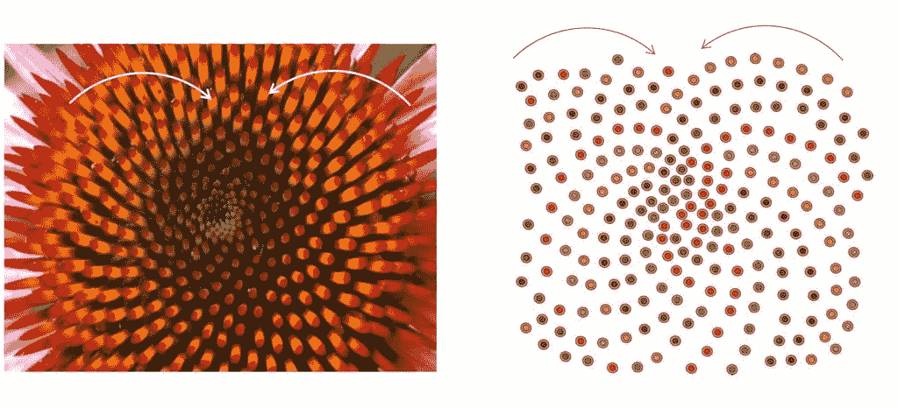
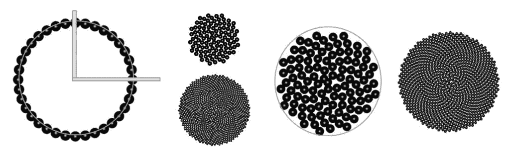
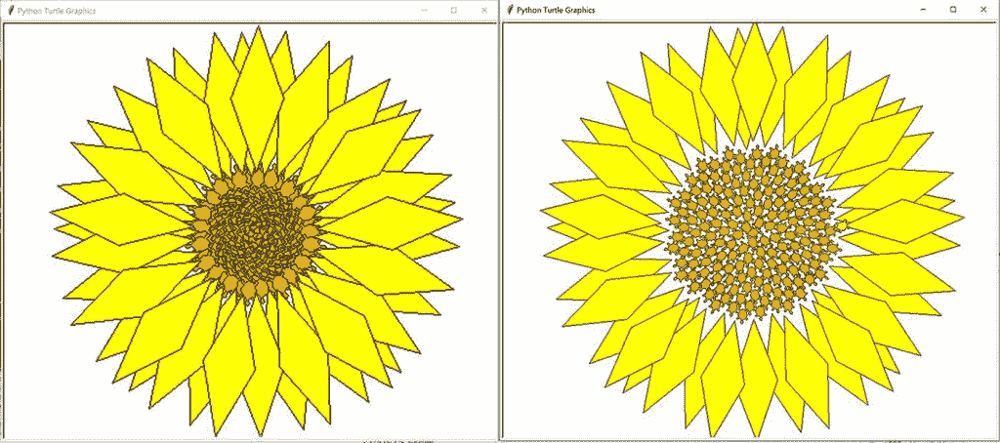

# Python 中的叶序模式|算法植物学的一个单元

> 原文:[https://www . geesforgeks . org/algorithm-植物学-叶序-python/](https://www.geeksforgeeks.org/algorithmic-botany-phyllotaxis-python/)

叶序/叶序是植物茎上叶子的排列&叶序螺旋在自然界中形成了一类独特的模式。这个词本身来自希腊语 phullon，意思是“叶子”，出租车，意思是“排列”。基本的花叶状体排列包括:
**1。螺旋叶序–**在螺旋叶序中，单个花器官以相同的发散角在规则的时间间隔内产生。具有螺旋形叶序的花的发散角大约为 137.5 度，这表明了遵循**斐波那契数列**的模式。下图显示了具有顺时针和逆时针螺旋模式的螺旋叶序模式。


 <small>**要注意的要点:**</small>

<small>*   Fibonacci series usually describes spirals found in nature. It is calculated as a sequence, where the sum of the previous pair of numbers is equal to the next number in the sequence. The sequence is 1, 1, 2, 3, 5, 8, 13, 21, 34, 55, 89 …*   Actually, there is a set of spirals clockwise and a set of spirals counterclockwise.*   The spiral of flower organ follows a set of molecules and denominators with offset Fibonacci numbers (1/2, 1/3, 2/5, 3/8, 5/13, 8/21, 13/34……). Is the number of times or turns that a molecule returns to its original origin around its axis. Denominator indicates the number of organs activated when turning. Therefore, 2/5 means two turns around the axis, and five organs return to the origin.*   For example–in pine trees, we have (2,3), (5,3) and (5,8) leaf sequences, and the pairs found in flower heads are (21,34), (55,34), (55,89) and (89,144), while in pineapple with hexagonal scales.*   The prevalence of Fibonacci series in leaf order is often called "the mystery of leaf order."</small>

<small></small>

其他类型的花的叶状排列是:
**2。轮生叶序，3。单轮生叶序，4。复轮生叶序& 5。不规则叶序**

**图案的形成:总结**

有些植物的叶子的美丽排列，叫做叶序，遵循许多微妙的数学关系。例如，向日葵头部的小花形成两个方向相反的螺旋:其中 55 个是顺时针方向，34 个是逆时针方向。令人惊讶的是，

1.  这些数字是连续的斐波那契数。
2.  交替的斐波那契数的比率由转换到φ^(-2 给出)，其中φ是[黄金比率](http://mathworld.wolfram.com/GoldenRatio.html)，据说它测量植物茎上连续叶子之间的一圈的分数:
3.  例如:榆树和椴树占 1/2，山毛榉和榛树占 1/3，橡树和苹果占 2/5，杨树和玫瑰占 3/8，柳树和杏仁占 5/13，等等。
4.  植物茎上的每一片新叶都与前一片叶子成一定角度，并且叶子之间的角度是恒定的:通常约为 137.5 度。

也就是说，如果你从植物的上方往下看，测量从茎到叶的一条线和下一片叶的相应线之间形成的角度，你会发现通常有一个固定的角度，称为发散角。
在这里，我们对螺旋叶序感兴趣，我们将使用海龟图形在 python 中编码形成螺旋叶序模式。

**设计代码**

1.  我们将编写两个函数，一个绘制叶序图案，另一个绘制花瓣。
2.  花瓣只需要在叶序模式完成后绘制。因此，我们将在绘制完叶序图案后，在最后一个 x & y 坐标被访问的情况下，从 drawPhylist()函数中调用 drawPetal()函数。
3.  draw 花瓣()功能将绘制带有海龟功能和特征的花瓣，参见[海龟编程](https://www.geeksforgeeks.org/turtle-programming-python/)。

要对叶序模式进行编码，我们需要遵循以下等式:

```
x = r*cos(θ)
y = r*sin(θ)

r, θ can also vary - so the to form phyllotactic pattern we substitutethe cartesian form
by polar form:

r = c*sqrt(n)
θ = n*137.508°

```



```
Reduces the problem to optimal packing on a disc, so
    r = c*sqrt(n) is from the area of the circle
        Area = πr² and n fills the Area in some units
        c1 * n/π = r²,    c is 1/sqrt(c1/π)
So, r = some constant c * sqrt(n)

```

**伪代码:叶序模式**

```
IMPORT MODULES ( MATH, TURTLE )

FUNCTION - DrawPhyllotaxisPattern( turtle, t length, petalstart, angle = 137.508, size, cspread)
    turtleColor("Black")
    FillColor('"Orange")
    Convert angle to radians (Φ)
    initialize ( xcenter,ycenter ) = ( 0,0 )
    Drawing the Pattern Starts:
    For n in Range ( 0,t ):
        r = cspread * sqrt(n)
        θ = n * Φ

        x = r * cos(θ) + xcenter
            y = r * sin(θ) + ycenter

        TURTLE POSITION(x,y)
        START DRAWING():
        if Drawing pattern ends:
            DrawFlowerPetals()

FUNCTION - DrawFlowerPetals(Turtle, x coordinate, y coordinate)
    DRAW using Turtle methods

Create Turtle  =  gfg
Call DrawPhyllotaxisPattern( gfg, t length, petalstart, angle = 137.508, size, cspread)

END

```

## Python 模式 A

```
import math       
import turtle

def drawPhyllPattern(turtle, t, petalstart, angle = 137.508, size = 2, cspread = 4 ):
    """print a pattern of circles using spiral phyllotactic data"""
    # initialize position
    # turtle.pen(outline=1, pencolor="black", fillcolor="orange")
    turtle.color('black')
    turtle.fillcolor("orange")
    phi = angle * ( math.pi / 180.0 ) #we convert to radian
    xcenter = 0.0
    ycenter = 0.0

    # for loops iterate in this case from the first value until < 4, so
    for n in range (0, t):
        r = cspread * math.sqrt(n)
        theta = n * phi

        x = r * math.cos(theta) + xcenter
        y = r * math.sin(theta) + ycenter

        # move the turtle to that position and draw 
        turtle.up()
        turtle.setpos(x, y)
        turtle.down()
        # orient the turtle correctly
        turtle.setheading(n * angle)
        if n > petalstart-1:
            turtle.color("yellow")
            drawPetal(turtle, x, y)
        else: turtle.stamp()

def drawPetal(turtle, x, y ):
    turtle.penup()
    turtle.goto(x, y)
    turtle.pendown()
    turtle.color('black')
    turtle.fillcolor('yellow')
    turtle.begin_fill()
    turtle.right(20)
    turtle.forward(70)
    turtle.left(40)
    turtle.forward(70)
    turtle.left(140)
    turtle.forward(70)
    turtle.left(40)
    turtle.forward(70)
    turtle.penup()
    turtle.end_fill() # this is needed to complete the last petal

gfg = turtle.Turtle()
gfg.shape("turtle")
gfg.speed(0) # make the turtle go as fast as possible
drawPhyllPattern(gfg, 200, 160, 137.508 )
gfg.penup()
gfg.forward(1000)
```

## python 模式

```
import math       
import turtle

def drawPhyllotacticPattern( t, petalstart, angle = 137.508, size = 2, cspread = 4 ):
        """print a pattern of circles using spiral phyllotactic data"""
        # initialize position
        turtle.pen(outline=1, pencolor="black", fillcolor="orange")
        # turtle.color("orange")
        phi = angle * ( math.pi / 180.0 )
        xcenter = 0.0
        ycenter = 0.0

        # for loops iterate in this case from the first value until < 4, so
        for n in range (0, t):
                r = cspread * math.sqrt(n)
                theta = n * phi

                x = r * math.cos(theta) + xcenter
                y = r * math.sin(theta) + ycenter

                # move the turtle to that position and draw 
                turtle.up()
                turtle.setpos(x, y)
                turtle.down()
                # orient the turtle correctly
                turtle.setheading(n * angle)
                if n > petalstart-1:
                        #turtle.color("yellow")
                        drawPetal(x, y)
                else: turtle.stamp()

def drawPetal( x, y ):
        turtle.up()
        turtle.setpos(x, y)
        turtle.down()
        turtle.begin_fill()
        #turtle.fill(True)
        turtle.pen(outline=1, pencolor="black", fillcolor="yellow")
        turtle.right(20)
        turtle.forward(100)
        turtle.left(40)
        turtle.forward(100)
        turtle.left(140)
        turtle.forward(100)
        turtle.left(40)
        turtle.forward(100)
        turtle.up()
        turtle.end_fill() # this is needed to complete the last petal

turtle.shape("turtle")
turtle.speed(0) # make the turtle go as fast as possible
drawPhyllotacticPattern( 200, 160, 137.508, 4, 10 )
turtle.exitonclick() # lets you x out of the window when outside of idle
```

**Output:** Phyllotaxis Patterns.


来源:

*   [蟒蛇和乌龟图形](http://www.deborahrfowler.com/PythonResources/PythonTurtle.html)作者[黛博拉·福勒](http://www.deborahrfowler.com/index.html)
*   [叶序模式](http://deborahrfowler.com/MathForVSFX/Phyllotaxis.html)由[黛博拉·r·福勒](http://www.deborahrfowler.com/index.html)
*   [T4【Python 实现](http://www.deborahrfowler.com/index.html)

[黛博拉·r·福勒*   T8】www.sciteneg.com/PhiTaxis/](http://www.deborahrfowler.com/index.html)
*   [叶序:自然界中的斐波那契数列](http://goldenratiomyth.weebly.com/phyllotaxis-the-fibonacci-sequence-in-nature.html)
*   [algorithmicbotany.org 论文](http://algorithmicbotany.org/papers/#abop)

本文由 **Amartya Ranjan Saikia** 供稿。如果你喜欢 GeeksforGeeks 并想投稿，你也可以使用[contribute.geeksforgeeks.org](http://www.contribute.geeksforgeeks.org)写一篇文章或者把你的文章邮寄到 contribute@geeksforgeeks.org。看到你的文章出现在极客博客主页上，帮助其他极客。

如果你发现任何不正确的地方，或者你想分享更多关于上面讨论的话题的信息，请写评论。