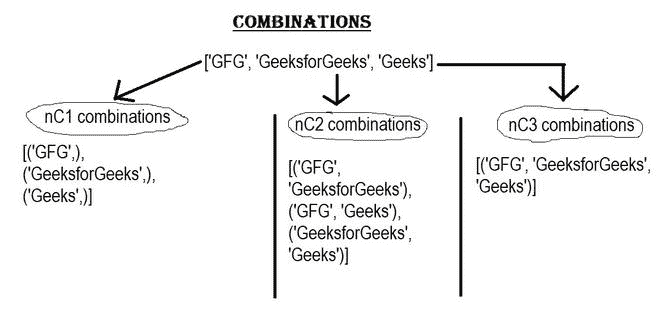

# 对象列表的所有组合

> 原文:[https://www . geesforgeks . org/对象列表的所有组合/](https://www.geeksforgeeks.org/all-combinations-for-a-list-of-objects/)

**先决条件:**[**Python ITER tools**](https://www.geeksforgeeks.org/python-itertools/)

有几种方法可以获得 python 中对象列表的所有组合。这个问题已经有了[递归解](https://www.geeksforgeeks.org/print-all-possible-combinations-of-r-elements-in-a-given-array-of-size-n/)。Python 有一个 itertools 模块，提供了两个名为 [**组合()**](https://www.geeksforgeeks.org/python-itertools-combinations-function/) 和 [**组合 _ with _ replacement()**](https://www.geeksforgeeks.org/python-itertools-combinations_with_replacement/)**的功能，让我们的工作轻松了很多。以下是两种方法:**

#### ****1。使用 itertools.combinations():****

> ****语法:**ITER tools . combination(ITER able，r)**T3】****
> 
>  **其中 r 是输出元组的长度。**

**这个函数从输入表中返回长度为 r 的子序列(元组)。它将对象列表和输出元组(r)的长度作为输入。但是这个函数需要注意一些事情，比如:**

*   **组合元组以字典顺序发出。因此，如果输入项是按排序顺序排列的，那么组合输出也将按排序顺序产生。**
*   **元素根据它们的位置而不是它们的值被视为唯一的。因此，如果输入元素包含重复的值，那么输出中就会有重复的值。**
*   **退回物品数量为 ***nCr = n！/ (r！* (n-r)！)*** 当 0 < = r < = n 时；而*T5【零点】T6*当 r > n。**

**

没有替换的所有组合** 

****下面是实现:****

## **蟒蛇 3**

```py
# code
from itertools import combinations

# m = list of objects.
# same method can be applied 
# for list of integers.
m = ['GFG', 'GeeksforGeeks', 'Geeks']
# display
for i in range(len(m)):
  print(list(combinations(m, i+1)))
```

****输出:****

```py
[('GFG',), ('GeeksforGeeks',), ('Geeks',)]
[('GFG', 'GeeksforGeeks'), ('GFG', 'Geeks'), ('GeeksforGeeks', 'Geeks')]
[('GFG', 'GeeksforGeeks', 'Geeks')]
```

****如果输入有重复元素:****

## **蟒蛇 3**

```py
# code
from itertools import combinations

# m = list of objects.
# 1st and 3rd elements are same. 
# same method can be applied 
# for list of integers.
m = ['GFG', 'GeeksforGeeks', 'GFG']

# output : list of combinations.
for i in range(len(m)):
  print(list(combinations(m, i+1)))
```

****输出:****

```py
[('GFG',), ('GeeksforGeeks',), ('GFG',)]
[('GFG', 'GeeksforGeeks'), ('GFG', 'GFG'), ('GeeksforGeeks', 'GFG')]
[('GFG', 'GeeksforGeeks', 'GFG')]
```

#### ****2。使用 ITER tools . combinations _ with _ replacement():****

> ****语法:**ITER tools . combination _ with _ replacement(可迭代，r)**
> 
> **其中 r 是输出元组的长度。**

**该函数的工作原理与 ***itertools.combinations()相同。*** 但是这个函数返回 r 长度的子序列，包括重复多次的单个元素。还有几点需要注意:**

*   **组合元组以字典顺序发出。因此，如果输入项是按排序顺序排列的，那么组合输出也将按排序顺序产生。**
*   **元素根据它们的位置而不是它们的值被视为唯一的。因此，如果输入元素包含重复的值，那么输出中就会有重复的值。**
*   **退回的项目数为 **(n+r-1)！/ r！/ (n-1)！当 n > 0。****

**

替换组合。** 

****下面是实现:****

## **蟒蛇 3**

```py
# code
from itertools import combinations_with_replacement

# m = list of objects.
# same method can be applied 
# for list of integers.
m = ['GFG', 'GeeksforGeeks', 'Geeks']

# output : list of combinations.
for i in range(len(m)):
  print(list(combinations_with_replacement(m, i+1)))
```

****输出:****

> **[(' GK '，(' GeeksforGeeks '，)，(' Geeks '，)，[' GK '，' GFG '，' GeeksforGeeks '，(' GFG '，' GeeksforGeeks ')，(' GeeksforGeeks '，' Geeks '，(' Geeks '，' Geeks '，' Geeks ')，[' Geeks '，'[geeks '，' geeks '，'][geeg '，' GFG '，' GFG '，' GFG '，[' gfg ')**