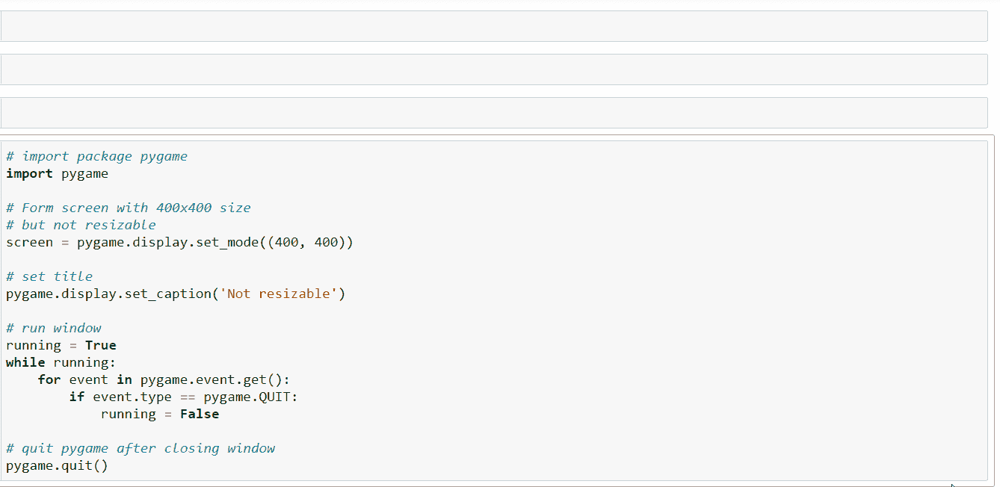
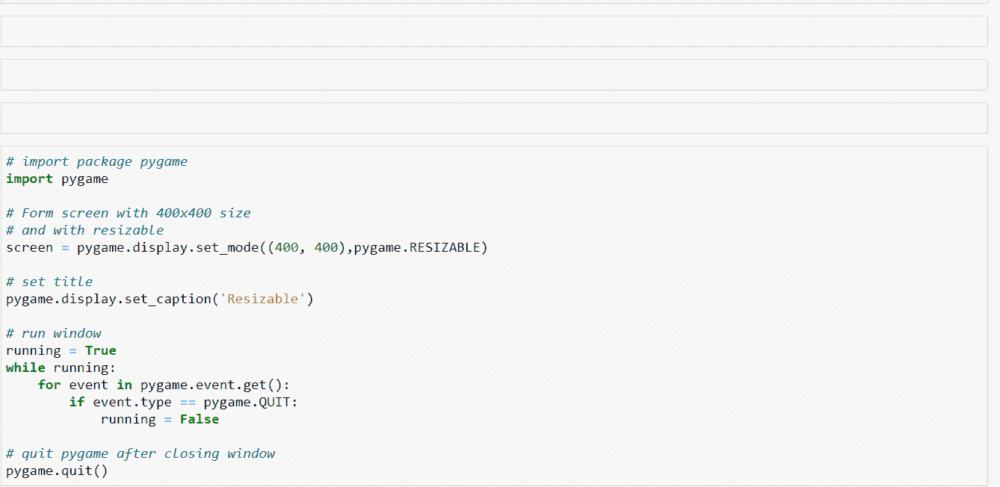

# 允许在 PyGame 中调整窗口大小

> 原文:[https://www . geesforgeks . org/allowing-size-window-in-pygame/](https://www.geeksforgeeks.org/allowing-resizing-window-in-pygame/)

在本文中，我们将学习如何调整[游戏](https://www.geeksforgeeks.org/introduction-to-pygame/)窗口的大小。

游戏编程现在非常有价值，它也可以用于广告和作为教学工具。游戏开发包括数学、逻辑、物理、人工智能等等，非常有趣。在 python 中，游戏编程是在 *pygame* 中完成的，它是这样做的最佳模块之一。

**安装:**

可以使用以下命令安装该库:

```py
pip install pygame 
```

### **正常游戏窗口**

**分步方法:**

1.  进口〔t0〕pygame〔t1〕。
2.  设置标题并添加内容。
3.  跑〔t0〕游戏。
4.  退出 *pygame。*

**以下是基于上述方法的程序:**

## 蟒蛇 3

```py
# import package pygame
import pygame

# Form screen with 400x400 size
# with not resizable
screen = pygame.display.set_mode((400, 400))

# set title
pygame.display.set_caption('Not resizable')

# run window
running = True
while running:
    for event in pygame.event.get():
        if event.type == pygame.QUIT:
            running = False

# quit pygame after closing window
pygame.quit()
```

**输出:**



### **可调整大小的游戏窗口**

**分步方法:**

1.  进口〔t0〕pygame〔t1〕。
2.  使用*pygame . display . set _ mode()*方法形成屏幕，并允许使用 *pygame 调整大小。RESIZABLE。*
3.  设置标题并添加内容。
4.  跑〔t0〕游戏。
5.  退出 *pygame。*

**以下是基于上述方法的程序:**

## 蟒蛇 3

```py
# import package pygame
import pygame

# Form screen with 400x400 size
# and with resizable
screen = pygame.display.set_mode((400, 400), 
                                 pygame.RESIZABLE)

# set title
pygame.display.set_caption('Resizable')

# run window
running = True
while running:
    for event in pygame.event.get():
        if event.type == pygame.QUIT:
            running = False

# quit pygame after closing window
pygame.quit()
```

**输出:**

