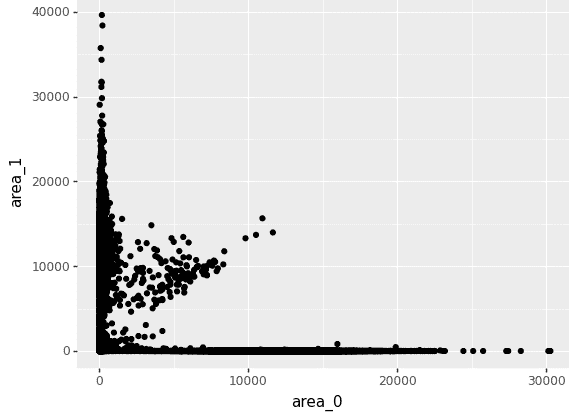
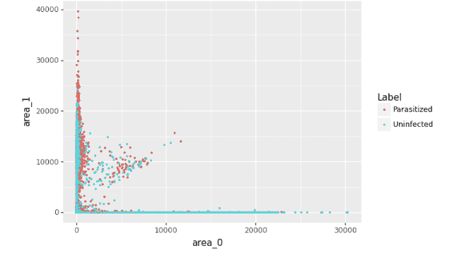

# Python 图形语法介绍

> 原文:[https://www . geesforgeks . org/python 图形语法入门/](https://www.geeksforgeeks.org/an-introduction-to-grammar-of-graphics-for-python/)

**一个图形语法**基本上是一个工具，让我们能够描述给定图形的组成部分。基本上，这让我们看到了命名图形之外的东西(散点图，仅举一例)和它背后的基本统计数据。图形语法最初是由利兰·威尔金森在 20 世纪 90 年代引入的，并由哈德利·韦翰凭借 **ggplot** 推广开来。

## 图形语法的组成部分

通常，为了用一个或多个维度构建或描述任何可视化，我们可以如下使用组件。

*   **数据**
    数据是图形语法必不可少的组成部分。毕竟，它包含了我们需要可视化的所有信息。因此，了解数据的格式以及我们正在处理的信息非常重要。
*   **层**
    基本上，层也是你在现实生活中可以联系到的东西。我们可以把层想象成一个包含图形的透明片，它可以以多种方式排列和组合。
*   **Geom**
    Geom 的视觉显示称为 Geom。几何图形可以是一条线、一个点，甚至是一个条、一个饼等。我们可以通过“分层”地理来显示大量信息。
*   **缩放数据**
    重新缩放我们的数据非常有用。缩放数据不会改变数据，就像说的，它只是改变数据集的视点。

这种图形语法最早是在 R 中引入的，使用的是 ggplot 和 ggplot2。考虑到它在过去的成功，它也被作为 plotnine 引入 Python。

## Python 绑定

**plotine**是 Python 中图形语法的实现/绑定。它基于 ggplot2。所以，基本上，如果你熟悉 R 编程和 ggplot2，你很可能很快就会赶上 plotnine。ggplot2 和 plotnine 只有 2 处明显的变化。

*   在 R 中，加号表示继续到下一行的代码/指令。然而，如果我们在 python 中做同样的事情，它会抛出一个异常。为了说明这一点，在 plotnine 中，加号前的表达式用大括号括起来，所以可以这样使用。
*   列名必须是字符串。这更有可能是 R 的一个特性，您可以将列名作为函数参数传递，而不用用引号将其括起来。但是，在 Python 中，如果单词没有用双引号或单引号括起来，它会将单词视为变量。

### 装置

这个模块没有内置 Python。要安装此模块，请在终端中键入以下命令。

```py
pip install plotnine 
```

**注意:**以下是以下示例中使用的 CSV 文件的链接:[数据集. csv](https://drive.google.com/file/d/15d90LElqnVfCo6v0zQltwRWorkm6gzsL/view?usp=sharing)

**例 1:**

## 蟒蛇 3

```py
import pandas as pd
from plotnine import *

# load dataset
dataset = pd.read_csv("dataset.csv")

# ggplot is to plot the given data
(ggplot(dataset, aes(x = "area_0", y = "area_1"))+
    geom_point()
)

# aes contains parameters which work
# as x-axis and y-axis for the given plot
# geom.point() makes the data entries as points
```

**输出:**



**例 2:**

## 蟒蛇 3

```py
import pandas as pd
from plotnine import *

# load dataset
dataset = pd.read_csv("dataset.csv")

(ggplot(dataset, aes(x = "area_0", y = "area_1"))+
    geom_point(color = "label", alpha = 0.7,
               size = 0.5)
)
```

**输出:**

