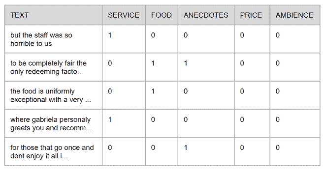
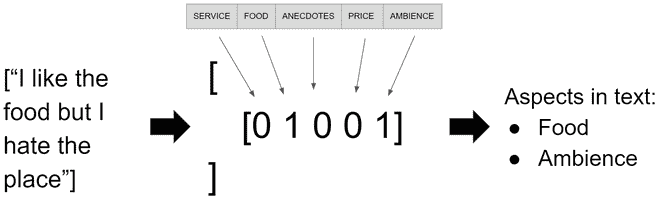
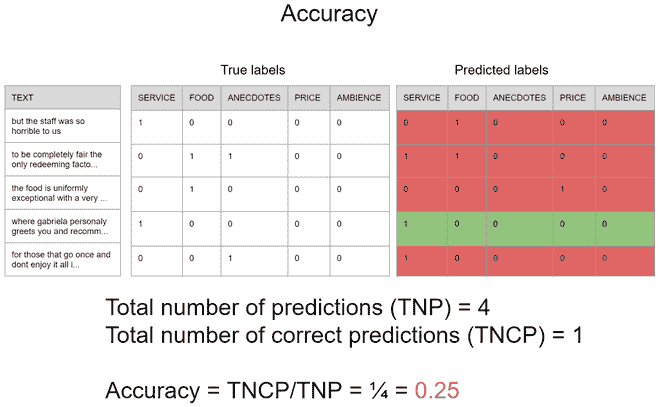
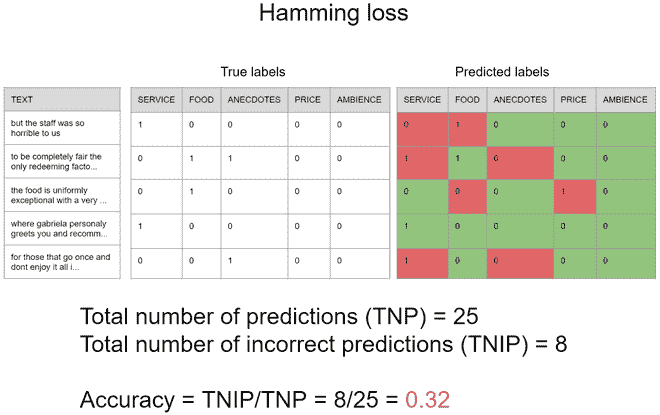

# 多标签分类介绍

> 原文:[https://www . geesforgeks . org/an-introduction-to-multi label-classification/](https://www.geeksforgeeks.org/an-introduction-to-multilabel-classification/)

监督机器学习技术最常用的功能之一是对内容进行分类，在许多环境中使用，例如告诉给定的餐馆评论是正面的还是负面的，或者推断图像上是否有猫或狗。这项任务可以分为三个领域，二进制分类、多类分类和多标签分类。在本文中，我们将解释这些类型的分类以及它们彼此不同的原因，并展示一个可以使用多标签分类的真实场景。

**分类类型之间的差异**

*   **二进制分类:**
    当只有两个截然不同的类，而我们要分类的数据只属于其中一个类时，就用它来分类，例如，关于某个给定产品的帖子是正面还是负面；
*   **多类分类:**当有三个或三个以上的类，并且我们要分类的数据只属于其中一个类时使用，例如，如果图像上的信号量是红色、黄色或绿色，则进行分类；
*   **Multilabel 分类:**
    当有两个或两个以上的类，而我们要分类的数据可能不属于任何一个类，也可能同时属于所有的类时，就会用到它，例如，对图像中包含哪些交通标志进行分类。

**真实世界多标签分类场景**
我们将在本教程中解决的问题是从 twitter 中提取餐馆评论的方面。在这种情况下，文本的作者可能不会提到预设列表的任何一个或所有方面，在我们的情况下，这个列表由五个方面组成:服务、食物、轶事、价格和氛围。为了训练模型，我们将使用最初为 2014 年语义评估国际研讨会上的竞赛提议的数据集，它被称为 SemEval-2014，包含关于文本中方面及其各自极性的数据，对于本教程，我们仅使用关于方面的数据，关于原始竞赛及其数据的更多信息可以在他们的 [网站](http://alt.qcri.org/semeval2014/) 上找到。

为了简单起见，在本教程中，原始的 XML 文件被转换为 CSV 文件，该文件将在 GitHub 上以[完整代码](https://github.com/Lucasfrota/MultilabelClassificationExample)提供。每一行都是由文本和其中包含的方面组成的，这些方面的存在与否分别由 1 和 0 表示，下图显示了表格的外观。

<center></center>

The first thing we need to do is importing the required libraries, all the of them are in the code snippet below if you are familiar with machine learning you will probably recognize some of those.

**代码:导入库**

```py
import pandas as pd
import numpy as np
from sklearn.model_selection import train_test_split
from sklearn.feature_extraction.text import TfidfVectorizer
from skmultilearn.adapt import MLkNN
from sklearn.metrics import hamming_loss, accuracy_score
```

在这之后，我们必须导入文本并对其进行适当的分割以训练模型，然而，原始文本本身对机器学习算法没有太大意义，因此，我们必须以不同的方式表示它们，有许多不同的形式来表示文本，这里我们将使用一种简单但非常强大的技术，称为 TF-IDF，它代表术语频率–反向文档频率，简而言之， 它用来表示一个文本语料库内部每个单词的重要性，你可能会在这篇 [不可思议的文章](https://www.geeksforgeeks.org/sklearn-feature-extraction-with-tf-idf/) 上找到更多关于 TF-IDF 的细节。 在下面的代码中，我们将文本集分配给 X，将每个文本中包含的方面分配给 y，将数据从行文本转换为 TF-IDF 我们将创建类 TfidfVectorizer 的一个实例，使用函数 *fit* 为其提供完整的文本集，这样以后我们就可以使用这个类来转换分割集，最后， 我们将在 train 和 test 数据之间分割数据，使用 70%的数据进行训练，剩下的用于测试最终模型，并使用我们之前创建的 TfidfVectorizer 实例中的函数 *transform* 转换这些集合中的每一个。
**代码:**

```py
aspects_df = pd.read_csv('semeval2014.csv')
X = aspects_df["text"]
y = np.asarray(aspects_df[aspects_df.columns[1:]])

# initializing TfidfVectorizer 
vetorizar = TfidfVectorizer(max_features=3000, max_df=0.85)
# fitting the tf-idf on the given data
vetorizar.fit(X)

# splitting the data to training and testing data set
X_train, X_test, y_train, y_test = train_test_split(X, y, test_size=0.30, random_state=42)

# transforming the data
X_train_tfidf = vetorizar.transform(X_train)
X_test_tfidf = vetorizar.transform(X_test)
```

现在一切都设置好了，所以我们可以实例化模型并训练它！可以使用几种方法来执行多标签分类，这里使用的方法将是 MLKnn，它是著名的 Knn 算法的改编，就像它的前身 MLKnn 基于目标和来自训练基地的数据之间的距离来推断目标的类别，但是假设它可能不属于任何类别或者属于所有类别。
**代号:**

```py
# using Multi-label kNN classifier
mlknn_classifier = MLkNN()
mlknn_classifier.fit(X_train_tfidf, y_train)
```

一旦模型被训练好了，我们就可以运行一个小测试，看看它是否适用于任何句子，我将使用句子“*我喜欢食物，但我讨厌这个地方”*但请随意使用任何你喜欢的句子。正如我们对训练和测试数据所做的那样，我们需要将新句子的向量转换为 TF-IDF，然后使用函数*从模型实例中预测*，这将为我们提供一个稀疏矩阵，该矩阵可以转换为函数*的数组，以返回数组的数组*，其中每个数组中的每个元素都推断某个方面的存在，如图 2 所示。

**代码:**

```py
new_sentences = ["I like the food but I hate the place"]
new_sentence_tfidf = vetorizar.transform(new_sentences)

predicted_sentences = mlknn_classifier.predict(new_sentence_tfidf)
print(predicted_sentences.toarray())
```

<center>
</center>

现在，我们必须做机器学习管道最重要的部分之一，测试。在这一部分，与多类问题有一些显著的区别，例如，我们不能以相同的方式使用准确性，因为一个单一的预测同时推断许多类，如在图 3 所示的假设场景中，请注意，当使用准确性时，只有与真实标签完全相等的预测才被认为是正确的预测， 因此，准确度是 0.25，这意味着如果你试图预测 100 个句子中只有 25 个句子的方面，那么所有方面的存在和不存在将同时被正确预测。

<center></center>

另一方面，有一个更合适的度量可以用来衡量模型独立预测每个方面的存在有多好，这个度量叫做汉明损失，它等于**不正确**预测的数量除以模型输出可能包含一个或多个预测的预测总数，下图使用了上一个例子的相同场景说明了它是如何工作的， **需要注意的是，汉明损失不太可能准确，结果越小，模型越好。** 因此，在这种情况下，汉明损失为 0.32，这意味着如果您试图预测 100 个句子的方面，模型将错误地预测约 32%的独立方面**。**

<center>****</center>

**虽然第二个度量似乎更适合像这样的问题，但重要的是要记住，所有的机器学习问题都是不同的，因此它们中的每一个都可能结合一组不同的度量来更好地理解模型的性能，一如既往，没有灵丹妙药。为了使用这些，我们将使用来自 sklearn 的度量模块，该模块采用模型使用测试数据执行的预测，并与真实标签进行比较。**

****代码:****

```py
predicted = mlknn_classifier.predict(X_test_tfidf)

print(accuracy_score(y_test, predicted))
print(hamming_loss(y_test, predicted))
```

**所以现在如果一切正常**精度接近 0.47** ，海明损失接近 **0.16** ！**