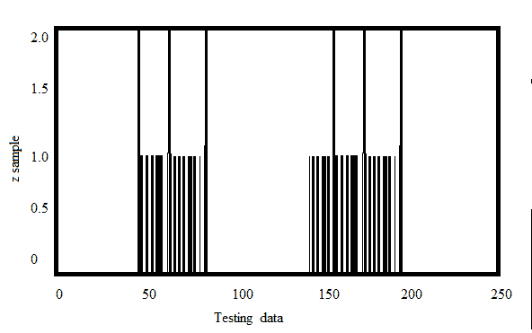
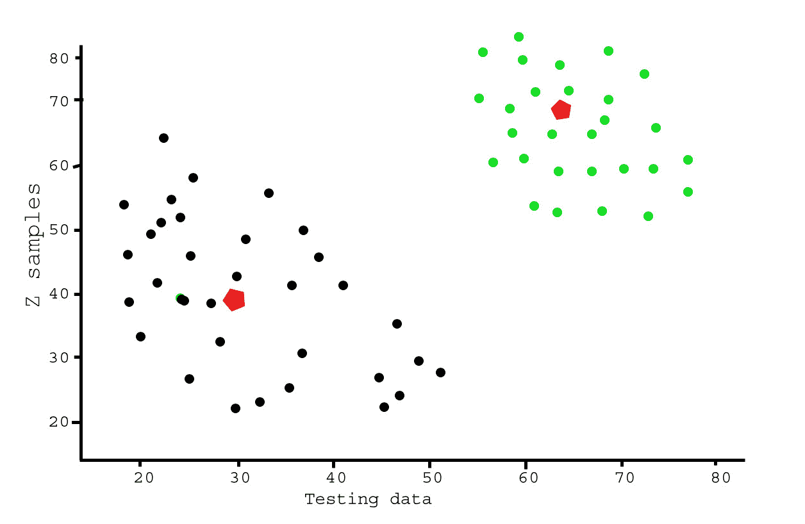

# 使用 Python 中的 K-Means 聚类分析测试数据

> 原文:[https://www . geeksforgeeks . org/分析测试数据-使用-k-means-clustering-in-python/](https://www.geeksforgeeks.org/analysis-of-test-data-using-k-means-clustering-in-python/)

本文演示了使用开放式 cv 库对样本随机数据进行 [K 均值聚类](https://www.geeksforgeeks.org/k-means-clustering-introduction/)的示例。

**先决条件:** [Numpy](https://www.geeksforgeeks.org/numpy-in-python-set-1-introduction/) 、OpenCV、 [matplot-lib](https://www.geeksforgeeks.org/graph-plotting-in-python-set-1/)
让我们首先使用 matplot-lib 工具可视化具有多个特征的测试数据。

```py
# importing required tools
import numpy as np
from matplotlib import pyplot as plt

# creating two test data
X = np.random.randint(10,35,(25,2))
Y = np.random.randint(55,70,(25,2))
Z = np.vstack((X,Y))
Z = Z.reshape((50,2))

# convert to np.float32
Z = np.float32(Z)

plt.xlabel('Test Data')
plt.ylabel('Z samples')

plt.hist(Z,256,[0,256])

plt.show()
```

这里的“Z”是一个大小为 100 的数组，取值范围从 0 到 255。现在，将“z”变形为列向量。当存在多个特征时，它会更有用。然后将数据更改为 np.float32 类型。

**输出:**


现在，将 k-Means 聚类算法应用到与上述测试数据相同的示例中，并查看其行为。
**涉及步骤:**
1)首先我们需要设置一个测试数据。
2)定义标准并应用 kmeans()。
3)现在分离数据。
4)最后绘制数据。

```py
import numpy as np
import cv2
from matplotlib import pyplot as plt

X = np.random.randint(10,45,(25,2))
Y = np.random.randint(55,70,(25,2))
Z = np.vstack((X,Y))

# convert to np.float32
Z = np.float32(Z)

# define criteria and apply kmeans()
criteria = (cv2.TERM_CRITERIA_EPS + cv2.TERM_CRITERIA_MAX_ITER, 10, 1.0)
ret,label,center = cv2.kmeans(Z,2,None,criteria,10,cv2.KMEANS_RANDOM_CENTERS)

# Now separate the data
A = Z[label.ravel()==0]
B = Z[label.ravel()==1]

# Plot the data
plt.scatter(A[:,0],A[:,1])
plt.scatter(B[:,0],B[:,1],c = 'r')
plt.scatter(center[:,0],center[:,1],s = 80,c = 'y', marker = 's')
plt.xlabel('Test Data'),plt.ylabel('Z samples')
plt.show()
```

**输出:**


这个例子旨在说明 k 均值将在哪里产生直观上可能的聚类。

**应用程序** :
1)识别癌变数据。
2)学生学习成绩预测。
3)药物活性预测。