# 用 Python 分析二手车售价

> 原文:[https://www . geeksforgeeks . org/analysis-销售-二手车价格-使用-python/](https://www.geeksforgeeks.org/analyzing-selling-price-of-used-cars-using-python/)

如今，随着技术的进步，机器学习等技术正在许多组织中大规模使用。这些模型通常使用数据集形式的一组预定义数据点。这些数据集包含特定领域的过去/以前的信息。在将这些数据点输入模型之前对其进行组织是非常重要的。这是我们使用数据分析的地方。如果提供给机器学习模型的数据组织得不好，它会给出错误或不希望的输出。这会给组织造成重大损失。因此，利用适当的数据分析非常重要。

**关于数据集:**

我们将在这个例子中使用的数据是关于汽车的。特别是包含各种关于二手车的信息数据点，如价格、颜色等。这里我们需要明白仅仅收集数据是不够的。原始数据没有用。在这里，数据分析在释放我们所需的信息以及获得对原始数据的新见解方面发挥着至关重要的作用。

考虑一下这个场景，我们的朋友奥蒂斯想卖掉他的车。但是他不知道他的车应该卖多少钱！他希望利润最大化，但他也希望它能以合理的价格卖给想要拥有它的人。所以在这里，我们，作为一个数据科学家，我们可以帮助我们的朋友奥蒂斯。

让我们像数据科学家一样思考，明确定义他的一些问题:比如，有没有其他车的价格及其特点的数据？汽车的哪些特点会影响价格？颜色？品牌？马力是否也会影响销售价格，或者可能是其他因素？

作为数据分析师或数据科学家，这些是我们可以开始思考的一些问题。为了回答这些问题，我们需要一些数据。但是这些数据是原始的。因此，我们需要首先对其进行分析。数据以`.csv/.data`格式提供给我们

要下载本例中使用的文件[，请点击此处](https://archive.ics.uci.edu/ml/machine-learning-databases/autos/imports-85.data)。提供的文件位于。数据格式。按照下面的过程将. data 文件转换为。csv 文件。

**转换过程。数据文件。csv:**

1.  打开微软 Excel
2.  去约会
3.  从文本中选择
4.  在 comas 上勾选复选框(仅限)
5.  另存为。csv 到你的电脑上你想要的位置！

**所需模块:**

*   **pandas:** Pandas 是一个开源库，可以用 Python 执行数据操作。熊猫提供了一种创建、操作和争论数据的简单方法。
*   **numpy:** Numpy 是 Python 科学计算的基础包。`numpy` 可以作为通用数据的高效多维容器。
*   **matplotlib:** Matplotlib 是一个 Python 2D 绘图库，以多种格式生成出版物质量数字。
*   **seaborn:** Seaborn 是一个基于 matplotlib 的 Python 数据可视化库。Seaborn 提供了一个高级界面，用于绘制吸引人且信息丰富的统计图形。
*   **scipy:** Scipy 是一个基于 Python 的面向数学、科学和工程的开源软件生态系统。

**安装这些包的步骤:**

*   如果您使用 anaconda- jupyter/ syder 或任何其他第三方软件来编写 python 代码，请确保在电脑的命令提示符下设置该软件的“脚本文件夹”的路径。
*   然后键入–pip 安装包名称
    **示例:**

```py
pip install numpy

```

*   Then after the installation is done. (Make sure you are connected to the internet!!) Open your IDE, then import those packages. To import, type – import package name
    **Example:**

    ```py
    import numpy

    ```

    **以下代码中使用的步骤(简短描述):**

    *   导入包
    *   设置数据文件的路径(。csv 文件)
    *   查找我们的文件中是否有空数据或 NaN 数据。如果有，移除它们
    *   对您的数据执行各种数据清理和数据可视化操作。为了更好地理解，这些步骤以注释的形式显示在每一行代码旁边，因为并排查看代码比在这里完全解释代码更好，这是没有意义的。
    *   获得结果！

    **让我们开始分析数据。**

    **第 1 步:**导入需要的模块。

    ```py
    # importing section
    import pandas as pd 
    import numpy as np
    import matplotlib.pyplot as plt
    import seaborn as sns
    import scipy as sp
    ```

    **第二步:**我们来检查数据集的前五个条目。

    ```py
    # using the Csv file
    df = pd.read_csv('output.csv') 

    # Checking the first 5 entries of dataset
    df.head()
    ```

    **输出:**

    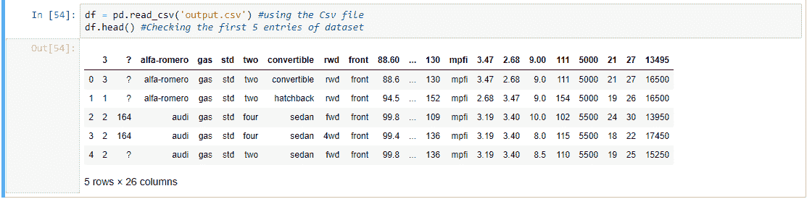

    **步骤 3:** 定义数据集的标题。

    ```py
    headers = ["symboling", "normalized-losses", "make", 
               "fuel-type", "aspiration","num-of-doors",
               "body-style","drive-wheels", "engine-location",
               "wheel-base","length", "width","height", "curb-weight",
               "engine-type","num-of-cylinders", "engine-size", 
               "fuel-system","bore","stroke", "compression-ratio",
               "horsepower", "peak-rpm","city-mpg","highway-mpg","price"]

    df.columns=headers
    df.head()
    ```

    **输出:**

    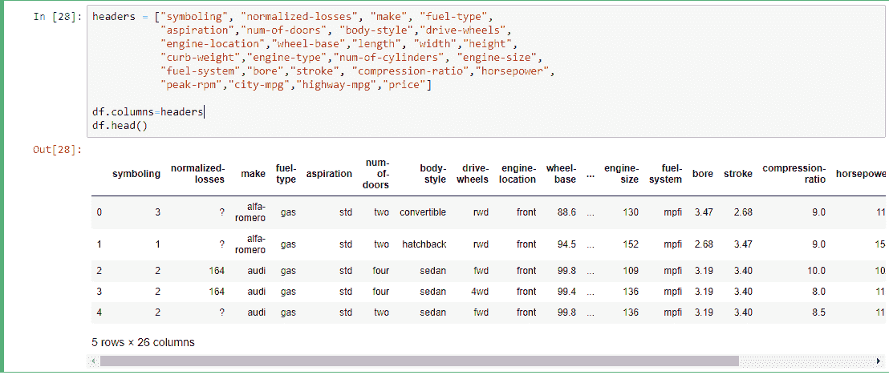

    **步骤 4:** 查找缺失值(如果有)。

    ```py
    data = df

    # Finding the missing values
    data.isna().any()

    # Finding if missing values 
    data.isnull().any() 
    ```

    **输出:**

    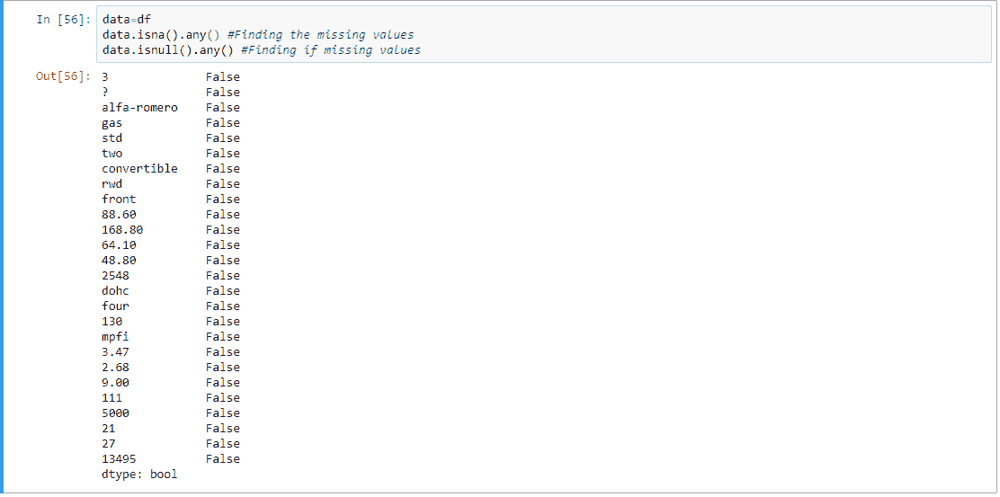

    **第四步:**将 mpg 转换为 L/100km，检查各列的数据类型。

    ```py
    # converting mpg to L / 100km
    data['city-mpg'] = 235 / df['city-mpg']
    data.rename(columns = {'city_mpg': "city-L / 100km"}, inplace = True)

    print(data.columns)

    # checking the data type of each column
    data.dtypes 
    ```

    **输出:**

    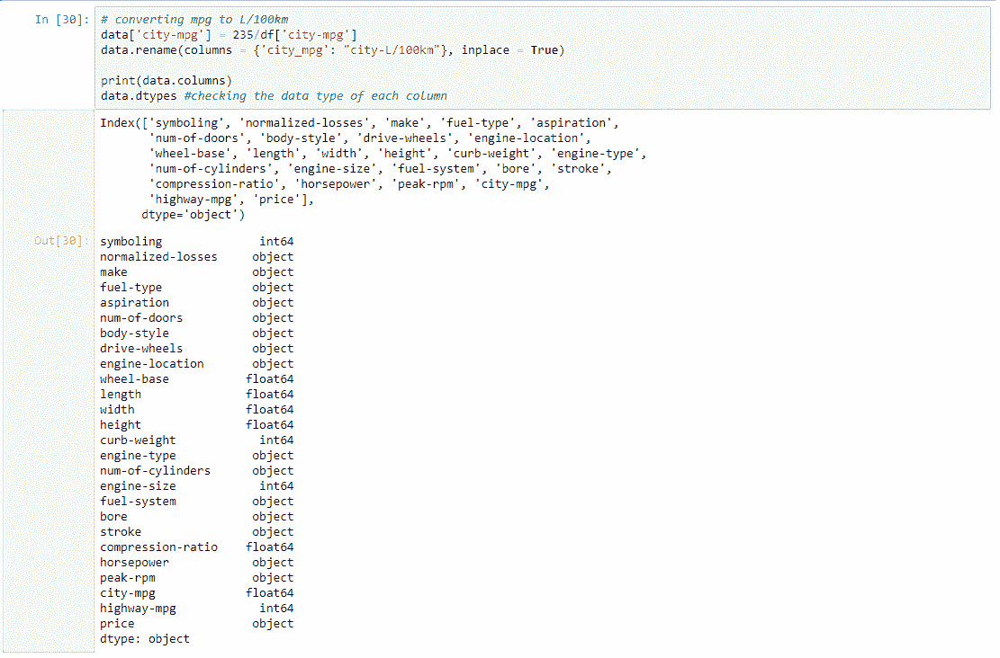

    **第五步:**这里，price 是 object 类型(字符串)，应该是 int 或者 float，需要修改

    ```py
    data.price.unique()

    # Here it contains '?', so we Drop it
    data = data[data.price != '?']

    # checking it again
    data.dtypes
    ```

    **输出:**

    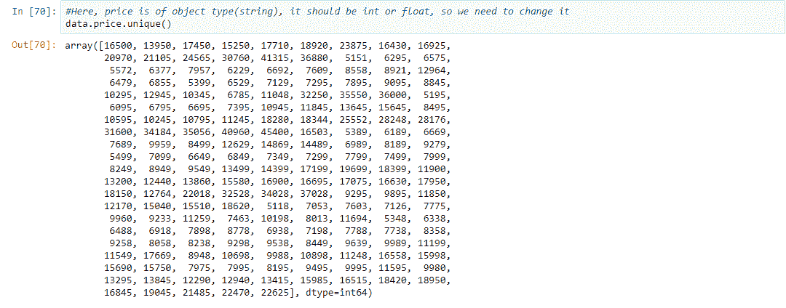

    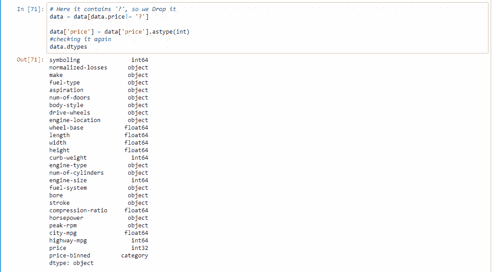

    **步骤 6:** 通过使用简单的特征缩放方法示例(对其余部分执行)和宁滨分组值来归一化值

    ```py
    data['length'] = data['length']/data['length'].max()
    data['width'] = data['width']/data['width'].max()
    data['height'] = data['height']/data['height'].max()

    # binning- grouping values
    bins = np.linspace(min(data['price']), max(data['price']), 4) 
    group_names = ['Low', 'Medium', 'High']
    data['price-binned'] = pd.cut(data['price'], bins, 
                                  labels = group_names, 
                                  include_lowest = True)

    print(data['price-binned'])
    plt.hist(data['price-binned'])
    plt.show()
    ```

    **输出:**

    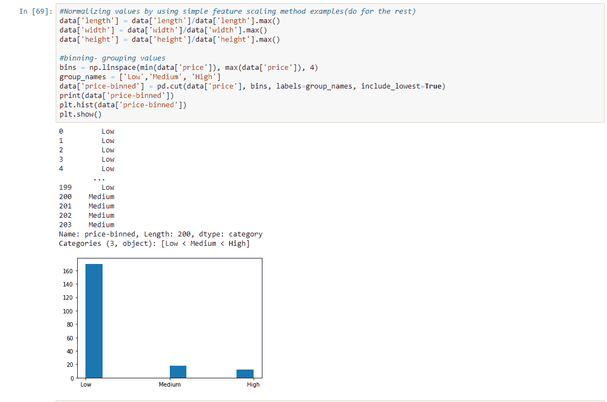

    **第七步:**对分类到数值的数据进行描述性分析。

    ```py
    # categorical to numerical variables
    pd.get_dummies(data['fuel-type']).head()

    # descriptive analysis
    # NaN are skipped
    data.describe()
    ```

    **输出:**

    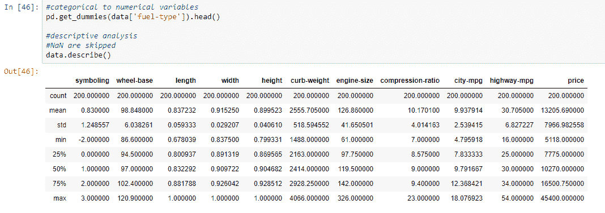

    **第 8 步:**根据基于发动机尺寸的价格绘制数据。

    ```py
    # examples of box plot
    plt.boxplot(data['price'])

    # by using seaborn
    sns.boxplot(x ='drive-wheels', y ='price', data = data)

    # Predicting price based on engine size
    # Known on x and predictable on y
    plt.scatter(data['engine-size'], data['price'])
    plt.title('Scatterplot of Enginesize vs Price')
    plt.xlabel('Engine size')
    plt.ylabel('Price')
    plt.grid()
    plt.show()
    ```

    **输出:**

    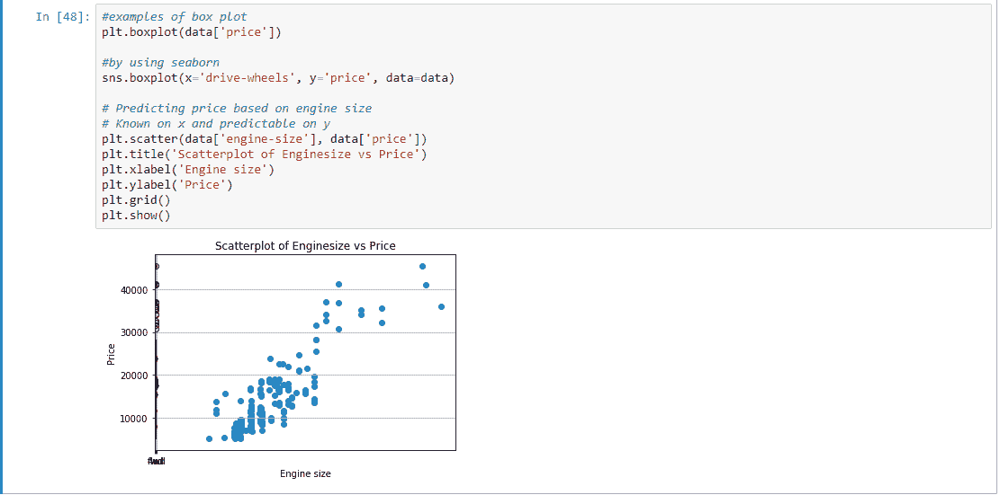

    **第九步:**根据车轮、车身样式、价格对数据进行分组。

    ```py
    # Grouping Data
    test = data[['drive-wheels', 'body-style', 'price']]
    data_grp = test.groupby(['drive-wheels', 'body-style'], 
                             as_index = False).mean()

    data_grp
    ```

    **输出:**

    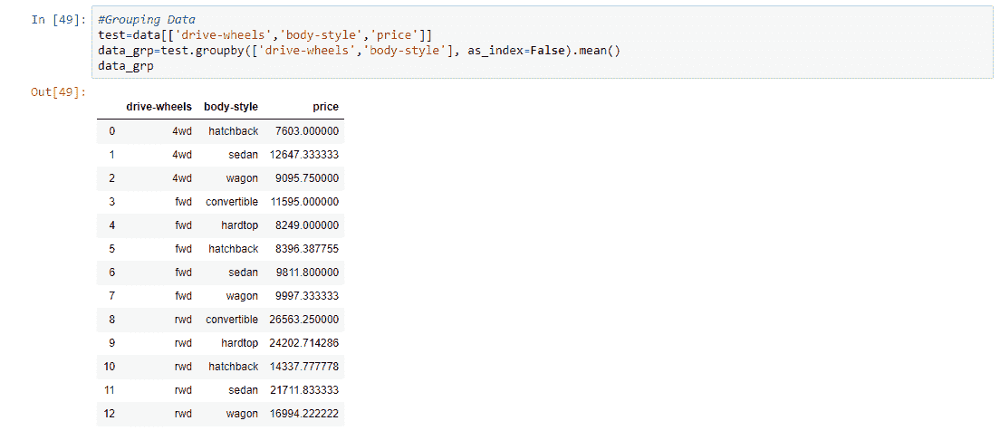

    **步骤 10:** 使用枢轴法，根据枢轴法得到的数据绘制热图

    ```py
    # pivot method
    data_pivot = data_grp.pivot(index = 'drive-wheels',
                                columns = 'body-style')
    data_pivot

    # heatmap for visualizing data
    plt.pcolor(data_pivot, cmap ='RdBu')
    plt.colorbar()
    plt.show()
    ```

    **输出:**

    

    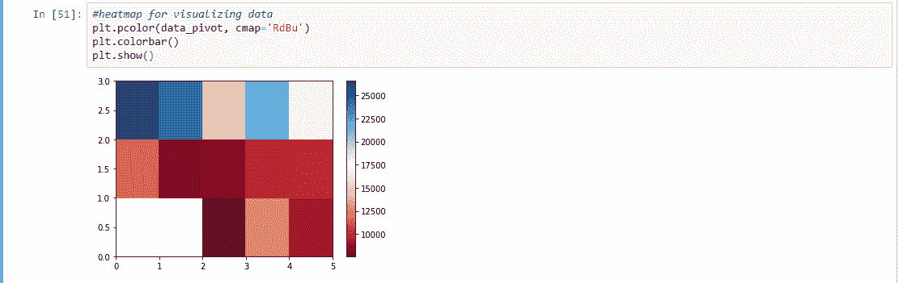

    **步骤 11:** 获得最终结果，并以图形的形式显示出来。当斜率正向增加时，它是一个正线性关系。

    ```py
    # Analysis of Variance- ANOVA
    # returns f-test and p-value
    # f-test = variance between sample group means divided by 
    # variation within sample group
    # p-value = confidence degree
    data_annova = data[['make', 'price']]
    grouped_annova = data_annova.groupby(['make'])
    annova_results_l = sp.stats.f_oneway(
                                 grouped_annova.get_group('honda')['price'],
                                 grouped_annova.get_group('subaru')['price']
                                        )
    print(annova_results_l)

    # strong corealtion between a categorical variable
    # if annova test gives large f-test and small p-value

    # Correlation- measures dependency, not causation
    sns.regplot(x ='engine-size', y ='price', data = data)
    plt.ylim(0, )
    ```

    **输出:**

    