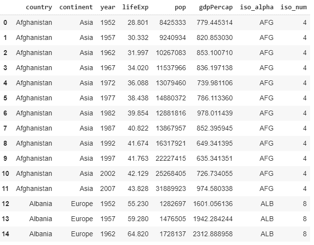

# 使用 Plotly Express 的动画数据可视化

> 原文:[https://www . geesforgeks . org/动画-数据-可视化-使用-plotly-express/](https://www.geeksforgeeks.org/animated-data-visualization-using-plotly-express/)

**数据可视化**是数据科学行业的一件大事，向企业或政府显示适当的统计数据可以极大地帮助他们改善服务。从多个图表中理解不同时间的数据并对其进行任何理解是非常痛苦的。这就是对动画数据可视化的需求所在。在这篇文章中，我们将使用 Plotly Express 来绘制和动画化来自 Gapminder 的数据和数据集。我们将看看 Plotly Express 提供的不同类型的动画。

## 装置

确保您的计算机中安装了 Python 3。安装将用于制作数据动画的 Plotly。要安装它，请在终端中键入以下命令。

```
pip install plotly

```

如果您不想在计算机上本地安装该模块，请使用 Jupyter 笔记本或 Google Colab。

## 导入模块和数据集

我们需要从 Gapminder 导入 Plotly Express 和世界数据。

```
import plotly.express as px

gapminder = px.data.gapminder()
```

**示例:**让我们打印这个数据库的前几行

## 蟒蛇 3

```
import plotly.express as px

gapminder = px.data.gapminder()
gapminder.head(15)
```

**输出:**



来自 Gapminder 的数据

现在我们已经获得了从 1952 年到 2007 年世界上几乎所有国家的数据，包括预期寿命、人均国内生产总值和人口。

## 预期寿命

地图是一种地图，它使用公共属性的定义区域中的颜色差异，以便将数据可视化为一个区域(在本例中为一个国家)的汇总汇总。Plotly Express 可以轻松绘制合唱团。下面的代码展示了如何从 *gapminder 获取信息。*设置要给合唱团上色的参数。在这里，我们希望合唱团根据预期寿命来给各个地区着色。*悬停 _ 名称*显示悬停时的设定数据。 *animation_frame* 是指动画应该在其上完成的参数(大部分情况下，这个参数是时间序列数据)。

**示例:**

## 蟒蛇 3

```
import plotly.express as px

gapminder = px.data.gapminder()
gapminder.head(15)

fig = px.choropleth(gapminder,
                    locations ="iso_alpha",
                    color ="lifeExp",
                    hover_name ="country", 
                    color_continuous_scale = px.colors.sequential.Plasma,
                    scope ="world",
                    animation_frame ="year")
fig.show()
```