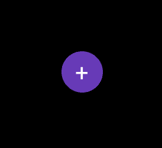
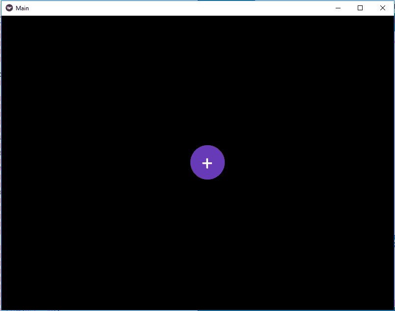

# kivy–Python 中的动画浮动动作按钮

> 原文:[https://www . geesforgeks . org/animated-floating-action-button-in-kivy-python/](https://www.geeksforgeeks.org/animated-floating-action-button-in-kivy-python/)

Kivy 是 Python 中独立于平台的 GUI 工具。因为它可以在安卓、IOS、linux 和 Windows 等平台上运行。它基本上是用来开发安卓应用程序的，但并不意味着它不能在桌面应用程序上使用。
在本文中，我们将学习如何将动画添加到浮动动作按钮。要学习如何创建它，你必须了解动画和时钟。

> **动画:**动画和动画转换用于动画小部件属性。您必须至少指定一个属性名称和目标值。要使用动画，请按照以下步骤操作:
> 
> *   设置动画对象
> *   在小部件上使用动画对象
> 
> 要设置小部件 x 或 y 位置的动画，只需指定小部件在动画结尾的目标 x/y 值:
> 
> ```
> anim = Animation(x=100, y=100)
> anim.start(widget)
> ```
> 
> **Clock:**Clock 对象允许您在将来调度函数调用；一次或以特定的时间间隔重复。
> 使用动画和时钟时必须使用 kivy 内置模块–
> 
> ```
> from kivy.animation import Animation
> from kivy.clock import Clock
> ```

```
Basic Approach:

1) import kivy
2) import kivyApp
3) import Boxlayout
4) import Animation
5) Import Clock
6) Set minimum version(optional)
7) create Layout class and Add(create) animation in it
8) create App class
9) Set up .kv file :
       1) Add Floating Button Properties
       2) Create Main Window
       3) Add Float Button(don't forget to give id)
10) return Layout/widget/Class(according to requirement)
11) Run an instance of the class
```

> [**Kivy 教程——用例子学习 Kivy。**T3】](https://www.geeksforgeeks.org/kivy-tutorial/)

**实施办法:**
**主文件**

## 蟒蛇 3

```
## Sample Python application demonstrating that
## How to create a button like floating Action Button
## in Kivy using .kv file

###################################################
# import modules

import kivy

# base Class of your App inherits from the App class.  
# app:always refers to the instance of your application 
from kivy.app import App

# BoxLayout arranges widgets in either
# in a vertical fashion that
# is one on top of another or in a horizontal
# fashion that is one after another.
from kivy.uix.boxlayout import BoxLayout

# To change the kivy default settings 
# we use this module config 
from kivy.config import Config 

# 0 being off 1 being on as in true / false 
# you can use 0 or 1 && True or False 
Config.set('graphics', 'resizable', True)

# The Clock object allows you to
# schedule a function call in the future
from kivy.clock import Clock

# To work with Animation you must have to import it
from kivy.animation import Animation

# creating the root widget used in .kv file
class MainWindow(BoxLayout):
    def __init__(self, **kwargs):
        super().__init__(**kwargs)

        # Schedule the interval for the animation
        Clock.schedule_interval(self.breath, 1)

    # Creating Animation function name breath
    def breath(self, dtx):

        # create an animation object. This object could be stored
        # and reused each call or reused across different widgets.
        # += is a sequential step
        anim = (Animation(btn_size =(60, 60), t ='in_quad', duration =.5)+
               Animation(btn_size =(70, 70), t ='in_quad', duration =.5))

        # Call the button id
        tgt = self.ids.cta

        # Start the Animation
        anim.start(tgt)

# creating the App class in which name
#.kv file is to be named main.kv
class MainApp(App):
    # defining build()
    def build(self):
        # returning the instance of root class
        return MainWindow()

# run the app
if __name__ == '__main__':
    MainApp().run()
```

**。千伏文件**

## 蟒蛇 3

```
#.kv file implementation of BoxLayout

# using Float Layout for the creation of Floatbutton
# Here we are creating the properties of button
# Button will be created in Main window Box Layout

<FloatButton@FloatLayout>
    id: float_root  # Giving id to button
    size_hint: (None, None)
    text: ''
    btn_size: (70, 70)
    size: (70, 70)
    bg_color: (0.404, 0.227, 0.718, 1.0)
    pos_hint: {'x': .6}

    # Adding shape and all, size, position to button
    Button:
        text: float_root.text
        markup: True
        font_size: 40
        size_hint: (None, None)
        size: float_root.btn_size
        pos_hint: {'x': 5.5, 'y': 3.8}
        background_normal: ''
        background_color: (0, 0, 0, 0)
        canvas.before:
            Color:
                rgba: (0.404, 0.227, 0.718, 1.0)
            Ellipse:
                size: self.size
                pos: self.pos

# Creation of main window
<MainWindow>:
    BoxLayout:
        # Creating the Float button
        FloatButton:

            # Giving id to the button
            # So that we can Apply the Animation
            id: cta
            text: '+'
            markup: True
            background_color: 1, 0, 1, 0
```

**输出:**





**视频输出:**

<video class="wp-video-shortcode" id="video-382355-1" width="640" height="360" preload="metadata" controls=""><source type="video/webm" src="https://media.geeksforgeeks.org/wp-content/uploads/20200226085902/float.webm?_=1">[https://media.geeksforgeeks.org/wp-content/uploads/20200226085902/float.webm](https://media.geeksforgeeks.org/wp-content/uploads/20200226085902/float.webm)</video>